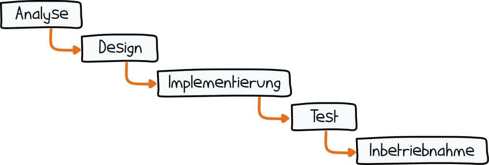
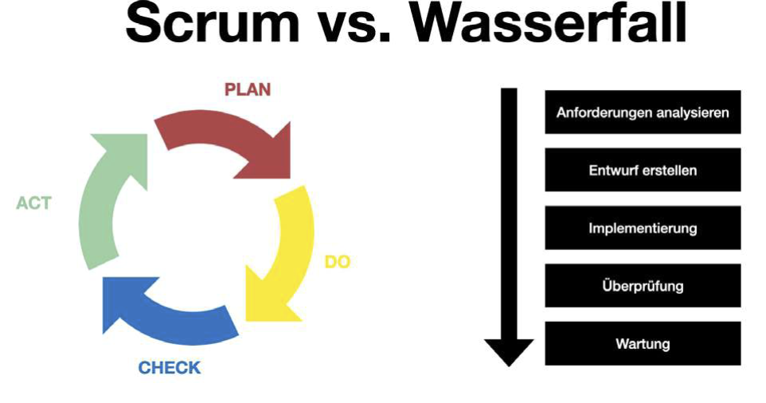

|                      |                           |                               |
| -------------------- | ------------------------- | ----------------------------- |
| **HF Systemtechnik** | **Softwareentwicklung B** |  |

- [1. Einführung in Agile Softwareentwicklung](#1-einführung-in-agile-softwareentwicklung)
  - [1.1. Lernziele](#11-lernziele)
  - [1.2. Einstieg – Problemorientierung](#12-einstieg--problemorientierung)
  - [1.3. Klassische Projektabwicklung](#13-klassische-projektabwicklung)
    - [1.3.1. Ablauf klassischer Projekte](#131-ablauf-klassischer-projekte)
    - [1.3.2. Vorteile](#132-vorteile)
    - [1.3.3. Nachteil/Probleme](#133-nachteilprobleme)
    - [1.3.4. Fazit](#134-fazit)
  - [1.4. Agile Softwareentwicklung](#14-agile-softwareentwicklung)
    - [1.4.1. Grundsätze](#141-grundsätze)
    - [1.4.2. Die 4 Werte](#142-die-4-werte)
    - [1.4.3. Die 12 Prinzipien](#143-die-12-prinzipien)
    - [1.4.4. Grundidee](#144-grundidee)
    - [1.4.5. Agile Prinzipien](#145-agile-prinzipien)
  - [1.5. Agil vs. Wasserfall – Vergleich](#15-agil-vs-wasserfall--vergleich)
- [2. Aufgaben](#2-aufgaben)
  - [2.1. Papierflugzeug-Projekt](#21-papierflugzeug-projekt)

---

</br>

# 1. Einführung in Agile Softwareentwicklung

## 1.1. Lernziele

- [x] den Ablauf eines klassischen Softwareprojekts erklären
- [x] zentrale Probleme klassischer Projektmethoden benennen
- [x] die Grundidee der agilen Entwicklung erklären
- [x] Unterschiede zwischen klassischer und agiler Entwicklung beschreiben
- [x] verstehen, warum agile Methoden in der Softwareentwicklung entstanden sind

## 1.2. Einstieg – Problemorientierung

Ein Unternehmen entwickelt eine Software für ein Smart-Home-System. Nach 12 Monaten Entwicklung wird das System dem Kunden präsentiert.

> **Der Kunde sagt: „So habe ich mir das nicht vorgestellt.“**

- Was könnte schiefgelaufen sein?
- Wer ist verantwortlich?
- Wann hätte man das Problem erkennen können?

> **Antworten sammeln (Tafel / Whiteboard).**

## 1.3. Klassische Projektabwicklung

- Ein typisches klassisches Modell ist das Wasserfallmodell.
- Das Wasserfallmodell folgt einem linearen Ablauf:

```console
Anforderungen → Design → Implementierung → Test → Betrieb
```

Ein Beispiel ist das bekannte Modell von [Winston W. Royce](https://commons.wikimedia.org/wiki/Category%3AWinston_W._Royce)

### 1.3.1. Ablauf klassischer Projekte

1. Anforderungen
2. Design
3. Implementierung
4. Test
5. Auslieferung



### 1.3.2. Vorteile

- klare Planung
- strukturierte Dokumentation
- gut für stabile Anforderungen

### 1.3.3. Nachteil/Probleme

- Änderungen schwierig
- Feedback kommt spät
- Risiko steigt mit Projektdauer
- Kunde sieht Produkt erst am Ende

### 1.3.4. Fazit

Das Wasserfall-Modell funktioniert gut, wenn Anforderungen **vollständig und stabil** sind – in der Praxis selten erfüllt.

> ⚠️ **Probleme des Wasserfallmodells**
>
> - Änderungen sind teuer, je später sie im Projekt auftreten
> - Kundenrückmeldung erfolgt erst am Projektende
> - Fehler in Anforderungen werden spät erkannt – wenn sie am teuersten zu beheben sind
> - „Big Bang"-Lieferung: Alles oder nichts am Projektende
> - Laut Standish CHAOS Report: **66 % aller Projekte** zu spät oder zu teuer – 19 % scheitern ganz

---

## 1.4. Agile Softwareentwicklung

Agile Entwicklung entstand als Gegenbewegung zu starren Prozessen.



Ein wichtiger Meilenstein ist das [Agile Manifesto](https://de.wikipedia.org/wiki/Agile_Softwareentwicklung)

### 1.4.1. Grundsätze

| **Agile Manifesto**                                                                                        | **Agile Manifesto Bildung**                                                                                                          |
| ---------------------------------------------------------------------------------------------------------- | ------------------------------------------------------------------------------------------------------------------------------------ |
| Menschen und Interaktionen sind wichtiger, als Prozesse und Werkzeuge.                                     | Individuen und Interaktionen gehen vor traditionellen Prozessen und Werkzeugen.                                                      |
| Funktionierende Software ist wichtiger als umfassende Dokumentation.                                       | Arbeitsprojekte/-ergebnisse sind einer um fassenden Dokumentation und Verschriftlichung vorzuziehen.                                 |
| Die Zusammenarbeit mit den Kunden ist wichtiger als die ursprünglich formulierten Leistungsbeschreibungen. | Zusammenarbeit mit allen am Schulleben Beteiligten ist wichtiger, als das Festhalten an Regelungen, Zuständigkeiten und Hierarchien. |
| Das Eingehen auf Veränderungen ist wichtiger als das Festhalten an einem Plan.                             | Auf Feedback reagieren – dieses wahr- und anzunehmen, statt an einem fixen Plan festzuhalten.                                        |

> **Das Problem verstehen – dann einfach, klar und kleinschrittig zu lösen ist von wesentlicher Bedeutung.**

Im **Februar 2001** trafen sich 17 erfahrene Entwickler in Snowbird, Utah. Das Ergebnis: **vier Kernwerte und zwölf Prinzipien**, veröffentlicht auf [agilemanifesto.org](https://agilemanifesto.org).

### 1.4.2. Die 4 Werte

| **Linke Seite *(mehr Wert)***     |       | **Rechte Seite *(hat Wert)*** |
| --------------------------------- | :---: | ----------------------------- |
| **Individuen und Interaktionen**  | über  | Prozesse und Werkzeuge        |
| **Funktionierende Software**      | über  | Umfassende Dokumentation      |
| **Zusammenarbeit mit dem Kunden** | über  | Vertragsverhandlungen         |
| **Reagieren auf Veränderung**     | über  | Das Befolgen eines Plans      |

> 💡 Beide Seiten haben Wert – die linke Seite hat **mehr** Wert.

### 1.4.3. Die 12 Prinzipien

1. Kundenzufriedenheit durch frühzeitige und kontinuierliche Lieferung wertvoller Software
2. Veränderungen in Anforderungen willkommen heissen – auch spät im Prozess
3. Funktionierende Software häufig liefern – alle paar Wochen oder Monate
4. Fachleute und Entwickler müssen täglich zusammenarbeiten
5. Projekte rund um motivierte Individuen errichten; ihnen Vertrauen schenken
6. Die effizienteste Kommunikation ist das direkte Gespräch von Angesicht zu Angesicht
7. Funktionierende Software ist das wichtigste Fortschrittsmass
8. Agile Prozesse fördern nachhaltige Entwicklung und ein gleichmässiges Tempo
9. Ständige Aufmerksamkeit auf technische Exzellenz und gutes Design
10. Einfachheit – die Kunst, den Umfang nicht getaner Arbeit zu maximieren
11. Die besten Architekturen und Entwürfe entstehen in selbstorganisierenden Teams
12. Das Team reflektiert regelmässig sein Vorgehen und passt es an

### 1.4.4. Grundidee

> **Software wird schrittweise entwickelt.**

**Statt:** 12 Monate entwickeln → dann testen

**macht man:** kleine Iterationen → kontinuierliches Feedback

### 1.4.5. Agile Prinzipien

- kurze Entwicklungszyklen
- frühes Feedback
- Zusammenarbeit mit Kunden
- Anpassung an Änderungen

Plan
 ↓
Develop
 ↓
Test
 ↓
Feedback
 ↓
Verbesserung

> **Dieser Zyklus wiederholt sich mehrmals.**

## 1.5. Agil vs. Wasserfall – Vergleich

| **Kriterium**         | **Wasserfall**        | **Agil**                 |
| --------------------- | --------------------- | ------------------------ |
| **Planung**           | Vollständig am Anfang | Iterativ, rollend        |
| **Anforderungen**     | Fest definiert        | Veränderbar, priorisiert |
| **Lieferung**         | Am Projektende        | Regelmässig (Sprints)    |
| **Kundenbeteiligung** | Anfang & Ende         | Kontinuierlich           |
| **Risiko**            | Hoch (spät erkannt)   | Gering (früh erkannt)    |
| **Dokumentation**     | Umfangreich           | So viel wie nötig        |
| **Teamstruktur**      | Hierarchisch          | Selbstorganisiert        |

---

</br>

# 2. Aufgaben

## 2.1. Papierflugzeug-Projekt

| **Vorgabe**             | **Beschreibung**                                                            |
| :---------------------- | :-------------------------------------------------------------------------- |
| **Lernziele**           | Studierende sollen praktisch erleben, warum agile Entwicklung Vorteile hat. |
| **Sozialform**          | Gruppenarbeit                                                               |
| **Auftrag**             | siehe unten                                                                 |
| **Hilfsmittel**         | A4 Papier                                                                   |
| **Erwartete Resultate** |                                                                             |
| **Zeitbedarf**          | 15 min                                                                      |
| **Lösungselemente**     | Papierflugzeug                                                              |

**Auftrag:**
Die Gruppe sollen ein Papierflugzeug entwickeln, das möglichst weit fliegt.

**Variante 1 – Klassisches Projekt:**

Ablauf:

1. 5 Minuten Planung
2. Flugzeug bauen
3. 1 Testflug

> **Regel:**
> Während der Planung darf nicht getestet werden.

**Variante 2 – Agile Entwicklung:**

Ablauf (3 Iterationen):

- Iteration:
  1. bauen
  2. testen
  3. verbessern

Zeit pro Iteration: 2 Minuten

**Fragen:**

- Welche Methode war erfolgreicher?
- Welche Methode machte mehr Spass?
- Welche Methode lernte schneller?

© 2026 Lukas Müller – Licensed under CC BY-NC-ND 4.0
See [LICENSE](..\license.md) file for details.
