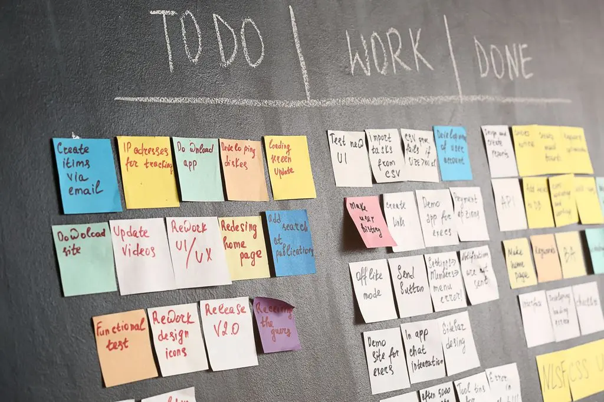

|                      |                           |                               |
| -------------------- | ------------------------- | ----------------------------- |
| **HF Systemtechnik** | **Softwareentwicklung B** |  |

# Einführung Einführung in Scrum

## Lernziele

- den Zweck von Scrum erklären
- die drei Scrum-Rollen beschreiben
- die wichtigsten Scrum-Artefakte erklären
- den Ablauf eines Sprints beschreiben
- ein einfaches Scrum-Board erstellen und verwenden

---

## Was ist Scrum?

Scrum ist eine agile Methode um ein Projekt zu managen und durchzuführen. Genauer gesagt ist Scrum ein **Framework – also Grundgerüst – zum Managen eines Prozesses**. Primär wurde Scrum in der Entwicklung von Software eingesetzt. Darüber hinaus kann und wird Scrum mittlerweile aber in den unterschiedlichsten Bereichen zum Projektmanagement genutzt – überall dort wo im Team an einem Produkt bzw. einer Dienstleistung gearbeitet wird. Ob im E-Commerce, der IT-Branche oder der agilen Hardwareentwicklung, findet agiles Projektmanagement nach Scrum mittlerweile Anwendung.

Statt, wie bisher in der klassischen Projekt- oder Produktplanung üblich, bis ins letzte Detail Vorgaben zu tätigen, **überträgt** man in Scrum viele Entscheidungen und damit einhergehend auch Verantwortung an das Team und die beteiligten Rollen. Diesem Vorgehen liegt zugrunde, dass man:

1. sich darüber bewusst ist, viel Unbekanntes vor sich zu haben und nicht jedes Problem vorhersagen zu können und
2. dem agilen Team eher zutraut aufkommende Probleme zu lösen. Aus dem selben Grund verpflichtet sich das Scrum Team im Sprint Planning Meeting zu einem Resultat für den Kunden und nicht zur Abarbeitung einer Liste von Aufgaben oder Anforderungen.


> Scrum ist eines der beliebtesten agilen Frameworks, das Teams dabei hilft, komplexe Projekte zu bewältigen, indem es die Arbeit in kleinere, iterative Zyklen, sogenannte Sprints, unterteilt

Scrum wird unter anderem von [Scrum.org](https://www.scrum.org/) verbreitet und weiterentwickelt.

[Scrum einfach erklärt](https://www.youtube.com/watch?v=4rBz9in_PsI)

**Zusammengefasst, Scrum hilft Teams:**

- komplexe Produkte zu entwickeln
- flexibel auf Änderungen zu reagieren
- kontinuierlich Fortschritte zu liefern

---

## Rollen und Verantwortlichkeiten in Scrum

Die Scrum Methode bringt klar definierte Rollen mit, die wichtig sind, um den Projekterfolg sicherzustellen. Die Rollen umfassen:

### 👤 Product Owner (PO)

- Verantwortlich für die Maximierung des **Produktwerts**
- Pflegt und priorisiert den **Product Backlog**
- Einzige Person, die Backlog-Einträge priorisiert
- Vertritt die Interessen der **Stakeholder**
- Muss verfügbar und entscheidungsfähig sein

### 🛡️ Scrum Master (SM)

- **Servant Leader** – dient dem Team, nicht umgekehrt
- Entfernt **Impediments** (Hindernisse) für das Team
- Schützt das Team vor externen Störungen
- Fördert das Verständnis und die Anwendung von Scrum
- Moderiert alle **Scrum Events**

### 💻 Developer (Entwicklungsteam)

- Setzt das Sprint Backlog um, erstellt das Increment
- **Selbstorganisierend**: Das Team entscheidet selbst, wie Arbeit erledigt wird
- **Cross-functional**: Alle nötigen Fähigkeiten im Team vorhanden
- Hält die **Definition of Done** ein
- Typisch 3–9 Personen

---

## Die Artefakte in Scrum

Neben den Scrum Rollen, sind auch die Scrum Artefakte klar definiert. Sie dienen dazu, den Fortschritt im Projekt und die Zusammenarbeit des Scrum Teams zu unterstützen. Die drei Artefakte sind das Product Backlog, das Sprint Backlog und das Produktinkrement:

| **Artefakt**        | **Beschreibung**                                                                         | **Commitment**     |
| ------------------- | ---------------------------------------------------------------------------------------- | ------------------ |
| **Product Backlog** | Geordnete Liste aller Anforderungen an das Produkt. Vom PO gepflegt und priorisiert.     | Produktziel        |
| **Sprint Backlog**  | Auswahl aus dem Product Backlog für den aktuellen Sprint + Umsetzungsplan.               | Sprint-Ziel        |
| **Increment**       | Kumuliertes, potenziell auslieferbares Produkt am Sprint-Ende. Muss der DoD entsprechen. | Definition of Done |

---

## Die fünf Scrum-Events

Neben der Struktur, die durch die Rollen und die Scrum-Artefakte gegeben wird, ist auch der Scrum-Prozess selbst durch einzelne **Ereignisse** strukturiert. Ein Scrum-Sprint umfasst verschiedene Ereignisse, die regelmäßig während eines Sprints stattfinden. 
Der Scrum-Prozess besteht aus vier Ereignissen: 

| **Event**           | **Max. Dauer** | **Zweck**                                                           |
| ------------------- | -------------- | ------------------------------------------------------------------- |
| **Sprint**          | 1–4 Wochen     | Container für alle anderen Events. Liefert ein Increment.           |
| **Sprint Planning** | 8 h            | Was wird im Sprint gemacht? Wie wird es umgesetzt?                  |
| **Daily Scrum**     | 15 Min./Tag    | Synchronisation: Was tat ich? Was tue ich? Hindernisse?             |
| **Sprint Review**   | 4 h            | Increment wird vorgestellt, Stakeholder-Feedback, Backlog angepasst |
| **Retrospektive**   | 3 h            | Team reflektiert Prozess: Was lief gut? Was verbessern wir?         |

## Der Sprint-Zyklus im Überblick

```console
Product Backlog
      │
      ▼
Sprint Planning
      │
      ▼
Sprint Backlog ──► Sprint (1–4 Wochen) ──► Increment
                        │
                        ├── Daily Scrum (täglich, 15 Min.)
                        ├── Sprint Review (Ende Sprint)
                        └── Retrospektive (Ende Sprint)
```

> 🔁 **Inspect & Adapt**: Nach jedem Sprint wird das Produkt (Review) und der Prozess (Retro) angepasst.

---

## Scrum in der Praxis

### Schätzungen mit Story Points

Story Points messen **relativen Aufwand** (nicht Zeit) und berücksichtigen Komplexität, Umfang und Risiko.

#### Fibonacci-Skala

```
1 · 2 · 3 · 5 · 8 · 13 · 21 · ?
```

- Relativ zur einfachsten Story des Teams
- **Planning Poker**: Alle schätzen gleichzeitig → Diskussion bei Abweichungen

### Das Kanban-Board

Visualisiert den Fortschritt des Sprint Backlogs:

```
┌─────────────┬─────────────┬───────────────┬─────────────┬─────────────┐
│  📋 Backlog │  🔜 To Do  │ ⚙️ In Progress│  🔍 Review  │  ✅ Done    │
├─────────────┼─────────────┼───────────────┼─────────────┼─────────────┤
│ Tasks       │ Login-      │ Task          │ Task        │ Startseite  │
│ exportieren │ Screen      │ erstellen     │ löschen     │             │
│             │ DB-Schema   │               │             │ Auth-Modul  │
└─────────────┴─────────────┴───────────────┴─────────────┴─────────────┘
```



> 💡 **Tools:** Jira, Azure DevOps, Trello, Notion oder ein physisches Whiteboard

---

## Fazit

> **Die Stärke der Scrum-Methode liegt in ihrer strikten Prozess- und Rollenstruktur sowie der Möglichkeit, kurzfristige Änderungen vorzunehmen**

---

</br>

# 2. Aufgaben

## 2.1. Smart-Pflanzenüberwachung

| **Vorgabe**             | **Beschreibung**                            |
| :---------------------- | :------------------------------------------ |
| **Lernziele**           | Studierende sollen Scrum praktisch erleben. |
| **Sozialform**          | Gruppenarbeit                               |
| **Auftrag**             | siehe unten                                 |
| **Hilfsmittel**         | A4 Papier                                   |
| **Erwartete Resultate** |                                             |
| **Zeitbedarf**          | 15 min                                      |
| **Lösungselemente**     | Scrum Board                                 |

**Auftrag:**

Teams entwickeln eine Idee für eine Smart-Pflanzenüberwachung (Arduino-Projekt).

Hardwareplattform: Arduino Uno

1. Schritt 1 – Product Backlog erstellen (5 Minuten)
   1. Teams schreiben User Stories auf Post-its.
2. Sprint Planung (5 Minuten)
   1. Teams wählen 3 User Stories für den Sprint.
   2. Dann zerlegen sie diese in Tasks.
3. Scrum Board erstellen (5 Minuten)
   1. To Do | In Progress | Done
   2. Tasks werden auf Post-its geschrieben und in die Spalten gelegt.

---


## Arduino Wetterstation

> **Projektziel:** Ihr entwickelt als Team eine **Arduino-basierte Wetterstation** über drei simulierte Sprints. Das System misst Temperatur und Luftfeuchtigkeit, zeigt die Werte auf einem Display an und gibt bei Grenzwertüberschreitung einen Alarm aus. Jeder Sprint entspricht einer Unterrichtseinheit. Alle Scrum-Events finden statt.

### Systemübersicht

```console
┌─────────────────────────────────────────────────────────┐
│                  Arduino Wetterstation                   │
│                                                         │
│  [DHT22 Sensor] ──► [Arduino Uno] ──► [LCD 16x2]        │
│  [LDR Sensor]   ──►      │       ──► [RGB LED]          │
│                          │       ──► [Buzzer]            │
│                          └───────► [Serial Monitor]      │
└─────────────────────────────────────────────────────────┘
```

### Benötigte Hardware (pro Team)

| Komponente              | Anzahl | Verwendung                        |
| ----------------------- | :----: | --------------------------------- |
| Arduino Uno (oder Nano) |   1    | Mikrocontroller                   |
| DHT22 Temperatursensor  |   1    | Temperatur & Luftfeuchtigkeit     |
| LCD Display 16×2 (I2C)  |   1    | Anzeige der Messwerte             |
| RGB LED                 |   1    | Statusanzeige (grün/gelb/rot)     |
| Buzzer (passiv)         |   1    | Alarm bei Grenzwertüberschreitung |
| LDR (Fotowiderstand)    |   1    | Helligkeit messen (Sprint 2)      |
| Widerstände 10kΩ        |   3    | Pull-down für Sensoren            |
| Breadboard + Kabel      | 1 Set  | Verkabelung                       |
| USB-Kabel               |   1    | Programmierung & Stromversorgung  |

### Technologie-Stack

| Schicht                | Technologie                                 |
| ---------------------- | ------------------------------------------- |
| Mikrocontroller        | Arduino C++ (Arduino IDE)                   |
| Bibliotheken           | `DHT.h`, `LiquidCrystal_I2C.h`              |
| Serielle Kommunikation | Arduino Serial Monitor / Python-Script      |
| Optionale Erweiterung  | Python + `pyserial` für Datenlogging auf PC |

---

## 4.2 Rollenverteilung

| Rolle                     | Person | Hauptaufgaben im Arduino-Projekt                                                              |
| ------------------------- | ------ | --------------------------------------------------------------------------------------------- |
| **Product Owner**         |        | Backlog pflegen, Akzeptanzkriterien definieren (z. B. «Sensor liest alle 2 s»), Demo abnehmen |
| **Scrum Master**          |        | Events moderieren, Impediments lösen (z. B. fehlende Bauteile), Team schützen                 |
| **Developer HW**          |        | Schaltung aufbauen, Sensoren anschliessen, Verkabelung dokumentieren                          |
| **Developer SW**          |        | Arduino-Sketch schreiben, Bibliotheken einbinden, testen                                      |
| **Developer Integration** |        | HW + SW zusammenführen, Serial-Output, optionales Python-Logging                              |

> 💡 In kleinen Teams (3 Personen) übernimmt der PO auch Entwicklungsaufgaben. Die Rollen können pro Sprint rotieren.

---

## Übung 3 · Sprint 1 – Sensor auslesen & Display anzeigen

⏱ **60 Minuten**

**Sprint-Ziel:** Der DHT22-Sensor ist angeschlossen und zeigt Temperatur & Luftfeuchtigkeit alle 2 Sekunden auf dem LCD-Display an.

**Sprint Planning (15 Min.)**
1. Wählt User Stories aus dem Product Backlog (→ Anhang A)
2. Definiert das Sprint-Ziel als Team
3. Schätzt die Stories in Story Points (Planning Poker)
4. Erstellt euren Sprint Backlog (Board: To Do / In Progress / Review / Done)

**Entwicklung (35 Min.)**
5. Führt (simuliert) einen Daily Scrum durch (3 Fragen, max. 5 Min.)
6. Dokumentiert Impediments sofort im Protokoll (z. B. «I2C-Adresse des Displays unbekannt»)
7. HW-Developer baut Schaltung auf, SW-Developer schreibt Sketch parallel

**Starter-Sketch als Ausgangsbasis:**

```cpp
#include <DHT.h>
#include <LiquidCrystal_I2C.h>

#define DHTPIN 2
#define DHTTYPE DHT22

DHT dht(DHTPIN, DHTTYPE);
LiquidCrystal_I2C lcd(0x27, 16, 2);  // I2C-Adresse ggf. anpassen

void setup() {
  Serial.begin(9600);
  dht.begin();
  lcd.init();
  lcd.backlight();
}

void loop() {
  float temp = dht.readTemperature();
  float humi = dht.readHumidity();

  lcd.setCursor(0, 0);
  lcd.print("Temp: ");
  lcd.print(temp, 1);
  lcd.print(" C");

  lcd.setCursor(0, 1);
  lcd.print("Humi: ");
  lcd.print(humi, 1);
  lcd.print(" %");

  Serial.print("T="); Serial.print(temp);
  Serial.print(" H="); Serial.println(humi);

  delay(2000);
}
```

**Sprint Review + Retrospektive (10 Min.)**
8. Live-Demo: Sensor vor Klasse auslesen, Werte auf Display zeigen
9. Retrospektive: Was lief gut? Was war das grösste Impediment (HW oder SW)?

---

### Sprint 1 – Daily Scrum Protokoll

**Sprint-Ziel:** ________________________________________________________________

**Datum:** __________________

| Person | Was tat ich gestern? | Was tue ich heute? | Impediments? |
| ------ | -------------------- | ------------------ | ------------ |
|        |                      |                    |              |
|        |                      |                    |              |
|        |                      |                    |              |
|        |                      |                    |              |

**Impediment-Log:**

| #   | Impediment | Gemeldet von | Gelöst durch | Status           |
| --- | ---------- | ------------ | ------------ | ---------------- |
| 1   |            |              |              | ☐ offen ☐ gelöst |
| 2   |            |              |              | ☐ offen ☐ gelöst |
| 3   |            |              |              | ☐ offen ☐ gelöst |

---

### Sprint 1 – Retrospektive

**Methode: Start / Stop / Continue**

| 🟢 Start (anfangen) | 🔴 Stop (aufhören) | 🔵 Continue (beibehalten) |
| ------------------ | ----------------- | ------------------------ |
|                    |                   |                          |
|                    |                   |                          |
|                    |                   |                          |

**Massnahmen für Sprint 2:**

| Massnahme | Verantwortlich | Bis wann |
| --------- | -------------- | -------- |
|           |                |          |
|           |                |          |

---

## Übung 4 · Sprint 2 – Grenzwerte, Alarm & Helligkeitsmessung

⏱ **60 Minuten**

**Sprint-Ziel:** Das System gibt bei Temperatur > 28 °C einen optischen (RGB LED) und akustischen (Buzzer) Alarm aus. Der LDR misst zusätzlich die Helligkeit.

**Zusatzaufgaben Sprint 2:**
- Sprint Planning anhand der Retro-Erkenntnisse aus Sprint 1 durchführen
- Mindestens 1 aufgetretenes Impediment dokumentieren und lösen
- **Backlog Refinement** (20 Min.): Sprint-3-Stories verfeinern und schätzen
- **Burndown-Diagramm** für den Sprint führen

**Erweiterung Sketch – Alarm-Logik:**

```cpp
#define LED_R 9
#define LED_G 10
#define LED_B 11
#define BUZZER 8
#define LDR_PIN A0

#define TEMP_WARN  25.0   // Gelb
#define TEMP_ALARM 28.0   // Rot + Buzzer

void setStatus(float temp) {
  if (temp >= TEMP_ALARM) {
    // Rot + Buzzer
    analogWrite(LED_R, 255); analogWrite(LED_G, 0); analogWrite(LED_B, 0);
    tone(BUZZER, 1000, 500);
  } else if (temp >= TEMP_WARN) {
    // Gelb
    analogWrite(LED_R, 255); analogWrite(LED_G, 80); analogWrite(LED_B, 0);
    noTone(BUZZER);
  } else {
    // Grün – alles OK
    analogWrite(LED_R, 0); analogWrite(LED_G, 255); analogWrite(LED_B, 0);
    noTone(BUZZER);
  }
}

// Im loop() ergänzen:
// int licht = analogRead(LDR_PIN);
// setStatus(temp);
```

### Burndown-Diagramm Sprint 2

Tragt täglich den verbleibenden Aufwand in Story Points ein:

```
SP
│
30 │ ×
   │    \  (Ideallinie)
20 │     \
   │      \
10 │       \
   │        \
 0 └──────────────────────────
   Tag 1  Tag 2  Tag 3  Tag 4  Tag 5
```

| Tag | Geplante SP (Ideal) | Tatsächliche Rest-SP |
| --- | ------------------: | -------------------: |
| 1   |                     |                      |
| 2   |                     |                      |
| 3   |                     |                      |
| 4   |                     |                      |
| 5   |                     |                      |

---

## Übung 5 · Sprint 3 – Datenlogging, Kalibrierung & Präsentation

⏱ **60 Minuten**

**Sprint-Ziel:** Das System loggt Messwerte über die serielle Schnittstelle. Ein Python-Script liest die Daten aus und zeigt sie als Verlaufsgraph an. Präsentation der Wetterstation vor der Klasse.

**Lieferobjekte Sprint 3:**
- Vollständig funktionierende Wetterstation (Demo live vor der Klasse)
- Python-Script für serielles Datenlogging (optional als Erweiterung)
- Schaltplan (Fritzing oder handgezeichnet, fotografiert)
- Sprint Review: 5-minütige Live-Demo mit Erklärung der Architektur
- Abschlussdiskussion: Was würdet ihr beim nächsten Hardware-Scrum-Projekt anders machen?

**Optionale Erweiterung – Python Serial Logger:**

```python
import serial
import csv
from datetime import datetime

PORT = "COM3"       # Windows: COM3, macOS/Linux: /dev/ttyUSB0
BAUD = 9600

with serial.Serial(PORT, BAUD, timeout=1) as ser:
    with open("messwerte.csv", "w", newline="") as f:
        writer = csv.writer(f)
        writer.writerow(["Zeitstempel", "Temperatur", "Luftfeuchtigkeit"])
        print("Logging gestartet – CTRL+C zum Beenden")
        while True:
            line = ser.readline().decode("utf-8").strip()
            # Erwartet Format: "T=23.5 H=55.2"
            if line.startswith("T="):
                parts = line.replace("T=","").replace("H=","").split()
                row = [datetime.now().isoformat()] + parts
                writer.writerow(row)
                print(row)
```

**Definition of Done – Arduino Wetterstation:**
- ✅ DHT22 liest Temperatur und Luftfeuchtigkeit alle 2 Sekunden korrekt aus
- ✅ LCD zeigt beide Werte formatiert an
- ✅ RGB LED zeigt korrekten Status (grün / gelb / rot)
- ✅ Buzzer löst bei Temperatur > 28 °C aus
- ✅ Serielle Ausgabe im Format `T=xx.x H=xx.x`
- ✅ Schaltplan vorhanden und korrekt
- ✅ Code kommentiert und im Team-Repository eingecheckt
- ✅ Live-Demo vor der Klasse erfolgreich durchgeführt

**Bewertungskriterien:**

| Kriterium                                                         | Gewichtung |
| ----------------------------------------------------------------- | ---------- |
| Einhaltung des Scrum-Frameworks (Rollen, Events, Artefakte)       | 25 %       |
| Funktionierende Hardware (Definition of Done)                     | 30 %       |
| Qualität der Dokumentation (User Stories, Schaltplan, Protokolle) | 20 %       |
| Teamarbeit und Selbstorganisation                                 | 15 %       |
| Präsentation und Reflexion                                        | 10 %       |
