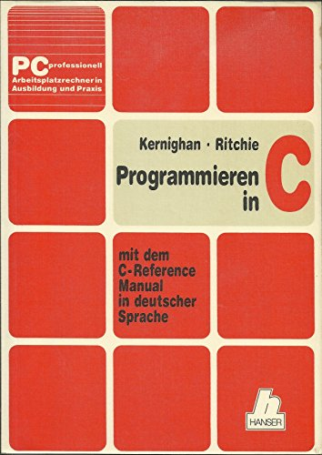

|                      |                           |                               |
| -------------------- | ------------------------- | ----------------------------- |
| **HF Systemtechnik** | **Softwareentwicklung B** |  |

- [1. Einführung \& Installation](#1-einführung--installation)
  - [1.1. Entstehung von C](#11-entstehung-von-c)
  - [1.2. Einsatzgebiete](#12-einsatzgebiete)
  - [1.3. Standardisierung](#13-standardisierung)
  - [1.4. Basiskomponenten der C-Programmiersprache](#14-basiskomponenten-der-c-programmiersprache)
  - [1.5. Warum lernen wir C?](#15-warum-lernen-wir-c)
  - [1.6. Der Arduino-Mikrocontroller](#16-der-arduino-mikrocontroller)
  - [1.7. Installation der Arduino IDE](#17-installation-der-arduino-ide)
    - [1.7.1. Schritt-für-Schritt Installation (Windows)](#171-schritt-für-schritt-installation-windows)
  - [1.8. Aufbau der Arduino IDE](#18-aufbau-der-arduino-ide)
  - [1.9. Das erste Programm: Blink](#19-das-erste-programm-blink)
- [2. Aufgaben](#2-aufgaben)
  - [2.1. Installation und erstes Programm](#21-installation-und-erstes-programm)

---

# 1. Einführung & Installation

**Lernziele:** Nach diesem Modul können die Studierenden die Arduino IDE installieren, ein erstes Programm auf den Arduino laden und die grundlegende Entwicklungsumgebung bedienen.

---

## 1.1. Entstehung von C

- Die Programmiersprache C wurde Anfang der 1970er Jahre von **Dennis Ritchie** am **Bell Telephone Laboratories (heute Bell Labs)** entwickelt.
- - Ihr Ursprung liegt in der Arbeit an dem Betriebssystem **UNIX**, das ursprünglich in der Assemblersprache geschrieben war.
- Die Entwickler suchten eine **effizientere**, aber dennoch maschinennahe Sprache, die sowohl **leistungsstark** als auch **portabel** war.

**Zusammenfassung der Merkmale:**

- Hohe Sprachexpressivität
- Sprachkonstrukte wie `while`, `if` etc.
- Sprechende Bezeichner (Variablen)
- Effiziente Programmierung einfachere Fehlersuche
- Portable und maschinenunabhängig

- **C** wurde in den **1970er** und **1980er** Jahren extrem populär, insbesondere durch die Veröffentlichung des Buches "The C Programming Language" (1978) von **Brian W. Kernighan** und **Dennis M. Ritchie** – oft einfach als **"K&R C"** bezeichnet.
- Dieses Buch setzte Massstäbe und prägte die frühe C-Programmierung massgeblich.



Später wurde C durch den **ANSI-Standard (ANSI C)** 1989 offiziell standardisiert, was ihre Definition und Kompatibilität zwischen verschiedenen Compilern sicherte.


---

## 1.2. Einsatzgebiete

- Von Anfang an war das Haupteinsatzgebiet von C die **Systemprogrammierung**.
- Es kommt bei den zu entwickelnden Programmen besonders auf **Geschwindigkeit** und einen **kompakten Programmcode** an.
- Ausserdem soll die **Hardware** besonders effektiv angesprochen werden können

**Einsatzbereiche:**

- Steuergeräte
- Lift
- Flugzeug
- Kaffeemaschine
- Auto
- etc.

---

## 1.3. Standardisierung

| **Standard** | **Bemerkung**                                                                                                                                                                                                                                                                                          |
| ------------ | ------------------------------------------------------------------------------------------------------------------------------------------------------------------------------------------------------------------------------------------------------------------------------------------------------ |
| **K&R-C**    | Diese Version basiert hauptsächlich auf dem ersten Buch zu C von den beiden Autoren Kernighan und Ritchie von 1978.                                                                                                                                                                                    |
| **C89**      | Die erste echte Standardisierung erfolgte über das American National Standards Institute (ANSI) im Jahre 1989.                                                                                                                                                                                         |
| **C90**      | Ein Jahr nach dem Erscheinen des 1. Standards wurden kleine Änderungen hinzugefügt und die ISO-Norm C90 definiert. </br> Sie ist Basis vieler heutiger C-Implementierungen. Die wichtigsten Verbesserungen waren die Einführung von Funktionsprototypen sowie die Normierung der C-Standardbibliothek. |
| **C95**      | 1995 wurden in einem neuen Standard Fehlerbehebungen, einige neue Makros sowie die Unterstützung weiterer Zeichensätze zusammengefasst. </br> Obwohl dieser Standard schon relativ alt ist, wird er selten von den gängigen Compilern vollständig implementiert.                                       |
| **C99**      | Über die Jahre wurden einige häufig vermisste Sprachkonstrukte und Schreibweisen anderer Sprachen hinzugefügt wie der </br> Datentyp _Bool, der einzeilige C++- Zeilenkommentator "//" oder die Möglichkeit, Variablen direkt in einer for-Schleife zu definieren.                                     |
| **C11**      | Ende 2011 wurde der aktuelle C11-Standard verabschiedet. </br> Er enthält Korrekturen der Vorversion und Neuerungen wie beispielsweise Unterstützung von Multithreading, neue Datentypen und generische Ausdrücke.                                                                                     |

---

## 1.4. Basiskomponenten der C-Programmiersprache

| **Komponenten**           | **Syntax**                        | **Beschreibung**                                                                                                                                                                                                                                                                                 |
| ------------------------- | --------------------------------- | ------------------------------------------------------------------------------------------------------------------------------------------------------------------------------------------------------------------------------------------------------------------------------------------------ |
| **Präprozessor**          | **`#`** </br>`#include, #define`  | Präprozessoranweisung können als Textersatz immer wieder verwendet warden. </br> z.B: `#include` wird verwendet um Header-Dateien in C einzufügen. </br> `#include <stdio.h>` enthält Funktionen für Ein- u. Ausgabe `scanf` und `printf` `#define` definiert Makros und Konstanten (Textersatz) |
| **Einstiegspunkt**        | **`main()`** </br> **`{ }`**      | **Startpunkt** der Ausführung – das erste, was beim Starten des Programms ausgeführt wird.                                                                                                                                                                                                       |
| **Variablen**             | **`int c=1;`**                    | **Variablendefinition** enthält eine Grösse und einen Datentyp und einen Wert. z.B. Integer-Variable mit Wert 1                                                                                                                                                                                  |
| **Funktionen**            | **`void test()`** </br> **`{ }`** | **Funktion**, welche immer wieder verwendet werden können                                                                                                                                                                                                                                        |
| **Bibliotheksfunktionen** | **`printf("Hallo")`**             | Funktionen der **Standard-Library** ANSI-C                                                                                                                                                                                                                                                       |

---

## 1.5. Warum lernen wir C?

C ist eine der wichtigsten und einflussreichsten Programmiersprachen der Geschichte. Entwickelt in den frühen 1970er-Jahren von Dennis Ritchie bei Bell Labs, bildet C die Grundlage für viele moderne Programmiersprachen – darunter C++, C#, Java und Go.

> 💡 **Warum C mit Arduino?**
>
> - **Hardware-nah:** C gibt uns direkte Kontrolle über Speicher und Hardware
> - **Ressourcenschonend:** Der Arduino Uno hat nur 2 KB RAM und 32 KB Flash – C ist sehr effizient
> - **Grundlage:** Wer C versteht, versteht die Basis aller modernen Sprachen
> - **Praxisrelevant:** Embedded Systems, Mikrocontroller und IoT-Geräte laufen fast alle auf C/C++

---

## 1.6. Der Arduino-Mikrocontroller

Arduino ist eine Open-Source-Elektronikplattform, die aus einem Mikrocontroller-Board und einer integrierten Entwicklungsumgebung (IDE) besteht. Im Lehrgang verwenden wir den **Arduino Uno** als Einstiegsplattform.

| **Eigenschaft**   | **Arduino Uno Spezifikation**              |
| ----------------- | ------------------------------------------ |
| Mikrocontroller   | ATmega328P (8-Bit, AVR)                    |
| Taktfrequenz      | 16 MHz                                     |
| Flash-Speicher    | 32 KB (0.5 KB für Bootloader)              |
| SRAM              | 2 KB                                       |
| EEPROM            | 1 KB                                       |
| Digitale I/O Pins | 14 (davon 6 PWM-fähig)                     |
| Analoge Eingänge  | 6 (10-Bit ADC, 0–1023)                     |
| Betriebsspannung  | 5V                                         |
| USB-Verbindung    | USB-B (Programmierung und Stromversorgung) |

---

## 1.7. Installation der Arduino IDE

Die Arduino IDE ist kostenlos und unterstützt Windows, macOS und Linux. Download unter: **arduino.cc/en/software**

### 1.7.1. Schritt-für-Schritt Installation (Windows)

1. Browser öffnen und `arduino.cc/en/software` besuchen
2. **Arduino IDE 2.x** herunterladen (Windows Installer `.exe`)
3. Installer als Administrator ausführen
4. Alle Standardoptionen bestätigen – **wichtig: USB-Treiber mitinstallieren!**
5. Nach der Installation: Arduino IDE starten
6. Arduino Uno per USB verbinden
7. **Tools → Board → "Arduino AVR Boards" → "Arduino Uno"** auswählen
8. **Tools → Port → COM-Port des Arduino** auswählen (z. B. COM3)

> ⚠️ **Port finden:**  
> **Windows:** Geräte-Manager → Anschlüsse (COM & LPT) → Arduino erscheint als „USB Serial Device"  
> **Linux/macOS:** `/dev/ttyACM0` oder `/dev/tty.usbmodem...` auswählen

---

## 1.8. Aufbau der Arduino IDE

Die IDE besteht aus folgenden Bereichen:

- **Toolbar:** Schaltflächen für Verifizieren (✓), Hochladen (→), Serial Monitor
- **Sketch-Bereich:** Hier wird der Code geschrieben
- **Ausgabebereich:** Compiler-Meldungen und Fehler werden hier angezeigt
- **Serial Monitor** (`Strg+Shift+M`): Kommunikation mit dem Arduino über USB (für Debugging)

---

## 1.9. Das erste Programm: Blink

Jedes Arduino-Programm (genannt "**Sketch**") hat **zwei Pflichtfunktionen**: **`setup()`** und **`loop()`**.

```c
// Erstes Arduino-Programm: LED blinken lassen
// Der Kommentar mit // gilt für eine Zeile

/* Mehrzeiliger Kommentar:
   setup() wird einmal beim Start ausgeführt.
   loop() wird danach endlos wiederholt. */

void setup() {
    // LED_BUILTIN ist Pin 13 (eingebaute LED auf dem Board)
    pinMode(LED_BUILTIN, OUTPUT);  // Pin als Ausgang konfigurieren
}

void loop() {
    digitalWrite(LED_BUILTIN, HIGH);  // LED einschalten (5V)
    delay(1000);                       // 1000 ms = 1 Sekunde warten
    digitalWrite(LED_BUILTIN, LOW);   // LED ausschalten (0V)
    delay(1000);                       // 1 Sekunde warten
}
```

Dieser **Sketch** lässt die eingebaute **LED (Pin 13)** im Sekundentakt blinken. Code mit dem **Häkchen-Button** verifizieren, dann mit dem **Pfeil-Button** hochladen.

---

</br>

# 2. Aufgaben

## 2.1. Installation und erstes Programm

| **Vorgabe**         | **Beschreibung**                                                  |
| :------------------ | :---------------------------------------------------------------- |
| **Lernziele**       | Arduino IDE ist installiert und kann bedient werden               |
|                     | Syntax u. Semantik eines C-Programmes sind bekannt                |
|                     | Kennen die Schritte und Werkzeuge zur Programmerstellung (Sketch) |
| **Sozialform**      | Einzelarbeit                                                      |
| **Auftrag**         | siehe unten                                                       |
| **Hilfsmittel**     |                                                                   |
| **Zeitbedarf**      | 60min                                                             |
| **Lösungselemente** | Funktionierendes Sketch                                           |

**Lernziel:** Arduino IDE einrichten, ersten Sketch hochladen und erste Modifikationen vornehmen.

1. Installieren Sie die Arduino **IDE**. Verbinden Sie den Arduino Uno per USB.
2. Öffnen Sie den Beispiel-Sketch: **Datei → Beispiele → 01.Basics → Blink**
3. Wählen Sie Board und Port korrekt aus. Laden Sie den Sketch hoch.
4. Beobachten Sie das Blinken der LED. Was passiert, wenn Sie `1000` in `delay()` auf `200` ändern?
5. **Bonus:** Lassen Sie die LED dreimal kurz blinken, dann einmal lang (Morsecode `S` = `···`).

© 2026 Lukas Müller – Licensed under CC BY-NC-ND 4.0
See [LICENSE](..\license.md) file for details.
