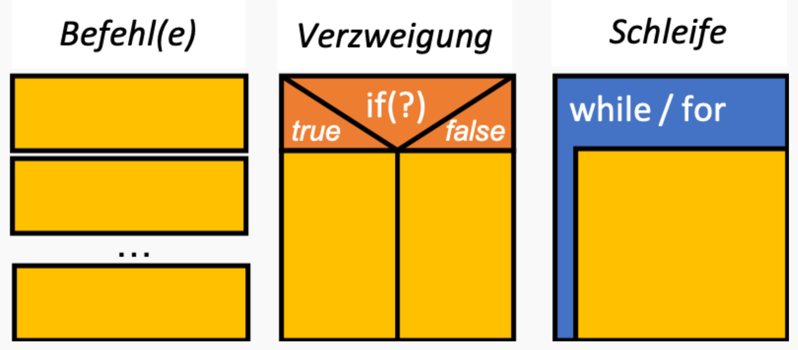
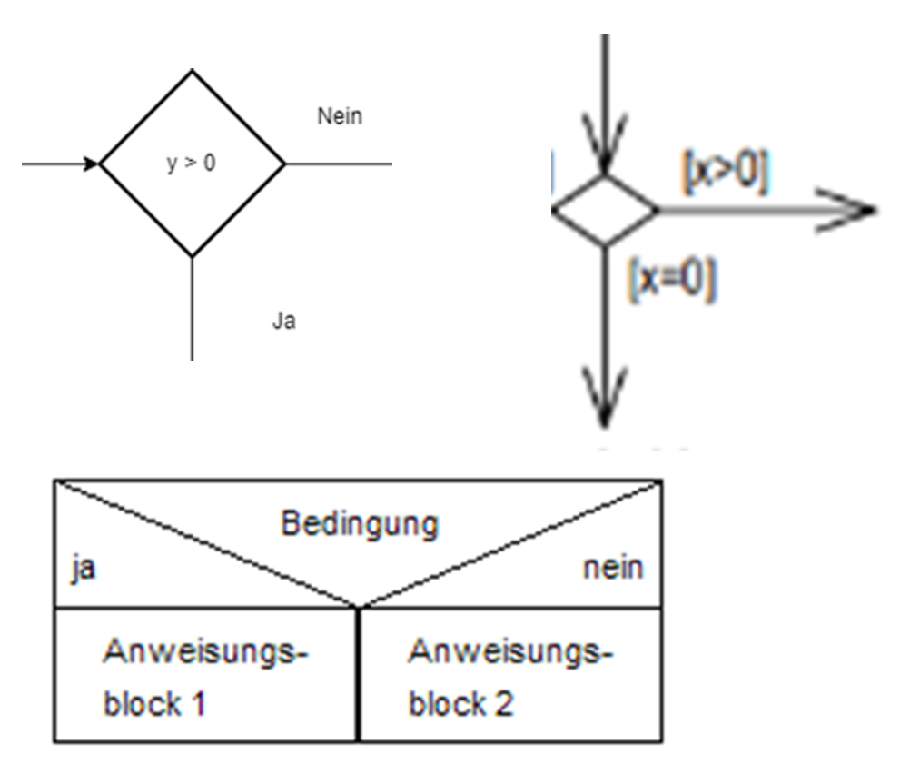
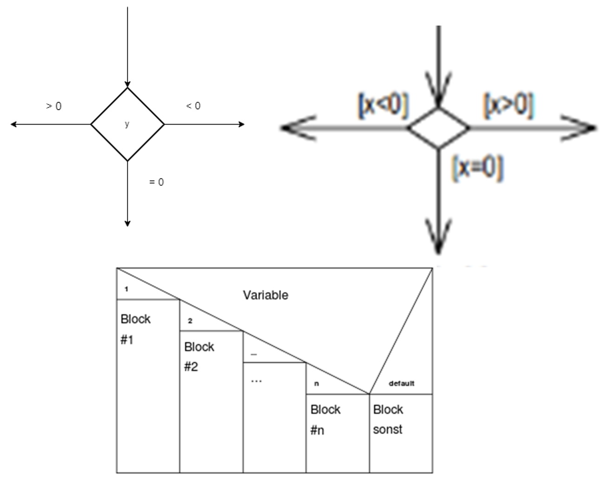
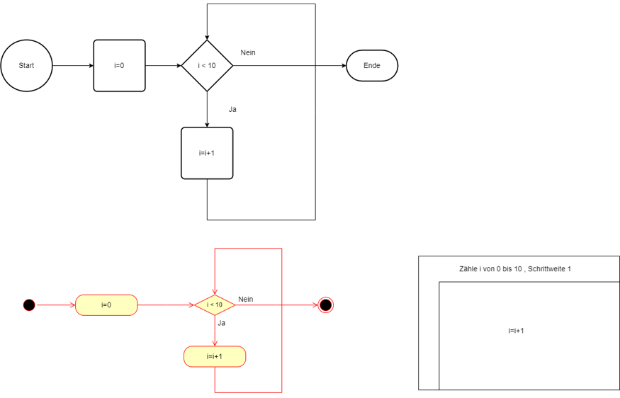
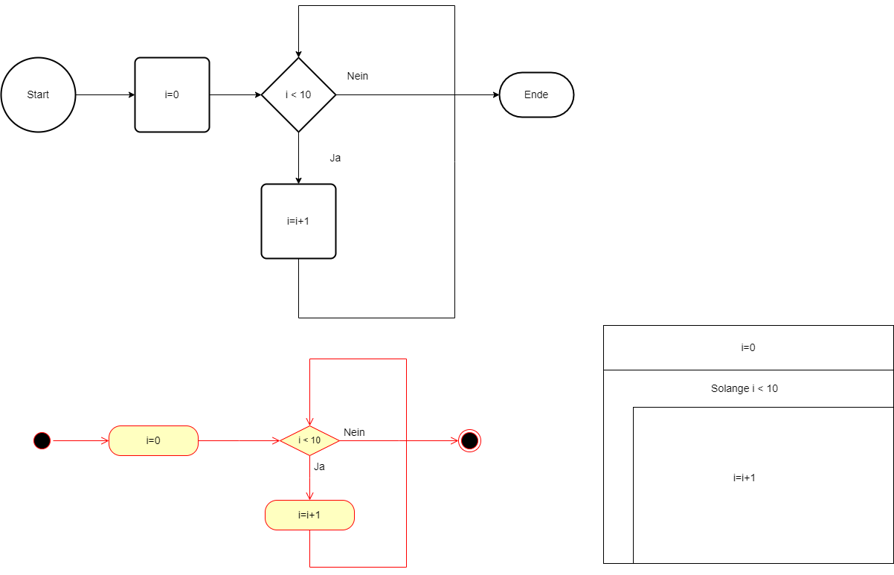
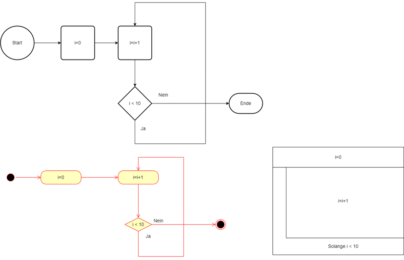

|                      |                           |                               |
| -------------------- | ------------------------- | ----------------------------- |
| **HF Systemtechnik** | **Softwareentwicklung B** |  |

- [1. Programmflusssteuerung](#1-programmflusssteuerung)
  - [1.1. Übersicht](#11-übersicht)
  - [1.2. Vergleichsoperatoren und logische Operatoren](#12-vergleichsoperatoren-und-logische-operatoren)
  - [1.3. Sequenz (Sequentielle Ausführung)](#13-sequenz-sequentielle-ausführung)
  - [1.4. if / else if / else](#14-if--else-if--else)
  - [1.5. switch / case](#15-switch--case)
  - [1.6. for-Schleife](#16-for-schleife)
  - [1.7. while-Schleife und do-while](#17-while-schleife-und-do-while)
  - [1.8. break und continue](#18-break-und-continue)
- [2. Aufgaben](#2-aufgaben)
  - [2.1. Ampel-Steuerung](#21-ampel-steuerung)

---

</br>

# 1. Programmflusssteuerung

**Lernziele:** Die Studierenden beherrschen Verzweigungen (`if`/`else`, `switch`) und Schleifen (`for`, `while`, `do-while`) und können komplexe Bedingungen formulieren.

## 1.1. Übersicht

- **Sequenz:**
  - Der Code wird in der Reihenfolge ausgeführt, wie er geschrieben ist.
- **Verzweigung**:
  - Mit **`if`**- und **`switch`**-Anweisungen können Sie Entscheidungen treffen, die den Fluss des Programms ändern.
- **Wiederholung:**
  - Schleifen wie **`for`**, **`while`** und **`do-while`** ermöglichen es, Codeblöcke basierend auf einer Bedingung mehrmals auszuführen.
- **Schleifensteuerung:**
  - Mit **`break`** und **`continue`** können Schleifen kontrolliert werden.



---

## 1.2. Vergleichsoperatoren und logische Operatoren

| **Operator**  | **Bedeutung**                   | **Beispiel**              |
| ------------- | ------------------------------- | ------------------------- |
| `==`          | Gleich                          | `if (x == 5)`             |
| `!=`          | Ungleich                        | `if (x != 0)`             |
| `<` und `>`   | Kleiner / Grösser               | `if (temp < 30.0)`        |
| `<=` und `>=` | Kleiner-gleich / Grösser-gleich | `if (i <= 100)`           |
| `&&`          | Logisches UND                   | `if (x > 0 && x < 100)`   |
| `\|\|`        | Logisches ODER                  | `if (x < 0 \|\| x > 100)` |
| `!`           | Logisches NICHT                 | `if (!istAn)`             |

> ⚠️ **Häufiger Fehler:** `=` (Zuweisung) statt `==` (Vergleich)!  
> `if (x = 5)` setzt x auf 5 und ist immer wahr. `if (x == 5)` vergleicht.

---

## 1.3. Sequenz (Sequentielle Ausführung)

- Die einfachste Ablaufstruktur in C ist die **Sequenz**, bei der die Befehle einfach nacheinander ausgeführt werden.
- Dies entspricht dem Standardablauf, bei dem eine Anweisung die nächste folgt.

```c
void setup() {
    int a = 5;
    int b = 10;
    
    // Diese Anweisungen werden sequenziell ausgeführt
    int sum = a + b;  // Addition
    printf("Summe: %d\n", sum);  // Ausgabe
    
    return 0;
}
```

- Zuerst wird `a` und `b` deklariert und mit Werten initialisiert.
- Dann wird die `Summe` berechnet und das Ergebnis ausgegeben.
- Die Ausführung folgt dem Code strikt von oben nach unten ohne Abzweigungen.

---

## 1.4. if / else if / else

- Mit einer **Verzweigung** können Sie den Ablauf des Programms basierend auf einer Bedingung ändern.
- In C gibt es zwei Hauptstrukturen für Verzweigungen: **if**-Bedingungen und **switch**-Anweisungen.
- Die **`if`**-Anweisung erlaubt es, Bedingungen zu prüfen und nur dann bestimmte Aktionen auszuführen, wenn die Bedingung wahr ist.
- Es gibt auch die Möglichkeit, eine **`else`**-Bedingung hinzuzufügen.



```c
float temperatur = analogRead(A0) * (5.0 / 1023.0) * 100.0;

if (temperatur < 0) {
    Serial.println("Frost! Heizung einschalten.");
    digitalWrite(HEIZUNG_PIN, HIGH);
} else if (temperatur >= 0 && temperatur < 20) {
    Serial.println("Kuehl. Normal-Betrieb.");
    digitalWrite(HEIZUNG_PIN, LOW);
} else if (temperatur >= 20 && temperatur < 35) {
    Serial.println("Angenehm.");
} else {
    Serial.println("WARNUNG: Zu heiss!");
    digitalWrite(ALARM_PIN, HIGH);
}

// Ternärer Operator (Kurzform für einfache Bedingungen):
int led = (temperatur > 25) ? HIGH : LOW;
digitalWrite(LED_PIN, led);
```

---

## 1.5. switch / case

- Ein **`switch`**-Statement wird verwendet, wenn mehrere Bedingungen auf denselben Wert überprüft werden sollen.
- Der switch-Block prüft den Wert von zahl und führt den entsprechenden **`case`**-Block aus.
- Der **`break`**-Befehl stellt sicher, dass das Programm den switch-Block nach Ausführung eines case verlässt.
- Der default-Block wird ausgeführt, wenn kein **`case`** zutrifft.
- Es bietet eine elegantere Möglichkeit, **viele if-Anweisungen zu ersetzen**.
- Wenn eine Variable mehrere **diskrete Werte** annehmen kann, ist `switch/case` übersichtlicher:



```c
int modus = 2;

switch (modus) {
    case 1:
        Serial.println("Modus 1: Langsames Blinken");
        break;   // Verlässt den switch-Block
    case 2:
        Serial.println("Modus 2: Normales Blinken");
        break;
    case 3:
        Serial.println("Modus 3: Schnelles Blinken");
        break;
    default:     // Wenn kein case zutrifft:
        Serial.println("Unbekannter Modus!");
        break;
}
```

> 💡 **Fallthrough:** Fehlendes `break` lässt die Ausführung in den nächsten `case` fallen. Kann bewusst eingesetzt werden, ist aber oft ein Bug!

---

## 1.6. for-Schleife

- Schleifen erlauben es, einen Codeblock wiederholt auszuführen, solange eine Bedingung erfüllt ist.
- In C gibt es drei Haupttypen von Schleifen: **`for`**, **`while`** und **`do-while`**.

- Die **`for`**-Schleife ist ideal, wenn die Anzahl der Wiederholungen im Voraus bekannt ist.
- Die Schleife startet mit `i = 1` und wird fortgesetzt, solange `i` kleiner oder gleich `5` ist.
- Nach jedem Durchgang wird i um 1 erhöht.



```c
// Grundstruktur: for (Initialisierung; Bedingung; Schrittweite)
for (int i = 0; i < 10; i++) {
    Serial.println(i);  // Gibt 0 bis 9 aus
}

// Rückwärts zählen:
for (int i = 10; i >= 0; i--) {
    Serial.print(i);
    Serial.print(" ");
}

// Alle Digital-Pins 2–13 als Ausgang konfigurieren:
for (int pin = 2; pin <= 13; pin++) {
    pinMode(pin, OUTPUT);
    digitalWrite(pin, LOW);
}

// LED-Helligkeit graduell steigern (PWM, Pin 9):
for (int hell = 0; hell <= 255; hell += 5) {
    analogWrite(9, hell);
    delay(20);
}

// Danach wieder dimmen:
for (int hell = 255; hell >= 0; hell -= 5) {
    analogWrite(9, hell);
    delay(20);
}
```

---

## 1.7. while-Schleife und do-while

- Die **`while`**-Schleife wird verwendet, wenn die Anzahl der Wiederholungen **nicht im Voraus bekannt ist**, sondern auf einer Bedingung basiert, die zu Beginn jedes Durchgangs überprüft wird.
- Solange `count` kleiner `5` ist, wird der Codeblock wiederholt ausgeführt.
- `count++` erhöht den Wert von `i` nach jedem Durchgang.



```c
// while: Bedingung wird VOR dem Schleifendurchgang geprüft
int count = 0;
while (count < 5) {
    Serial.println(count);
    count++;
}
// → Schleife wird 0 Mal ausgeführt, wenn Bedingung von Anfang an falsch ist

// Warten, bis Taster gedrückt wird (Pin 2 mit Pull-up):
while (digitalRead(2) == HIGH) {
    // Nichts tun, warten...
}
Serial.println("Taster wurde gedrueckt!");
```



```c
// do-while: Schleifenkörper wird MINDESTENS EINMAL ausgeführt
int eingabe;
do {
    eingabe = analogRead(A0);
    Serial.println(eingabe);
    delay(100);
} while (eingabe < 512);   // Wiederholen, solange Wert unter 512
Serial.println("Schwellwert erreicht!");
```

---

## 1.8. break und continue

- In C können Sie die Ausführung von Schleifen mit den Anweisungen **`break`** und **`continue`** steuern.
- Die **`break`**-Anweisung beendet sofort die Schleife oder den `switch`-Block und fährt mit dem Code fort, der nach der Schleife kommt.
- Die **`continue`**-Anweisung überspringt den aktuellen Durchgang der Schleife und fährt mit der nächsten Iteration fort.

```c
// break: Schleife sofort verlassen
for (int i = 0; i < 100; i++) {
    if (digitalRead(2) == LOW) {    // Wenn Taster gedrückt:
        Serial.println("Abgebrochen!");
        break;                       // Schleife sofort verlassen
    }
    delay(100);
}

// continue: Aktuellen Durchgang überspringen, mit nächstem fortfahren
for (int i = 0; i < 10; i++) {
    if (i % 2 == 0) {   // Wenn gerade Zahl:
        continue;        // Rest des Schleifenkörpers überspringen
    }
    Serial.println(i);  // Nur ungerade Zahlen: 1, 3, 5, 7, 9
}
```

---

</br>

# 2. Aufgaben

## 2.1. Ampel-Steuerung

| **Vorgabe**         | **Beschreibung**                                                                 |
| :------------------ | :------------------------------------------------------------------------------- |
| **Lernziele**       | Verzweigungen und Schleifen praxisnah in einem realen Steuerungsprojekt anwenden |
| **Sozialform**      | Einzelarbeit                                                                     |
| **Auftrag**         | siehe unten                                                                      |
| **Hilfsmittel**     |                                                                                  |
| **Zeitbedarf**      | 40min                                                                            |
| **Lösungselemente** | Vollständiges Sketch                                                             |

**Hardware:** 3 LEDs (rot, gelb, grün) mit 220-Ω-Widerständen an Pins 10, 11, 12. Taster an Pin 2 (mit `INPUT_PULLUP`).

1. Bauen Sie eine Ampel: **Rot** (5 s) → **Rot+Gelb** (1 s) → **Grün** (4 s) → **Gelb** (1 s) → **Rot**.
   1. Verwenden Sie `digitalWrite()` und `delay()`.
2. Erweitern Sie: Nach **3 vollständigen Zyklen** wechselt die Ampel in den Nacht-Modus (Gelb blinkt endlos).
   1. Verwenden Sie eine `for`-Schleife für die Zyklen und `while(true)` für den Nachtmodus.
3. **Fussgänger-Ampel:** Wenn der Taster gedrückt wird, soll nach der aktuellen Rot-Phase sofort Grün geschaltet werden.
   1. Tipp: `if (digitalRead(2) == LOW)` innerhalb der Delay-Phasen prüfen.
4. **Bonus:** Implementieren Sie einen Countdown im Serial Monitor für jede Ampelphase (von N bis 0).

© 2026 Lukas Müller – Licensed under CC BY-NC-ND 4.0
See [LICENSE](..\license.md) file for details.
