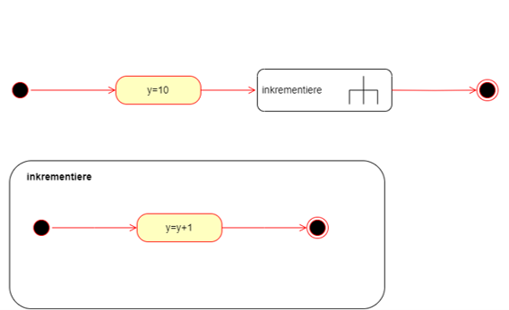
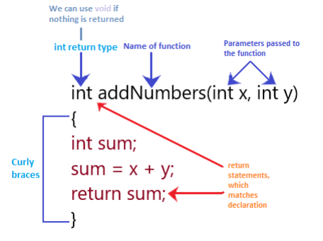

|                      |                           |                               |
| -------------------- | ------------------------- | ----------------------------- |
| **HF Systemtechnik** | **Softwareentwicklung B** |  |

- [1. Funktionen](#1-funktionen)
  - [1.1. Warum Funktionen?](#11-warum-funktionen)
  - [1.2. Funktionsdefinition](#12-funktionsdefinition)
  - [1.3. Funktionsaufruf](#13-funktionsaufruf)
  - [1.4. Funktionsdefinition und -aufruf](#14-funktionsdefinition-und--aufruf)
  - [1.5. Rückgabewert einer Funktion](#15-rückgabewert-einer-funktion)
  - [1.6. Funktionen ohne Rückgabewert (`void` Funktionen)](#16-funktionen-ohne-rückgabewert-void-funktionen)
  - [1.7. Übergabe von Parametern an Funktionen](#17-übergabe-von-parametern-an-funktionen)
    - [1.7.1. Pass-by-Value](#171-pass-by-value)
    - [1.8. Parameter: Call by Value](#18-parameter-call-by-value)
    - [1.9. Standardwerte für Parameter (C++ Feature)](#19-standardwerte-für-parameter-c-feature)
  - [1.10. Variablenbereich (Scope)](#110-variablenbereich-scope)
  - [1.11. Standardbibliotheken und Funktionen](#111-standardbibliotheken-und-funktionen)
  - [1.12. Praktisches Beispiel: Sensorauswertung](#112-praktisches-beispiel-sensorauswertung)
- [2. Aufgaben](#2-aufgaben)
  - [2.1. Funktions-Bibliothek für LEDs](#21-funktions-bibliothek-für-leds)

---

# 1. Funktionen

**Lernziele:** Die Studierenden können eigene Funktionen mit Parametern und Rückgabewerten definieren und aufrufen. Sie verstehen das DRY-Prinzip und können Code strukturieren.

---

## 1.1. Warum Funktionen?

- **Funktionen** sind ein zentraler Bestandteil der C-Programmierung, da sie es ermöglichen, Code zu **modularisieren** und zu **strukturieren**.
- Eine **Funktion** in C ist ein Block von Code, der eine **bestimmte Aufgabe ausführt**.
- **Funktionen** in C bieten eine Möglichkeit zur **Wiederverwendbarkeit** von Code.
- Eine **Funktion** hat immer einen **Rückgabetyp**, einen **Namen** und ggf. **Parameter**.
- Funktionen machen Code: **übersichtlicher, wiederverwendbar, leichter testbar** und einfacher zu warten.  
- **Faustregel:** Jede Funktion sollte **eine Aufgabe** erledigen (Single Responsibility Principle).

> **Wenn Sie denselben Code mehrmals schreiben müssen, ist es Zeit für eine Funktion.**  
> 💡 **DRY – Don't Repeat Yourself**  



---

## 1.2. Funktionsdefinition

- Eine Funktion wird durch ihre **Signatur** und **Implementierung** definiert.
- Die Signatur umfasst den **Rückgabetyp** der Funktion, ihren **Namen** und die **Parameter** (Eingabewerte).

**Syntax der Funktionsdefinition:**



```c
Rückgabetyp Funktionsname(Parameter1, Parameter2, ...) {
    // Funktionskörper
}
```

- **Rückgabetyp:**
  - Gibt an, welchen Typ von Wert die Funktion zurückgibt (z. B. `int`, `float`, `void` für keine Rückgabe).
- **Funktionsname:**
  - Der Name der Funktion, der verwendet wird, um sie aufzurufen.
- **Parameter:**
  - Die Werte, die an die Funktion übergeben werden (optional).

---

## 1.3. Funktionsaufruf

- Ein Funktionsaufruf erfolgt durch den Funktionsnamen und Übergabe der Argumente (falls vorhanden).

**Syntax des Funktionsaufrufs:**

```c
Funktionsname(Argument1, Argument2, ...);
```

**Beispiel eines Funktionsaufrufs:**

```c
int ergebnis = addiere(5, 3);
```

---

## 1.4. Funktionsdefinition und -aufruf

```c
// Syntax:
// Rueckgabetyp Funktionsname(Typ Parameter1, Typ Parameter2) { ... }

// Funktion ohne Rückgabewert (void) und ohne Parameter:
void begruessung() {
    Serial.println("Hallo!");
}

// Funktion mit Parametern:
void blinken(int anzahl, int pauseMs) {
    for (int i = 0; i < anzahl; i++) {
        digitalWrite(LED_BUILTIN, HIGH);
        delay(pauseMs);
        digitalWrite(LED_BUILTIN, LOW);
        delay(pauseMs);
    }
}

// Funktion mit Rückgabewert:
float fahrenheitZuCelsius(float fahrenheit) {
    return (fahrenheit - 32.0) * 5.0 / 9.0;
}

// Funktion mit bool-Rückgabe:
bool istTasterGedrueckt(int pin) {
    return digitalRead(pin) == LOW;
}

// ─── Verwendung ───────────────────────────────────────────────────
void setup() {
    Serial.begin(9600);
    pinMode(LED_BUILTIN, OUTPUT);
}

void loop() {
    begruessung();           // Kein Argument nötig
    blinken(3, 200);         // 3x blinken, 200 ms Pause
    blinken(1, 1000);        // 1x blinken, 1 s Pause

    float celsius = fahrenheitZuCelsius(98.6);
    Serial.println(celsius); // 37.0

    if (istTasterGedrueckt(2)) {
        Serial.println("Gedrueckt!");
    }
}
```

---

## 1.5. Rückgabewert einer Funktion

- Eine Funktion kann einen Wert zurückgeben, der an den Funktionsaufrufer übergeben wird.
- Der Rückgabewert wird durch das Schlüsselwort `return` angegeben.

**Syntax:**

```c
return Wert;
```

Der Rückgabetyp der Funktion muss mit dem Datentyp des Wertes übereinstimmen.

**Beispiel:**

```c
int addiere(int a, int b) {
    return a + b;  // Gibt die Summe von a und b zurück
}
```

## 1.6. Funktionen ohne Rückgabewert (`void` Funktionen)

- Wenn eine Funktion keinen Wert zurückgeben soll, wird der Rückgabetyp mit `void` angegeben.
- Diese Funktionen werden oft verwendet, um eine Aufgabe auszuführen, ohne etwas zurückzugeben.

**Beispiel:**

```c
void druckeGruss() {
    printf("Hallo, Welt!\n");
}
```

**Aufruf:**

```c
druckeGruss();  // Ruft die Funktion auf, die nichts zurückgibt
```

## 1.7. Übergabe von Parametern an Funktionen

In C gibt es zwei Hauptmethoden, um Parameter an eine Funktion zu übergeben: **Pass-by-Value** und **Pass-by-Reference**.

### 1.7.1. Pass-by-Value

- Beim **Pass-by-Value** wird eine **Kopie** der übergebenen Variablen an die Funktion übergeben.
- Änderungen an der Kopie haben **keine** Auswirkungen auf die Originalvariable.

**Beispiel:**

```c
void verdoppeln(int x) {
    x = x * 2;
}

int main() {
    int a = 5;
    verdoppeln(a);  // a bleibt 5
    printf("%d\n", a);  // Ausgabe: 5
    return 0;
}
```

---

### 1.8. Parameter: Call by Value

In C werden Parameter standardmässig als **Kopie** übergeben – das Original wird nicht verändert:

```c
void verdoppeln(int wert) {
    wert = wert * 2;        // Nur die lokale Kopie wird verdoppelt!
    Serial.println(wert);   // Gibt 20 aus
}

void setup() {
    Serial.begin(9600);
    int x = 10;
    verdoppeln(x);           // Übergibt eine Kopie von x
    Serial.println(x);       // Gibt 10 aus – x ist unverändert!
}
```

---

### 1.9. Standardwerte für Parameter (C++ Feature)

Arduino-Sketches verwenden C++, das Standardwerte für Parameter erlaubt:

```c
// Wenn kein zweites Argument übergeben wird, ist pauseMs = 500
void blinken(int anzahl, int pauseMs = 500) {
    for (int i = 0; i < anzahl; i++) {
        digitalWrite(LED_BUILTIN, HIGH);
        delay(pauseMs);
        digitalWrite(LED_BUILTIN, LOW);
        delay(pauseMs);
    }
}

void loop() {
    blinken(3);       // pauseMs = 500 (Standardwert)
    blinken(3, 100);  // pauseMs = 100 (überschrieben)
}
```

---

## 1.10. Variablenbereich (Scope)

- Der **Scope** einer Variablen gibt an, in welchem Bereich des Programms sie **sichtbar** und **verfügbar** ist.
- Variablen, die innerhalb einer Funktion deklariert werden, haben nur in dieser Funktion Gültigkeit (lokaler Scope).

**Beispiel:**

```c
void meineFunktion() {
    int a = 10;  // 'a' ist nur innerhalb von meineFunktion sichtbar
}

int main() {
    // 'a' ist hier nicht sichtbar, es führt zu einem Fehler
    return 0;
}
```

---

## 1.11. Standardbibliotheken und Funktionen

Die C-Standardbibliothek enthält viele nützliche **Funktionen**, die in Programmen verwendet werden können, z.B. **Funktionen zur Eingabe/Ausgabe**, String-Manipulation oder **mathematische Funktionen**.

**Beispiel (Eingabe/Ausgabe):**

```c
#include <LibPrintf.h>

void setup() {
    int zahl;

    printf("Gib eine Zahl ein: ");
    scanf("%d", &zahl);

    printf("Die eingegebene Zahl ist: %d\n", zahl);
    return 0;
}
```

---

## 1.12. Praktisches Beispiel: Sensorauswertung

```c
const int TEMP_PIN  = A0;
const int LED_ROT   = 8;
const int LED_GRUEN = 9;

// Einzelne Aufgabe: Temperatur lesen und umrechnen
float leseTemperatur() {
    int rohWert = analogRead(TEMP_PIN);
    float spannung = rohWert * (5.0 / 1023.0);
    return (spannung - 0.5) * 100.0;   // LM35-Formel
}

// Einzelne Aufgabe: Formatierte Ausgabe
void zeigeTemperatur(float temp) {
    Serial.print("Temperatur: ");
    Serial.print(temp, 1);             // 1 Dezimalstelle
    Serial.println(" Grad C");
}

// Einzelne Aufgabe: LED-Status setzen
void setzeStatusLED(float temp) {
    bool zuWarm = temp > 30.0;
    digitalWrite(LED_ROT,   zuWarm ? HIGH : LOW);
    digitalWrite(LED_GRUEN, zuWarm ? LOW  : HIGH);
}

void setup() {
    Serial.begin(9600);
    pinMode(LED_ROT,   OUTPUT);
    pinMode(LED_GRUEN, OUTPUT);
}

void loop() {
    float temp = leseTemperatur();  // Lesen
    zeigeTemperatur(temp);          // Ausgeben
    setzeStatusLED(temp);           // Anzeigen
    delay(1000);
}
```

---

</br>

# 2. Aufgaben

## 2.1. Funktions-Bibliothek für LEDs

| **Vorgabe**         | **Beschreibung**                                                            |
| :------------------ | :-------------------------------------------------------------------------- |
| **Lernziele**       | Eigene Funktionen schreiben und ein Projekt durch Funktionen strukturieren. |
| **Sozialform**      | Einzelarbeit                                                                |
| **Auftrag**         | siehe unten                                                                 |
| **Hilfsmittel**     |                                                                             |
| **Zeitbedarf**      | 60min                                                                       |
| **Lösungselemente** | Vollständiges Sketch                                                        |

1. **Schreiben Sie drei Funktionen:** `alleAus(int vonPin, int bisPin)`, `alleEin(int vonPin, int bisPin)` und `toggeln(int pin)`, die mehrere LEDs steuern.
2. **Erstellen Sie eine Funktion** `lauflicht(int startPin, int endPin, int geschwindigkeitMs)`, die eine Lauflicht-Animation erzeugt.
3. **Schreiben Sie eine Funktion** `int mapWert(int wert, int vonMin, int vonMax, int zuMin, int zuMax)`, die einen Wert von einem Bereich in einen anderen umrechnet (wie die eingebaute `map()`-Funktion).
4. **Bonus:** Refaktorieren Sie Ihre Ampel aus vorgehender Aufgabe vollständig mit Funktionen – eine Funktion pro Ampelphase und eine übergeordnete Steuerungsfunktion.

© 2026 Lukas Müller – Licensed under CC BY-NC-ND 4.0
See [LICENSE](..\license.md) file for details.
