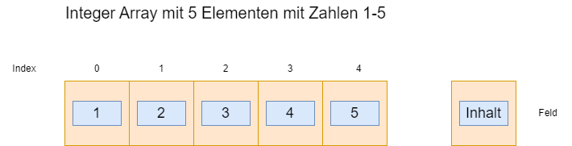

|                      |                           |                               |
| -------------------- | ------------------------- | ----------------------------- |
| **HF Systemtechnik** | **Softwareentwicklung B** |  |

- [1. Arrays \& Strings](#1-arrays--strings)
  - [1.1. Definition von Arrays](#11-definition-von-arrays)
  - [1.2. Array Beispielanwendung](#12-array-beispielanwendung)
  - [1.3. Mehrdimensionale Arrays](#13-mehrdimensionale-arrays)
  - [1.4. Ring-Buffer (Kreispuffer)](#14-ring-buffer-kreispuffer)
- [2. Strings](#2-strings)
  - [2.1. Definition von Strings](#21-definition-von-strings)
  - [2.2. Deklaration von Strings](#22-deklaration-von-strings)
  - [2.3. String-Terminierung (`\0`)](#23-string-terminierung-0)
  - [2.4. Wichtige String-Funktionen in C (aus `<string.h>`)](#24-wichtige-string-funktionen-in-c-aus-stringh)
  - [2.5. Strings in Arduino](#25-strings-in-arduino)
- [3. Aufgaben](#3-aufgaben)
  - [3.1. Temperatur-Datenlogger](#31-temperatur-datenlogger)

---

</br>

# 1. Arrays & Strings

**Lernziele:** Die Studierenden können Arrays deklarieren und verwenden, verstehen die Array-Index-Logik und können mit Strings in C/C++ arbeiten.

---

## 1.1. Definition von Arrays

- Arrays sind in C ein grundlegender Datentyp, mit dem sich mehrere Werte des gleichen Typs unter einem gemeinsamen Namen speichern lassen.
- Sie sind besonders nützlich, wenn man eine **Sammlung von Daten** bearbeiten oder strukturieren möchte – z.B. eine Liste von Zahlen oder Zeichen.
- Ein Array ist eine Sammlung von Daten **gleichen Typs**, die im zusammenhängenden Speicherbereich abgelegt sind.
- Jedes Element im Array ist über einen **Index** zugreifbar, wobei die Zählung bei **0** beginnt.

```c
// Deklaration von 5 Zahlen
int zahlen[5];

// Zugriff Zuweisung Wert (erstes Element)
zahlen[0]=1;

// Zugriff Zuweisung Wert (letztes Element)
zahlen[4]=5;
```

Dies reserviert Speicher für 5 Ganzzahlen (int). Die einzelnen Elemente sind:



```c
/*...*/

for (int index = 1 ; index < 5 ; index++) 
{
  printf("%d\n", zahlen[index]);
}
```

**Deklaration von Arrays**: Ein Array wird deklariert, indem der Datentyp, der Name des Arrays und die Grösse in eckigen Klammern angegeben werden.

Allgemeine Syntax: `<Datentyp> <Arrayname>[<Grösse>];`

**Beispiele:**

```c
int zahlen[10];         // Array aus 10 int-Werten
float noten[5];         // Array aus 5 float-Werten
char buchstaben[26];    // Array aus 26 Zeichen
```

> **Hinweis: Die Grösse muss zur Kompilierzeit bekannt sein (es sei denn, du nutzt dynamische Arrays mit malloc)**

**Initialisierung von Arrays:** Ein Array kann direkt bei der Deklaration initialisiert werden.

```c
int zahlen[5] = {10, 20, 30, 40, 50};
```

**Automatische Grössenbestimmung:**

```c
int zahlen[] = {4, 8, 12};  // Compiler setzt Grösse auf 3
char name[] = "Max";  // = {'M', 'a', 'x', '\0'}
```

**Zugriff auf ein Element:** Auf Array-Elemente wird mit dem Index zugegriffen. Dabei gilt: Index **0** ist das erste Element.

```c
int zahlen[3] = {5, 10, 15};

int x = zahlen[1];  // x = 10
zahlen[2] = 20;     // Das dritte Element wird auf 20 gesetzt
```

> **Der Zugriff ausserhalb des gültigen Bereichs (zahlen[3] in obigem Beispiel) führt zu undefiniertem Verhalten!**
> **Es gibt keinen automatischen Schutz vor Indexüberläufen in C.**

## 1.2. Array Beispielanwendung

Ein Array ist eine **geordnete Sammlung** von Elementen desselben Datentyps. Der **Index** beginnt immer bei **0**.

```c
// Deklaration und Initialisierung:
int pins[6] = {3, 5, 6, 9, 10, 11};      // 6 PWM-Pins
float temperaturen[24] = {0};            // 24 Werte, alle 0
bool zustaende[8];                       // 8 bool-Werte (undefiniert!)

// Zugriff über Index (beginnt bei 0!):
pins[0] = 3;    // Erstes Element  (Index 0)
pins[5] = 11;   // Letztes Element (Index 5, bei Grösse 6)
// pins[6] = 12; // FEHLER! Buffer Overflow – undefiniertes Verhalten

// Array-Grösse berechnen (nützlicher Trick):
int laenge = sizeof(pins) / sizeof(pins[0]);  // = 6

// Array mit for-Schleife durchlaufen:
for (int i = 0; i < laenge; i++) {
    pinMode(pins[i], OUTPUT);
    Serial.println(pins[i]);
}

// Array mit automatischer Grössenbestimmung:
int ledPins[] = {2, 3, 4, 5, 6, 7, 8};  // Compiler zählt: 7 Elemente
int anzLEDs = sizeof(ledPins) / sizeof(ledPins[0]);  // = 7

// Lauflicht-Animation:
void loop() {
    for (int i = 0; i < anzLEDs; i++) {
        digitalWrite(ledPins[i], HIGH);
        delay(100);
        digitalWrite(ledPins[i], LOW);
    }
}
```

---

## 1.3. Mehrdimensionale Arrays

```c
// 2D-Array: 3 Zeilen, 4 Spalten
int matrix[3][4] = {
    {1,  2,  3,  4},
    {5,  6,  7,  8},
    {9, 10, 11, 12}
};

// Zugriff: matrix[Zeile][Spalte]
Serial.println(matrix[1][2]);  // 7

// Anwendungsbeispiel: LED-Matrix-Animationen
// Jede Zeile ist ein Frame, jede Spalte ein LED-Status
byte animationen[3][4] = {
    {1, 0, 0, 0},   // Frame 1
    {0, 1, 0, 0},   // Frame 2
    {0, 0, 1, 0},   // Frame 3
};
```

---

## 1.4. Ring-Buffer (Kreispuffer)

Ein Ring-Buffer ermöglicht es, immer die letzten N Werte zu speichern, ohne dass das Array verschoben werden muss:

```c
const int PUFFER_GROESSE = 10;
float messwerte[PUFFER_GROESSE];
int schreibIndex = 0;
int anzahlWerte  = 0;

void neuerMesswert(float wert) {
    messwerte[schreibIndex] = wert;
    schreibIndex = (schreibIndex + 1) % PUFFER_GROESSE;  // Wraparound
    if (anzahlWerte < PUFFER_GROESSE) anzahlWerte++;
}

float berechneDurchschnitt() {
    float summe = 0;
    for (int i = 0; i < anzahlWerte; i++) {
        summe += messwerte[i];
    }
    return summe / anzahlWerte;
}
```

---

</br>

# 2. Strings

## 2.1. Definition von Strings

- Ein String ist in C eine **Abfolge von Zeichen**, die im Speicher als **char**-Array gespeichert wird.
- Das **letzte Zeichen** eines Strings ist immer das Null-Zeichen **`'\0'`**, das das Ende der Zeichenkette markiert.

```c
char name[] = {'J', 'o', 'h', 'n', '\0'};
```

> Ohne `'\0'` wüsste das Programm nicht, wann die Zeichenkette endet – das ist essentiell für die Stringverarbeitung in C.

## 2.2. Deklaration von Strings

**Leeres Array:**

```c
char wort[10];  // Platz für 9 Zeichen + '\0'
```

**Mit Initialisierung:**

```c
char wort[] = "Hallo";  // Automatische Grösse: 6 (inkl. '\0')

// Wichtig:
char wort[] = {'H', 'a', 'l', 'l', 'o'};  // KEIN String, da '\0' fehlt
```

> **Ein String muss das Nullzeichen '\0' enthalten, sonst verhalten sich String-Funktionen undefiniert.**

## 2.3. String-Terminierung (`\0`)

- Das Zeichen `'\0'` markiert das Ende eines Strings.
- Alle Funktionen der Standardbibliothek wie `strlen()`, `printf()`, `strcpy()` usw. verlassen sich auf dieses Terminierungszeichen.
- Wenn ein `char[]` **nicht** mit `'\0'` abgeschlossen ist, führen String-Operationen zu **undefiniertem Verhalten**.

```c
char falsch[] = {'H', 'i'};  // Kein '\0' -> kein gültiger String
```

> `'\0'` ist gleichbedeutend mit dem Ganzzahlwert 0 und belegt 1 Byte.

## 2.4. Wichtige String-Funktionen in C (aus `<string.h>`)

Um mit Strings in C zu arbeiten, stellt die Standardbibliothek viele Funktionen bereit.
Diese befinden sich in der Header-Datei: `#include <string.h>`

| **Funktion**               | **Beschreibung**                                    |
| :------------------------- | :-------------------------------------------------- |
| `strlen(s)`                | Gibt die Länge von `s` (ohne `\0`) zurück           |
| `strcpy(ziel, quelle)`     | Kopiert `quelle` nach `ziel`                        |
| `strncpy(ziel, quelle, n)` | Kopiert max. `n` Zeichen                            |
| `strcat(ziel, quelle)`     | Hängt `quelle` an `ziel` an                         |
| `strncat(ziel, quelle, n)` | Hängt max. `n` Zeichen an                           |
| `strcmp(s1, s2)`           | Vergleicht zwei Strings lexikografisch              |
| `strncmp(s1, s2, n)`       | Vergleicht die ersten `n` Zeichen                   |
| `strchr(s, c)`             | Gibt Zeiger auf erstes `c` in `s` zurück            |
| `strstr(s1, s2)`           | Sucht `s2` in `s1`, Rückgabe: Zeiger auf Fundstelle |

## 2.5. Strings in Arduino

Arduino bietet zwei Möglichkeiten für Zeichenketten:

- **char-Array** (C-Stil, speichereffizient)
- **String-Klasse** (C++-Stil, bequemer)

```c
// ── Weg 1: char-Array (C-Stil, speichereffizient) ────────────────
char name[] = "Arduino";      // Automatisch '\0' am Ende → 8 Zeichen
char name2[20] = "Arduino";   // Fixer Buffer mit 20 Zeichen

// Länge messen (aus <string.h>, automatisch eingebunden):
int laenge = strlen(name);    // = 7 (ohne '\0')

// ── Weg 2: String-Klasse (C++-Stil, bequemer) ────────────────────
String nachricht = "Hallo ";
String voll = nachricht + "Welt!";   // Verkettung mit +
Serial.println(voll);                 // "Hallo Welt!"

String text = "Temperatur: 22.5 C";
Serial.println(text.length());        // 18
Serial.println(text.toUpperCase());   // "TEMPERATUR: 22.5 C"
Serial.println(text.indexOf(":"));    // 11 (Position des ':')
Serial.println(text.substring(13));   // "22.5 C"

// Zahl zu String:
float temp = 23.7;
String ausgabe = "Temp: " + String(temp, 1) + " Grad";
Serial.println(ausgabe);              // "Temp: 23.7 Grad"
```

> ⚠️ **Speicher-Warnung:** Die `String`-Klasse kann auf kleinen Arduinos (Uno: 2 KB RAM) zu Heap-Fragmentierung führen!  
> Für fixe Texte: `Serial.println(F("Fixtext"))` – das `F()`-Makro speichert den String im Flash-Speicher statt im RAM.

---

</br>

# 3. Aufgaben

## 3.1. Temperatur-Datenlogger

| **Vorgabe**         | **Beschreibung**                                                                  |
| :------------------ | :-------------------------------------------------------------------------------- |
| **Lernziele**       | Arrays sinnvoll für Datensammlung einsetzen, eigene Analyse-Funktionen schreiben. |
| **Sozialform**      | Einzelarbeit                                                                      |
| **Auftrag**         | siehe unten                                                                       |
| **Hilfsmittel**     |                                                                                   |
| **Zeitbedarf**      | 60min                                                                             |
| **Lösungselemente** | Vollständiges Sketch                                                              |

1. **Erstelle** ein `float`-Array für 10 Temperaturmessungen.
   1. Befüllen Sie es mit Dummy-Werten (z.B. 20.0, 21.5, 23.0, ...) und geben Sie alle Werte aus.
2. Schreibe eine **Funktionen**: `float durchschnitt(float arr[], int n)`, `float minimum(float arr[], int n)`, `float maximum(float arr[], int n)`.
3. **Simulieren Sie einen echten Datenlogger:** Lesen Sie alle 5 Sekunden einen Wert von A0 ein, speichern Sie die letzten 10 Werte in einem Ring-Buffer und geben Sie nach jeder Messung **Min/Max/Durchschnitt** aus.
4. **Bonus:** Stellen Sie die gespeicherten Werte als einfaches ASCII-Balkendiagramm im Serial Monitor dar (z. B. ein `*` für je 10 Grad).

© 2026 Lukas Müller – Licensed under CC BY-NC-ND 4.0
See [LICENSE](..\license.md) file for details.
