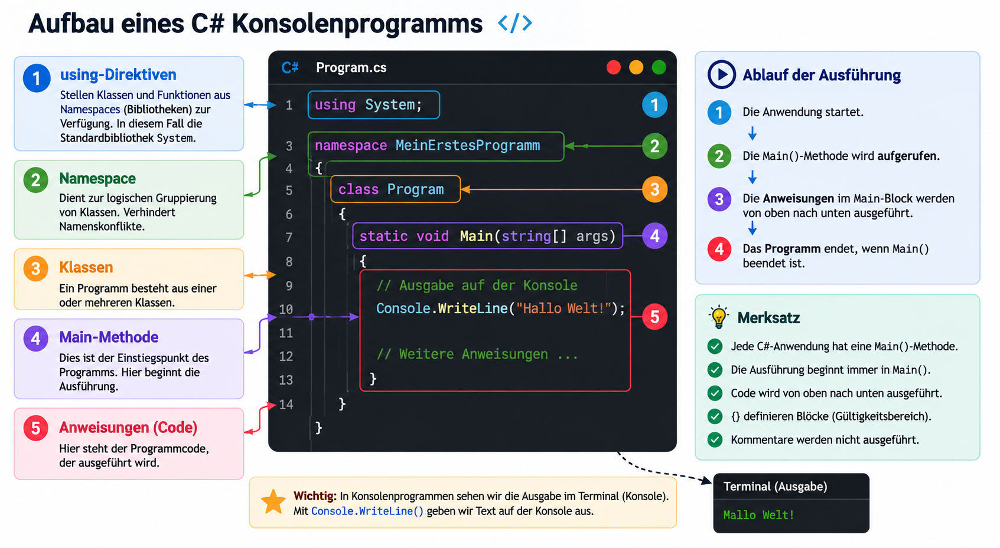

|                      |                           |                               |
| -------------------- | ------------------------- | ----------------------------- |
| **HF Systemtechnik** | **Softwareentwicklung B** |  |

- [1. Einführung in .NET C#](#1-einführung-in-net-c)
  - [1.1. Lernziele](#11-lernziele)
  - [1.2. Entwicklungsumgebung](#12-entwicklungsumgebung)
  - [1.3. Die .NET CLI – Projekte erstellen, ausführen und debuggen](#13-die-net-cli--projekte-erstellen-ausführen-und-debuggen)
    - [1.3.1. Projekt erstellen](#131-projekt-erstellen)
    - [1.3.2. Projekt ausführen](#132-projekt-ausführen)
    - [1.3.3. Debugging in VS Code](#133-debugging-in-vs-code)
    - [1.3.4. Übersicht der wichtigsten dotnet-Befehle](#134-übersicht-der-wichtigsten-dotnet-befehle)
  - [1.4. Grundstruktur einer C#-Anwendung](#14-grundstruktur-einer-c-anwendung)
    - [1.4.1. Modernes Minimal-Format (Top-Level Statements)](#141-modernes-minimal-format-top-level-statements)
    - [1.4.2. Klassisches Format (explizite Struktur)](#142-klassisches-format-explizite-struktur)
    - [1.4.3. Ein- und Ausgabe](#143-ein--und-ausgabe)
  - [1.5. Variablen und Datentypen](#15-variablen-und-datentypen)
    - [1.5.1. Variablen deklarieren](#151-variablen-deklarieren)
    - [1.5.2. Überblick der wichtigsten Datentypen](#152-überblick-der-wichtigsten-datentypen)
    - [1.5.3. Konstanten](#153-konstanten)
    - [1.5.4. String-Interpolation und Verkettung](#154-string-interpolation-und-verkettung)
  - [1.6. Lexikalische Konventionen](#16-lexikalische-konventionen)
    - [1.6.1. Gross-/Kleinschreibung](#161-gross-kleinschreibung)
    - [1.6.2. Bezeichnerregeln](#162-bezeichnerregeln)
    - [1.6.3. Kommentare](#163-kommentare)
    - [1.6.4. Weitere Konventionen](#164-weitere-konventionen)
    - [1.6.5. Namenskonventionen](#165-namenskonventionen)
  - [1.7. Typkonvertierungen](#17-typkonvertierungen)
    - [1.7.1. Implizite Konvertierung (automatisch, verlustfrei)](#171-implizite-konvertierung-automatisch-verlustfrei)
    - [1.7.2. Explizite Konvertierung (Cast, möglicher Datenverlust)](#172-explizite-konvertierung-cast-möglicher-datenverlust)
    - [1.7.3. Konvertierung mit Convert-Klasse](#173-konvertierung-mit-convert-klasse)
    - [1.7.4. Konvertierung mit Parse und TryParse](#174-konvertierung-mit-parse-und-tryparse)
    - [1.7.5. Zahlen in String umwandeln](#175-zahlen-in-string-umwandeln)
  - [1.8. Programmflusssteuerung](#18-programmflusssteuerung)
    - [1.8.1. Bedingte Anweisung: `if / else if / else`](#181-bedingte-anweisung-if--else-if--else)
    - [1.8.2. Switch-Anweisung](#182-switch-anweisung)
    - [1.8.3. Switch-Expression (modernes C#)](#183-switch-expression-modernes-c)
    - [1.8.4. for-Schleife](#184-for-schleife)
    - [1.8.5. while-Schleife](#185-while-schleife)
    - [1.8.6. do-while-Schleife](#186-do-while-schleife)
    - [1.8.7. foreach-Schleife](#187-foreach-schleife)
    - [1.8.8. Steuerung mit `break` und `continue`](#188-steuerung-mit-break-und-continue)
  - [1.9. Zusammenfassung](#19-zusammenfassung)
- [2. Aufgaben](#2-aufgaben)
  - [2.1. Taschenrechner-Konsolenanwendung](#21-taschenrechner-konsolenanwendung)
    - [2.1.1. Anforderungen](#211-anforderungen)
    - [2.1.2. Erwartete Ausgabe (Beispiel)](#212-erwartete-ausgabe-beispiel)

---

</br>

# 1. Einführung in .NET C\#

## 1.1. Lernziele

Nach dieser Lektion können die Studierenden:

- Ein C#-Konsolenprojekt mit der .NET CLI erstellen, ausführen und debuggen
- Die Grundstruktur einer C#-Anwendung erklären und anwenden
- Variablen und die wichtigsten Datentypen deklarieren und verwenden
- Lexikalische Konventionen (Namensgebung, Kommentare) einhalten
- Einfache Typkonvertierungen durchführen
- Den Programmfluss mit Bedingungen und Schleifen steuern
- Eine einfache Konsolenanwendung mit eigener Logik selbständig programmieren

---

## 1.2. Entwicklungsumgebung

- Verwendete Werkzeuge
- Visual Studio Code
- C# Dev Kit Extension
- .NET SDK

## 1.3. Die .NET CLI – Projekte erstellen, ausführen und debuggen

Die .NET CLI (Command Line Interface) ist das zentrale Werkzeug zur Projektverwaltung. Sie wird im integrierten Terminal von VS Code verwendet.

### 1.3.1. Projekt erstellen

```bash
# Neues Konsolenprojekt erstellen
dotnet new console -n HalloWelt

# In den Projektordner wechseln
cd HalloWelt
```

> **Ergebnis:** Der Befehl legt eine Ordnerstruktur mit einer `Program.cs` und einer `.csproj`-Datei an.

### 1.3.2. Projekt ausführen

```bash
# Kompilieren und starten
dotnet run

# Nur kompilieren (ohne Starten)
dotnet build
```

### 1.3.3. Debugging in VS Code

Über das C# Dev Kit wird Debugging direkt in VS Code unterstützt:

1. **Breakpoint setzen:** Auf die Zeilennummer links neben dem Code klicken (roter Punkt erscheint)
2. **Debugger starten:** `F5` drücken oder über *Run → Start Debugging*
3. **Wichtige Tasten während dem Debugging:**

| Taste      | Aktion                                |
| ---------- | ------------------------------------- |
| `F5`       | Weiter bis zum nächsten Breakpoint    |
| `F10`      | Nächste Zeile ausführen (Step Over)   |
| `F11`      | In Methode hineinspringen (Step Into) |
| `Shift+F5` | Debugging beenden                     |

> **Tipp:** Im Debug-Panel links sind unter *Variables* alle aktuellen Variablenwerte sichtbar.

### 1.3.4. Übersicht der wichtigsten dotnet-Befehle

| Befehl                       | Beschreibung                       |
| ---------------------------- | ---------------------------------- |
| `dotnet new console -n Name` | Neues Konsolenprojekt anlegen      |
| `dotnet run`                 | Projekt kompilieren und starten    |
| `dotnet build`               | Nur kompilieren                    |
| `dotnet clean`               | Build-Artefakte löschen            |
| `dotnet --version`           | Installierte .NET-Version anzeigen |

---

## 1.4. Grundstruktur einer C#-Anwendung



### 1.4.1. Modernes Minimal-Format (Top-Level Statements)

Ab .NET 6 ist die Grundstruktur sehr kompakt:

```csharp
// Program.cs
Console.WriteLine("Hallo Welt!");
```

> Das ist gültiger, vollständiger C#-Code. Der Compiler ergänzt die Klassen- und Methodenstruktur automatisch.

### 1.4.2. Klassisches Format (explizite Struktur)

In der Praxis und in grösseren Projekten begegnet man häufig der vollständigen Schreibweise:

```csharp
using System;

namespace HalloWelt
{
    class Program
    {
        static void Main(string[] args)
        {
            Console.WriteLine("Hallo Welt!");
        }
    }
}
```

| **Element**              | **Bedeutung**                     |
| ------------------------ | --------------------------------- |
| `using System;`          | Einbinden des Standard-Namespaces |
| `namespace`              | Logische Gruppierung von Klassen  |
| `class Program`          | Definition einer Klasse           |
| `static void Main(...)`  | Einstiegspunkt des Programms      |
| `Console.WriteLine(...)` | Ausgabe in die Konsole            |

### 1.4.3. Ein- und Ausgabe

```csharp
// Ausgabe (ohne Zeilenumbruch)
Console.Write("Ihr Name: ");

// Eingabe lesen
string eingabe = Console.ReadLine();

// Ausgabe mit Zeilenumbruch
Console.WriteLine($"Hallo, {eingabe}!");
```

---

## 1.5. Variablen und Datentypen

### 1.5.1. Variablen deklarieren

```csharp
// Explizite Typenangabe
int alter = 25;
string name = "Anna";

// Implizite Typenangabe mit var (Typ wird vom Compiler ermittelt)
var gewicht = 70.5;     // double
var aktiv = true;       // bool
```

> `var` ist kein dynamischer Typ – der Compiler legt den Typ bei der Kompilierung fest.

### 1.5.2. Überblick der wichtigsten Datentypen

| **Typ**   | **Beschreibung**                    | **Beispielwert** |
| --------- | ----------------------------------- | ---------------- |
| `int`     | Ganzzahl (32 Bit)                   | `42`, `-7`       |
| `long`    | Grosse Ganzzahl (64 Bit)            | `9_000_000_000`  |
| `double`  | Dezimalzahl (Gleitkomma)            | `3.14`           |
| `decimal` | Präzise Dezimalzahl (für Währungen) | `9.99m`          |
| `bool`    | Wahrheitswert                       | `true`, `false`  |
| `char`    | Einzelnes Zeichen                   | `'A'`            |
| `string`  | Zeichenkette                        | `"Hallo"`        |
| `object`  | Basistyp aller Typen                | beliebig         |

### 1.5.3. Konstanten

```csharp
// Konstante: Wert kann nicht verändert werden
const double PI = 3.14159;
const int MAX_VERSUCHE = 3;
```

### 1.5.4. String-Interpolation und Verkettung

```csharp
string vorname = "Hans";
int alter = 30;

// String-Interpolation (empfohlen)
Console.WriteLine($"Name: {vorname}, Alter: {alter}");

// Verkettung mit +
Console.WriteLine("Name: " + vorname + ", Alter: " + alter);
```

---

## 1.6. Lexikalische Konventionen

### 1.6.1. Gross-/Kleinschreibung

C# unterscheidet zwischen Gross- und Kleinschreibung.

```csharp
int alter;
int Alter;
```

> **Dies sind zwei unterschiedliche Variablen.**

### 1.6.2. Bezeichnerregeln

**Ein Variablenname:**

- darf keine Leerzeichen enthalten
- darf nicht mit einer Zahl beginnen
- sollte sprechend benannt sein

**Gute Beispiele:**

- int anzahlStudenten;
- double temperatur;

Schlechte Beispiele:

- int x;
- double a1;

### 1.6.3. Kommentare

```csharp
// Einzeiliger Kommentar

/*
   Mehrzeiliger
   Kommentar
*/

/// <summary>
/// XML-Dokumentationskommentar (für Methoden und Klassen)
/// </summary>
```

> **Faustregel:** Kommentare erklären das **Warum**, nicht das **Was**. Gut lesbarer Code erklärt sich selbst.

### 1.6.4. Weitere Konventionen

- Geschweifte Klammern `{}` stehen auf einer **eigenen Zeile** (Allman-Style in C#)
- Eine Einrückungstiefe beträgt **4 Leerzeichen** (oder 1 Tab)
- Pro Datei **eine Klasse**, Dateiname entspricht dem Klassennamen
- Keine Abkürzungen in Variablennamen: `anzahlStudierende` statt `anzStud`

### 1.6.5. Namenskonventionen

Konsistente Benennung ist ein Zeichen von professionellem Code.

| **Element** | **Konvention**             | **Beispiel**                      |
| ----------- | -------------------------- | --------------------------------- |
| Klassen     | PascalCase                 | `BankKonto`, `Kundenverwaltung`   |
| Methoden    | PascalCase                 | `BerechneZins()`, `LeseEingabe()` |
| Variablen   | camelCase                  | `kontostand`, `anzahlVersuche`    |
| Konstanten  | PascalCase oder UPPER_CASE | `MaxVersuche`, `MAX_VERSUCHE`     |
| Interfaces  | Prefix `I` + PascalCase    | `IRepository`, `IBerechnung`      |

---

## 1.7. Typkonvertierungen

### 1.7.1. Implizite Konvertierung (automatisch, verlustfrei)

```csharp
int ganzzahl = 42;
double dezimal = ganzzahl;   // int → double: automatisch, kein Datenverlust
```

### 1.7.2. Explizite Konvertierung (Cast, möglicher Datenverlust)

```csharp
double preis = 9.99;
int gerundet = (int)preis;   // 9 – Nachkommastellen werden abgeschnitten!
```

### 1.7.3. Konvertierung mit Convert-Klasse

```csharp
string eingabe = "42";
int zahl = Convert.ToInt32(eingabe);
double dezimal = Convert.ToDouble("3.14");
bool wert = Convert.ToBoolean("true");
```

### 1.7.4. Konvertierung mit Parse und TryParse

```csharp
// Parse: wirft eine Exception, wenn die Eingabe ungültig ist
int zahl = int.Parse("123");

// TryParse: sicherer – gibt false zurück bei ungültiger Eingabe
string eingabe = Console.ReadLine();
if (int.TryParse(eingabe, out int resultat))
{
    Console.WriteLine($"Gültige Zahl: {resultat}");
}
else
{
    Console.WriteLine("Ungültige Eingabe!");
}
```

> **Empfehlung:** In der Praxis immer `TryParse` verwenden, wenn Benutzereingaben verarbeitet werden.

### 1.7.5. Zahlen in String umwandeln

```csharp
int zahl = 42;
string text = zahl.ToString();          // "42"
string formatiert = zahl.ToString("D5"); // "00042" (5 Stellen mit führenden Nullen)
```

---

## 1.8. Programmflusssteuerung

### 1.8.1. Bedingte Anweisung: `if / else if / else`

```csharp
int note = 4;

if (note >= 5)
{
    Console.WriteLine("Bestanden – sehr gut!");
}
else if (note >= 4)
{
    Console.WriteLine("Bestanden");
}
else
{
    Console.WriteLine("Nicht bestanden");
}
```

### 1.8.2. Switch-Anweisung

```csharp
string wochentag = "Montag";

switch (wochentag)
{
    case "Montag":
    case "Dienstag":
        Console.WriteLine("Woche hat begonnen");
        break;
    case "Freitag":
        Console.WriteLine("Fast Wochenende!");
        break;
    default:
        Console.WriteLine("Normaler Tag");
        break;
}
```

### 1.8.3. Switch-Expression (modernes C#)

```csharp
int note = 5;
string bewertung = note switch
{
    6 => "Ausgezeichnet",
    5 => "Gut",
    4 => "Genügend",
    _ => "Ungenügend"
};
Console.WriteLine(bewertung);
```

### 1.8.4. for-Schleife

```csharp
// Zählt von 1 bis 5
for (int i = 1; i <= 5; i++)
{
    Console.WriteLine($"Durchgang {i}");
}
```

### 1.8.5. while-Schleife

```csharp
int versuche = 0;

while (versuche < 3)
{
    Console.Write("Passwort eingeben: ");
    string eingabe = Console.ReadLine();
    
    if (eingabe == "geheim")
    {
        Console.WriteLine("Zugang gewährt!");
        break;
    }
    
    versuche++;
    Console.WriteLine($"Falsches Passwort. Versuche: {versuche}/3");
}
```

### 1.8.6. do-while-Schleife

```csharp
// Wird mindestens einmal ausgeführt
int zahl;
do
{
    Console.Write("Bitte eine Zahl zwischen 1 und 10 eingeben: ");
} while (!int.TryParse(Console.ReadLine(), out zahl) || zahl < 1 || zahl > 10);

Console.WriteLine($"Eingabe akzeptiert: {zahl}");
```

### 1.8.7. foreach-Schleife

```csharp
string[] namen = { "Anna", "Beat", "Carmen" };

foreach (string name in namen)
{
    Console.WriteLine($"Hallo, {name}!");
}
```

### 1.8.8. Steuerung mit `break` und `continue`

```csharp
for (int i = 1; i <= 10; i++)
{
    if (i % 2 == 0) continue;   // Gerade Zahlen überspringen
    if (i > 7) break;           // Abbruch ab 8

    Console.WriteLine(i);       // Ausgabe: 1, 3, 5, 7
}
```

---

## 1.9. Zusammenfassung

```console
dotnet new console -n Projekt   →  Projekt erstellen
dotnet run                       →  Ausführen
F5 in VS Code                    →  Debugging starten

Grundstruktur: using / namespace / class / Main()
Datentypen: int, double, decimal, bool, char, string
Konventionen: PascalCase (Klassen/Methoden), camelCase (Variablen)
Konvertierung: (int)wert, Convert.ToInt32(), int.TryParse()
Fluss: if/else, switch, for, while, do-while, foreach
```

---

</br>

# 2. Aufgaben

## 2.1. Taschenrechner-Konsolenanwendung

| **Vorgabe**         | **Beschreibung**                                                           |
| :------------------ | :------------------------------------------------------------------------- |
| **Lernziele**       | Kennen die Schritte und Werkzeuge zur Programmerstellung                   |
|                     | Grundstruktur eines C#-Programmes ist bekannt                              |
|                     | Syntax u. Semantik eines C#-Programmes sind bekannt                        |
|                     | Kann eine kleine Logik mit Programmflusssteuerungselementen implementieren |
| **Sozialform**      | Einzelarbeit                                                               |
| **Auftrag**         | siehe unten                                                                |
| **Hilfsmittel**     |                                                                            |
| **Zeitbedarf**      | 60min                                                                      |
| **Lösungselemente** | Funktionierendes Programm                                                  |

Erstellen Sie eine Konsolenanwendung, die einen einfachen Taschenrechner simuliert.

### 2.1.1. Anforderungen

**Pflichtteil:**

1. Das Programm begrüsst den Benutzer mit seinem Namen (Eingabe abfragen)
2. Der Benutzer gibt zwei Zahlen ein (Gleitkommazahlen möglich)
3. Der Benutzer wählt eine Rechenoperation: `+`, `-`, `*`, `/`
4. Das Programm berechnet das Ergebnis und gibt es formatiert aus
5. Division durch 0 wird abgefangen und mit einer Fehlermeldung behandelt
6. Ungültige Zahleneingaben werden mit `TryParse` abgefangen

**Erweiterung (für Schnelle):**

7. Nach der Berechnung fragt das Programm, ob eine weitere Rechnung durchgeführt werden soll (`j`/`n`)
8. Das Programm zählt, wie viele Berechnungen durchgeführt wurden, und gibt die Anzahl am Ende aus

### 2.1.2. Erwartete Ausgabe (Beispiel)

```console
=== Taschenrechner ===
Ihr Name: Lisa

Willkommen, Lisa!

Erste Zahl:  12.5
Zweite Zahl: 4
Operation (+, -, *, /): *

Ergebnis: 12.5 * 4 = 50.00

Weitere Berechnung? (j/n): n

Sie haben 1 Berechnung durchgeführt.
Auf Wiedersehen, Lisa!
```
