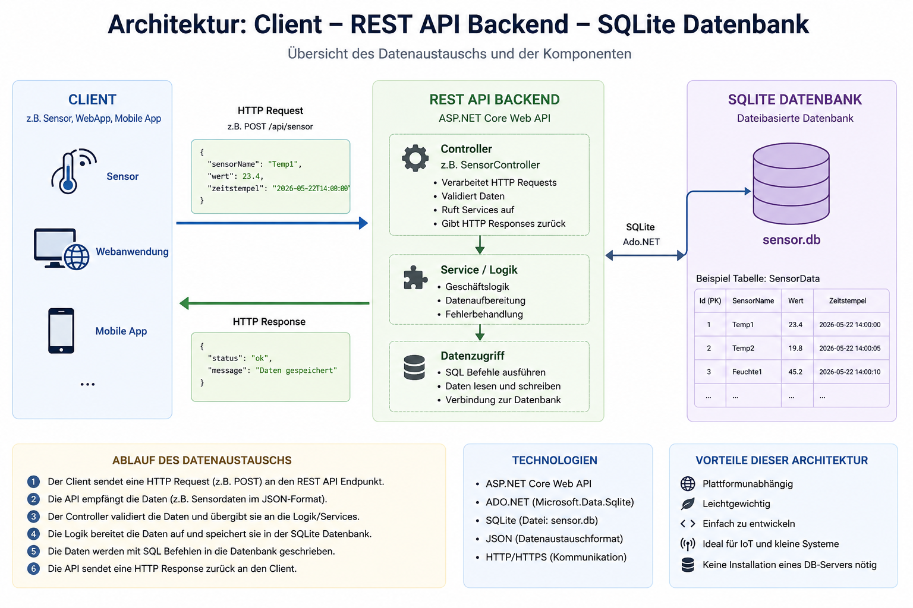
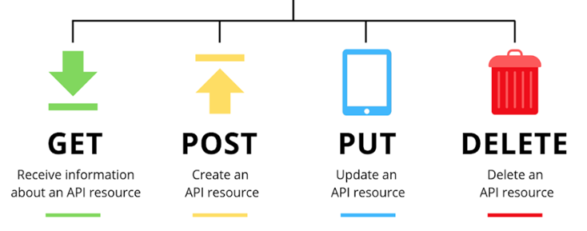

|                      |                           |                               |
| -------------------- | ------------------------- | ----------------------------- |
| **HF Systemtechnik** | **Softwareentwicklung B** |  |

- [1. REST WebAPI mit ASP.NET Core und SQLite](#1-rest-webapi-mit-aspnet-core-und-sqlite)
  - [1.1. Lernziele](#11-lernziele)
  - [1.2. Was ist REST?](#12-was-ist-rest)
    - [1.2.1. Das Client-Server-Prinzip](#121-das-client-server-prinzip)
    - [1.2.2. Vorteile einer WebAPI gegenüber direktem Datenbankzugriff](#122-vorteile-einer-webapi-gegenüber-direktem-datenbankzugriff)
  - [1.3. HTTP-Verben und ihre Bedeutung](#13-http-verben-und-ihre-bedeutung)
    - [1.3.1. HTTP-Statuscodes](#131-http-statuscodes)
    - [1.3.2. Aufbau eines HTTP-Requests und Response](#132-aufbau-eines-http-requests-und-response)
  - [1.4. ASP.NET Core WebAPI – Projektaufbau](#14-aspnet-core-webapi--projektaufbau)
    - [1.4.1. Projektstruktur](#141-projektstruktur)
  - [1.5. Die Komponenten im Detail](#15-die-komponenten-im-detail)
    - [1.5.1. Das Model – Models/Sensormessung.cs](#151-das-model--modelssensormessungcs)
    - [1.5.2. Der Controller – Controllers/SensordatenController.cs](#152-der-controller--controllerssensordatencontrollercs)
    - [1.5.3. Der Einstiegspunkt – Program.cs](#153-der-einstiegspunkt--programcs)
    - [1.5.4. Konfiguration – appsettings.json](#154-konfiguration--appsettingsjson)
  - [1.6. API testen](#16-api-testen)
    - [1.6.1. Swagger UI](#161-swagger-ui)
    - [1.6.2. Mit der REST Client Extension testen](#162-mit-der-rest-client-extension-testen)
- [2. Aufgaben](#2-aufgaben)
  - [2.1. Wetterstation-API](#21-wetterstation-api)
    - [2.1.1. Datenbankstruktur](#211-datenbankstruktur)
    - [2.1.2. Request-Model (JSON, vom Client gesendet)](#212-request-model-json-vom-client-gesendet)
    - [2.1.3. Pflicht-Endpunkte](#213-pflicht-endpunkte)
    - [2.1.4. Mindestanforderungen](#214-mindestanforderungen)
    - [2.1.5. Erweiterung (für Schnelle)](#215-erweiterung-für-schnelle)
    - [2.1.6. Testdaten für Swagger / REST Client](#216-testdaten-für-swagger--rest-client)

---

</br>

# 1. REST WebAPI mit ASP.NET Core und SQLite

## 1.1. Lernziele

Nach dieser Lektion können die Studierenden:

- Das REST-Architekturprinzip und die HTTP-Verben erklären
- Den Aufbau und die Vorteile einer WebAPI gegenüber direktem DB-Zugriff beschreiben
- Ein ASP.NET Core WebAPI-Projekt erstellen und strukturieren
- Controller, Routen und Endpunkte definieren
- JSON-Daten empfangen (POST) und zurückgeben (GET)
- Sensordaten über eine API entgegennehmen und in SQLite speichern
- Die API mit Swagger UI und einem REST-Client testen

---

## 1.2. Was ist REST?

**REST** (Representational State Transfer) ist ein Architekturstil für verteilte Systeme. Eine REST-konforme API (WebAPI) stellt Ressourcen über HTTP-Endpunkte zur Verfügung und kommuniziert standardmässig über **JSON**.

### 1.2.1. Das Client-Server-Prinzip



Der Client (z.B. ein IoT-Sensor, eine Mobile-App, ein Angular-Frontend) kennt die Datenbank **nicht**. Er kommuniziert ausschliesslich mit der API über ein definiertes Interface.

### 1.2.2. Vorteile einer WebAPI gegenüber direktem Datenbankzugriff

| **Aspekt**  | **Direkter DB-Zugriff**    | **REST WebAPI**                       |
| ----------- | -------------------------- | ------------------------------------- |
| Zugriff     | Nur im lokalen Netz        | Überall via HTTP/HTTPS                |
| Clients     | Ein spezifischer Client    | Beliebige Clients (App, Browser, IoT) |
| Sicherheit  | DB-Credentials im Client   | API regelt Zugriff zentral            |
| Technologie | Gleiche Technologie nötig  | Clients technologieneutral            |
| Wartbarkeit | DB-Änderung bricht Clients | API als stabiles Interface            |
| Skalierung  | Schwierig                  | Einfach horizontal skalierbar         |

> **Praxisbeispiel:** Ein Temperatursensor auf einer Maschine soll Messwerte speichern. Er kann kein SQLite einbinden – aber er kann einen HTTP POST-Request senden.

---

## 1.3. HTTP-Verben und ihre Bedeutung

REST nutzt die Standard-HTTP-Methoden als semantische Operationen auf Ressourcen.



| **HTTP-Verb** | **CRUD-Operation**   | **Beschreibung**               | **Beispiel-URL**            |
| ------------- | -------------------- | ------------------------------ | --------------------------- |
| `GET`         | Read                 | Ressource(n) abrufen           | `GET /api/sensordaten`      |
| `POST`        | Create               | Neue Ressource erstellen       | `POST /api/sensordaten`     |
| `PUT`         | Update (vollständig) | Ressource vollständig ersetzen | `PUT /api/sensordaten/5`    |
| `PATCH`       | Update (partiell)    | Einzelne Felder aktualisieren  | `PATCH /api/sensordaten/5`  |
| `DELETE`      | Delete               | Ressource löschen              | `DELETE /api/sensordaten/5` |

### 1.3.1. HTTP-Statuscodes

Der Server antwortet immer mit einem Statuscode, der das Ergebnis beschreibt:

| **Code**                    | **Bedeutung**            | **Typische Verwendung**      |
| --------------------------- | ------------------------ | ---------------------------- |
| `200 OK`                    | Erfolgreich              | GET, PUT, DELETE erfolgreich |
| `201 Created`               | Ressource erstellt       | Nach erfolgreichem POST      |
| `204 No Content`            | Erfolgreich, kein Inhalt | DELETE ohne Rückgabe         |
| `400 Bad Request`           | Ungültige Anfrage        | Validierungsfehler           |
| `404 Not Found`             | Ressource nicht gefunden | ID existiert nicht           |
| `500 Internal Server Error` | Serverfehler             | Unbehandelte Exception       |

### 1.3.2. Aufbau eines HTTP-Requests und Response

```console
── Request ──────────────────────────────────────────────
POST /api/sensordaten HTTP/1.1
Host: localhost:5000
Content-Type: application/json

{
  "sensorId": "TEMP-01",
  "wert": 23.4,
  "einheit": "°C"
}

── Response ─────────────────────────────────────────────
HTTP/1.1 201 Created
Content-Type: application/json

{
  "id": 42,
  "sensorId": "TEMP-01",
  "wert": 23.4,
  "einheit": "°C",
  "zeitstempel": "2024-11-15T09:30:00"
}
```

---

## 1.4. ASP.NET Core WebAPI – Projektaufbau

```bash
# WebAPI-Projekt erstellen
dotnet new webapi -n SensorApi --use-controllers
cd SensorApi

# SQLite-Paket hinzufügen
dotnet add package Microsoft.Data.Sqlite
```

> Das Projekt enthält bereits Swagger (OpenAPI) – damit können Endpunkte direkt im Browser getestet werden, ohne ein externes Tool.

### 1.4.1. Projektstruktur

```console
SensorApi/
├── Program.cs                   ← Konfiguration und Start
├── appsettings.json             ← Einstellungen (DB-Pfad)
├── Models/
│   └── Sensormessung.cs         ← Datenklassen
└── Controllers/
    └── SensordatenController.cs ← API-Endpunkte + DB-Zugriff
```

---

## 1.5. Die Komponenten im Detail

### 1.5.1. Das Model – Models/Sensormessung.cs

Das Model repräsentiert die Daten, die über die API ausgetauscht werden. ASP.NET Core konvertiert diese automatisch von/nach JSON.

```csharp
namespace SensorApi.Models;

// Daten, die der Client sendet (kein Id, kein Zeitstempel)
public class SensormessungRequest
{
    public string SensorId { get; set; } = string.Empty;
    public double Wert     { get; set; }
    public string Einheit  { get; set; } = string.Empty;
}

// Daten, die der Server zurückgibt (mit Id und Zeitstempel)
public class Sensormessung
{
    public long     Id          { get; set; }
    public string   SensorId    { get; set; } = string.Empty;
    public double   Wert        { get; set; }
    public string   Einheit     { get; set; } = string.Empty;
    public DateTime Zeitstempel { get; set; }
}
```

> `Id` und `Zeitstempel` werden vom Server generiert – der Client kennt diese beim Senden noch nicht.

---

### 1.5.2. Der Controller – Controllers/SensordatenController.cs

Der Controller ist das Herzstück der API. Er definiert die Endpunkte (Routen) und enthält direkt den SQLite-Datenbankzugriff.

```csharp
using Microsoft.AspNetCore.Mvc;
using Microsoft.Data.Sqlite;
using SensorApi.Models;

namespace SensorApi.Controllers;

[ApiController]
[Route("api/[controller]")]   // → Route: /api/sensordaten
public class SensordatenController : ControllerBase
{
    // Connection String direkt im Controller (aus appsettings.json)
    private readonly string _connectionString;

    public SensordatenController(IConfiguration config)
    {
        _connectionString = config.GetConnectionString("SensorDb")
            ?? "Data Source=sensor.db";
    }

    // ──────────────────────────────────────────────────────────────
    // GET /api/sensordaten
    // Gibt alle gespeicherten Messungen zurück
    // ──────────────────────────────────────────────────────────────
    [HttpGet]
    public ActionResult<List<Sensormessung>> AlleAbrufen()
    {
        var liste = new List<Sensormessung>();

        using var verbindung = new SqliteConnection(_connectionString);
        verbindung.Open();

        string sql = "SELECT Id, SensorId, Wert, Einheit, Zeitstempel " +
                     "FROM Sensormessungen ORDER BY Zeitstempel DESC";

        using var befehl = new SqliteCommand(sql, verbindung);
        using var leser  = befehl.ExecuteReader();

        while (leser.Read())
        {
            liste.Add(new Sensormessung
            {
                Id          = leser.GetInt64(0),
                SensorId    = leser.GetString(1),
                Wert        = leser.GetDouble(2),
                Einheit     = leser.GetString(3),
                Zeitstempel = DateTime.Parse(leser.GetString(4))
            });
        }

        return Ok(liste);   // 200 OK + JSON-Array
    }

    // ──────────────────────────────────────────────────────────────
    // GET /api/sensordaten/TEMP-01
    // Gibt Messungen eines bestimmten Sensors zurück
    // ──────────────────────────────────────────────────────────────
    [HttpGet("{sensorId}")]
    public ActionResult<List<Sensormessung>> NachSensorAbrufen(string sensorId)
    {
        var liste = new List<Sensormessung>();

        using var verbindung = new SqliteConnection(_connectionString);
        verbindung.Open();

        string sql = "SELECT Id, SensorId, Wert, Einheit, Zeitstempel " +
                     "FROM Sensormessungen WHERE SensorId = @sensorId " +
                     "ORDER BY Zeitstempel DESC";

        using var befehl = new SqliteCommand(sql, verbindung);
        befehl.Parameters.AddWithValue("@sensorId", sensorId);
        using var leser = befehl.ExecuteReader();

        while (leser.Read())
        {
            liste.Add(new Sensormessung
            {
                Id          = leser.GetInt64(0),
                SensorId    = leser.GetString(1),
                Wert        = leser.GetDouble(2),
                Einheit     = leser.GetString(3),
                Zeitstempel = DateTime.Parse(leser.GetString(4))
            });
        }

        if (liste.Count == 0)
            return NotFound($"Keine Daten für Sensor '{sensorId}' gefunden.");

        return Ok(liste);   // 200 OK + gefilterte Liste
    }

    // ──────────────────────────────────────────────────────────────
    // POST /api/sensordaten
    // Nimmt eine neue Messung entgegen und speichert sie
    // ──────────────────────────────────────────────────────────────
    [HttpPost]
    public ActionResult<Sensormessung> Einfuegen([FromBody] SensormessungRequest request)
    {
        // Einfache Validierung
        if (string.IsNullOrWhiteSpace(request.SensorId))
            return BadRequest("SensorId darf nicht leer sein.");

        var zeitstempel = DateTime.UtcNow;

        using var verbindung = new SqliteConnection(_connectionString);
        verbindung.Open();

        string sql = "INSERT INTO Sensormessungen (SensorId, Wert, Einheit, Zeitstempel) " +
                     "VALUES (@sensorId, @wert, @einheit, @zeitstempel); " +
                     "SELECT last_insert_rowid();";

        using var befehl = new SqliteCommand(sql, verbindung);
        befehl.Parameters.AddWithValue("@sensorId",    request.SensorId);
        befehl.Parameters.AddWithValue("@wert",        request.Wert);
        befehl.Parameters.AddWithValue("@einheit",     request.Einheit);
        befehl.Parameters.AddWithValue("@zeitstempel", zeitstempel.ToString("o"));

        long neueId = (long)befehl.ExecuteScalar()!;

        // Gespeicherten Datensatz als Antwort zurückgeben
        var gespeichert = new Sensormessung
        {
            Id          = neueId,
            SensorId    = request.SensorId,
            Wert        = request.Wert,
            Einheit     = request.Einheit,
            Zeitstempel = zeitstempel
        };

        return Created($"/api/sensordaten/{gespeichert.SensorId}", gespeichert);
    }
}
```

**Erklärung der wichtigsten Attribute:**

| Attribut                      | Bedeutung                                                   |
| ----------------------------- | ----------------------------------------------------------- |
| `[ApiController]`             | Aktiviert automatisches JSON-Binding und Validierung        |
| `[Route("api/[controller]")]` | Basisroute – `[controller]` → Klassenname ohne "Controller" |
| `[HttpGet]`                   | Reagiert auf GET-Requests an die Basisroute                 |
| `[HttpGet("{sensorId}")]`     | GET mit URL-Parameter: `/api/sensordaten/TEMP-01`           |
| `[HttpPost]`                  | Reagiert auf POST-Requests                                  |
| `[FromBody]`                  | Liest das Objekt aus dem JSON-Request-Body                  |

---

### 1.5.3. Der Einstiegspunkt – Program.cs

```csharp
var builder = WebApplication.CreateBuilder(args);

// Controller-Support und Swagger aktivieren
builder.Services.AddControllers();
builder.Services.AddEndpointsApiExplorer();
builder.Services.AddSwaggerGen();

// IConfiguration wird automatisch verfügbar gemacht (für den Controller-Konstruktor)

var app = builder.Build();

// Tabelle beim Start erstellen (falls noch nicht vorhanden)
string connectionString = builder.Configuration.GetConnectionString("SensorDb")
    ?? "Data Source=sensor.db";

using (var verbindung = new Microsoft.Data.Sqlite.SqliteConnection(connectionString))
{
    verbindung.Open();
    string sql = @"CREATE TABLE IF NOT EXISTS Sensormessungen (
                       Id          INTEGER PRIMARY KEY AUTOINCREMENT,
                       SensorId    TEXT NOT NULL,
                       Wert        REAL NOT NULL,
                       Einheit     TEXT NOT NULL,
                       Zeitstempel TEXT NOT NULL
                   )";
    using var befehl = new Microsoft.Data.Sqlite.SqliteCommand(sql, verbindung);
    befehl.ExecuteNonQuery();
}

// Swagger nur in der Entwicklungsumgebung
if (app.Environment.IsDevelopment())
{
    app.UseSwagger();
    app.UseSwaggerUI();
}

app.UseHttpsRedirection();
app.MapControllers();
app.Run();
```

### 1.5.4. Konfiguration – appsettings.json

```json
{
  "ConnectionStrings": {
    "SensorDb": "Data Source=sensor.db"
  },
  "Logging": {
    "LogLevel": {
      "Default": "Information",
      "Microsoft.AspNetCore": "Warning"
    }
  },
  "AllowedHosts": "*"
}
```

---

## 1.6. API testen

### 1.6.1. Swagger UI

Nach dem Start ist Swagger unter `https://localhost:{port}/swagger` erreichbar.

```bash
dotnet run
# → Konsole zeigt z.B.: https://localhost:7042
# → Browser öffnen:    https://localhost:7042/swagger
```

In Swagger kann jeder Endpunkt direkt ausprobiert werden: Endpunkt aufklappen → *Try it out* → Request-Body eingeben → *Execute*.

### 1.6.2. Mit der REST Client Extension testen

Die VS Code Extension **REST Client** (humao.rest-client) erlaubt Tests direkt im Editor. Datei `test.http` anlegen:

```http
@baseUrl = https://localhost:7042

### Messung einfügen
POST {{baseUrl}}/api/sensordaten
Content-Type: application/json

{
  "sensorId": "TEMP-01",
  "wert": 23.4,
  "einheit": "°C"
}

### Alle Messungen abrufen
GET {{baseUrl}}/api/sensordaten

### Messungen nach Sensor filtern
GET {{baseUrl}}/api/sensordaten/TEMP-01

### Nicht vorhandener Sensor → 404
GET {{baseUrl}}/api/sensordaten/UNBEKANNT-99
```

> Über jeder Anfrage erscheint der Link **Send Request** – Klick genügt, die Antwort erscheint rechts daneben.

---

</br>

# 2. Aufgaben

## 2.1. Wetterstation-API

| **Vorgabe**         | **Beschreibung**                                                                   |
| :------------------ | :--------------------------------------------------------------------------------- |
| **Lernziele**       | Das REST-Architekturprinzip und die HTTP-Verben erklären                           |
|                     | Den Aufbau und die Vorteile einer WebAPI gegenüber direktem DB-Zugriff beschreiben |
|                     | Controller, Routen und Endpunkte definieren                                        |
|                     | Sensordaten über eine API entgegennehmen und in SQLite speichern                   |
| **Sozialform**      | Einzelarbeit                                                                       |
| **Auftrag**         | siehe unten                                                                        |
| **Hilfsmittel**     |                                                                                    |
| **Zeitbedarf**      | 120min                                                                             |
| **Lösungselemente** | Funktionierendes Programm                                                          |

Erstellen Sie eine **ASP.NET Core WebAPI**, die Messdaten einer Wetterstation entgegennimmt und in einer SQLite-Datenbank speichert. Die API soll über POST-Requests Daten empfangen und über GET-Requests abfragbar sein.

### 2.1.1. Datenbankstruktur

```sql
CREATE TABLE IF NOT EXISTS Messungen (
    Id           INTEGER PRIMARY KEY AUTOINCREMENT,
    StationsId   TEXT    NOT NULL,
    Temperatur   REAL    NOT NULL,
    Luftfeuchte  REAL    NOT NULL,
    Luftdruck    REAL,
    Zeitstempel  TEXT    NOT NULL
);
```

### 2.1.2. Request-Model (JSON, vom Client gesendet)

```json
{
  "stationsId":  "WS-ZUERICH-01",
  "temperatur":  18.7,
  "luftfeuchte": 65.2,
  "luftdruck":   1013.25
}
```

### 2.1.3. Pflicht-Endpunkte

| Methode | Route                         | Beschreibung                                  |
| ------- | ----------------------------- | --------------------------------------------- |
| `POST`  | `/api/messungen`              | Neue Messung speichern → `201 Created`        |
| `GET`   | `/api/messungen`              | Alle Messungen abrufen → `200 OK`             |
| `GET`   | `/api/messungen/{stationsId}` | Messungen einer Station → `200 OK` oder `404` |

### 2.1.4. Mindestanforderungen

1. WebAPI-Projekt korrekt erstellt (`dotnet new webapi`)
2. `Microsoft.Data.Sqlite` eingebunden
3. Zwei Model-Klassen: `MessungRequest` und `Messung`
4. Repository mit den Methoden `TabelleErstellen()`, `Einfuegen()`, `AlleAbrufen()`, `NachStationAbrufen()`
5. Controller mit den drei Endpunkten (POST, GET alle, GET nach Station)
6. Registrierung in `Program.cs` (DI, Tabelle beim Start erstellen)
7. Swagger aktiv und API damit testbar
8. Zeitstempel wird serverseitig beim Einfügen gesetzt (nicht vom Client)
9. `404 Not Found` wenn Station keine Daten hat
10. Parametrisierte SQL-Abfragen (kein SQL-Injection-Risiko)

### 2.1.5. Erweiterung (für Schnelle)

11. `GET /api/messungen/{stationsId}/letztemessung` – nur den neuesten Datensatz einer Station zurückgeben
12. `GET /api/messungen/stationen` – Liste aller Stations-IDs zurückgeben, die mindestens eine Messung haben (`SELECT DISTINCT`)
13. Einfache Validierung im Controller: `Luftfeuchte` muss zwischen 0 und 100 liegen, bei Fehler `400 Bad Request` mit Fehlermeldung zurückgeben

### 2.1.6. Testdaten für Swagger / REST Client

```http
### Station Zürich – Messung 1
POST https://localhost:{port}/api/messungen
Content-Type: application/json

{
  "stationsId":  "WS-ZUERICH-01",
  "temperatur":  18.7,
  "luftfeuchte": 65.2,
  "luftdruck":   1013.25
}

### Station Bern – Messung 1
POST https://localhost:{port}/api/messungen
Content-Type: application/json

{
  "stationsId":  "WS-BERN-01",
  "temperatur":  16.3,
  "luftfeuchte": 72.0,
  "luftdruck":   1010.50
}

### Alle Messungen abrufen
GET https://localhost:{port}/api/messungen

### Messungen Zürich abrufen
GET https://localhost:{port}/api/messungen/WS-ZUERICH-01

### Nicht existierende Station (→ 404)
GET https://localhost:{port}/api/messungen/WS-GENF-99
```
