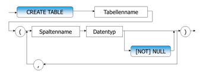
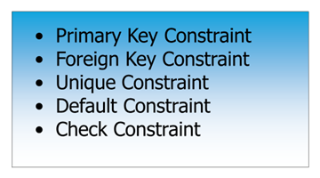
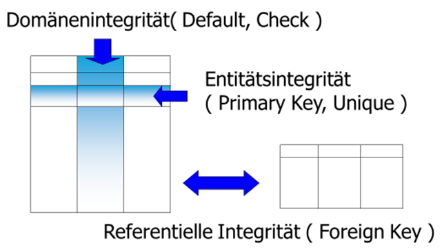
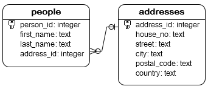
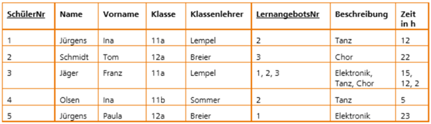

|                      |                           |                               |
| -------------------- | ------------------------- | ----------------------------- |
| **HF Systemtechnik** | **Softwareentwicklung B** |  |

- [1. Schema implementieren (Data Definition Language DDL)](#1-schema-implementieren-data-definition-language-ddl)
<<<<<<< HEAD
  - [Lernziele](#lernziele)
  - [1. Datentypen in SQLite](#1-datentypen-in-sqlite)
    - [1.1 Das Type-Affinity-System](#11-das-type-affinity-system)
    - [1.2 Empfohlene Datentypen für SQLite](#12-empfohlene-datentypen-für-sqlite)
    - [1.3 Datumstypen – die wichtigste SQLite-Besonderheit](#13-datumstypen--die-wichtigste-sqlite-besonderheit)
  - [2. CREATE TABLE – Tabellen erstellen](#2-create-table--tabellen-erstellen)
    - [2.1 Grundsyntax](#21-grundsyntax)
    - [2.2 Erste Tabelle: `abteilungen`](#22-erste-tabelle-abteilungen)
    - [2.3 IF NOT EXISTS – Sicheres Erstellen](#23-if-not-exists--sicheres-erstellen)
    - [2.4 Die vollständige `mitglieder`-Tabelle](#24-die-vollständige-mitglieder-tabelle)
  - [3. Constraints im Detail](#3-constraints-im-detail)
    - [3.1 NOT NULL](#31-not-null)
    - [3.2 UNIQUE](#32-unique)
    - [3.3 PRIMARY KEY](#33-primary-key)
    - [3.4 DEFAULT](#34-default)
    - [3.5 CHECK](#35-check)
    - [3.6 Constraints auf Tabellenebene – Übersicht](#36-constraints-auf-tabellenebene--übersicht)
  - [4. FOREIGN KEY – Fremdschlüssel und referentielle Integrität](#4-foreign-key--fremdschlüssel-und-referentielle-integrität)
    - [4.1 Grundkonzept](#41-grundkonzept)
    - [4.2 FK-Enforcement in SQLite aktivieren](#42-fk-enforcement-in-sqlite-aktivieren)
    - [4.3 ON DELETE und ON UPDATE – Referentielle Aktionen](#43-on-delete-und-on-update--referentielle-aktionen)
    - [4.4 Zirkuläre Referenzen](#44-zirkuläre-referenzen)
  - [5. DROP TABLE – Tabellen löschen](#5-drop-table--tabellen-löschen)
  - [6. ALTER TABLE – Tabellen anpassen](#6-alter-table--tabellen-anpassen)
    - [6.1 Was geht in SQLite](#61-was-geht-in-sqlite)
    - [6.2 Was geht NICHT – und der Workaround](#62-was-geht-nicht--und-der-workaround)
  - [7. Weitere nützliche Schema-Befehle](#7-weitere-nützliche-schema-befehle)
    - [7.1 Schema inspizieren](#71-schema-inspizieren)
    - [7.2 Indizes](#72-indizes)
    - [7.3 Views – Virtuelle Tabellen](#73-views--virtuelle-tabellen)
=======
  - [1.1. Lernziele](#11-lernziele)
  - [1.2. Datentypen in SQLite](#12-datentypen-in-sqlite)
    - [1.2.1. Das Type-Affinity-System](#121-das-type-affinity-system)
    - [1.2.2. Empfohlene Datentypen für SQLite](#122-empfohlene-datentypen-für-sqlite)
    - [1.2.3. Datumstypen – die wichtigste SQLite-Besonderheit](#123-datumstypen--die-wichtigste-sqlite-besonderheit)
  - [1.3. CREATE TABLE – Tabellen erstellen](#13-create-table--tabellen-erstellen)
    - [1.3.1. Grundsyntax](#131-grundsyntax)
    - [1.3.2. Erste Tabelle: `abteilungen`](#132-erste-tabelle-abteilungen)
    - [1.3.3. IF NOT EXISTS – Sicheres Erstellen](#133-if-not-exists--sicheres-erstellen)
    - [1.3.4. Die vollständige `mitglieder`-Tabelle](#134-die-vollständige-mitglieder-tabelle)
  - [1.4. Constraints im Detail](#14-constraints-im-detail)
    - [1.4.1. NOT NULL](#141-not-null)
    - [1.4.2. UNIQUE](#142-unique)
    - [1.4.3. PRIMARY KEY](#143-primary-key)
    - [1.4.4. DEFAULT](#144-default)
    - [1.4.5. CHECK](#145-check)
    - [1.4.6. Constraints auf Tabellenebene – Übersicht](#146-constraints-auf-tabellenebene--übersicht)
  - [1.5. FOREIGN KEY – Fremdschlüssel und referentielle Integrität](#15-foreign-key--fremdschlüssel-und-referentielle-integrität)
    - [1.5.1. Grundkonzept](#151-grundkonzept)
    - [1.5.2. FK-Enforcement in SQLite aktivieren](#152-fk-enforcement-in-sqlite-aktivieren)
    - [1.5.3. ON DELETE und ON UPDATE – Referentielle Aktionen](#153-on-delete-und-on-update--referentielle-aktionen)
    - [1.5.4. Zirkuläre Referenzen](#154-zirkuläre-referenzen)
  - [1.6. DROP TABLE – Tabellen löschen](#16-drop-table--tabellen-löschen)
  - [1.7. ALTER TABLE – Tabellen anpassen](#17-alter-table--tabellen-anpassen)
    - [1.7.1. 6.1 Was geht in SQLite](#171-61-was-geht-in-sqlite)
    - [1.7.2. Was geht NICHT – und der Workaround](#172-was-geht-nicht--und-der-workaround)
  - [1.8. Weitere nützliche Schema-Befehle](#18-weitere-nützliche-schema-befehle)
    - [1.8.1. Schema inspizieren](#181-schema-inspizieren)
    - [1.8.2. Indizes](#182-indizes)
    - [1.8.3. Views – Virtuelle Tabellen](#183-views--virtuelle-tabellen)
>>>>>>> d0a075d34870b80930722cb04d25515622b2bc1f
- [2. Übungsaufgaben](#2-übungsaufgaben)
  - [2.1. Produktherstellung (Implementierung)](#21-produktherstellung-implementierung)
  - [2.2. Schulverwaltung (Implementierung)](#22-schulverwaltung-implementierung)
  - [2.3. Lernangebot (Normalisierung u. Implementierung)](#23-lernangebot-normalisierung-u-implementierung)

---

</br>

# 1. Schema implementieren (Data Definition Language DDL)

[SQLite Tutorial](https://www.sqlitetutorial.net/)

<<<<<<< HEAD
## Lernziele
=======
## 1.1. Lernziele
>>>>>>> d0a075d34870b80930722cb04d25515622b2bc1f

Nach dieser Lektion könnt ihr:

- Tabellen in SQLite mit `CREATE TABLE` erstellen und mit `DROP TABLE` löschen
- Sinnvolle Datentypen für Spalten wählen und die Besonderheiten von SQLite dabei kennen
- Primärschlüssel (`PRIMARY KEY`) und Fremdschlüssel (`FOREIGN KEY`) korrekt definieren
- Constraints (`NOT NULL`, `UNIQUE`, `CHECK`, `DEFAULT`) gezielt einsetzen
- Bestehende Tabellen mit `ALTER TABLE` anpassen
- Ein vollständiges Datenbankschema von Grund auf implementieren

<<<<<<< HEAD
## 1. Datentypen in SQLite

### 1.1 Das Type-Affinity-System
=======
## 1.2. Datentypen in SQLite

### 1.2.1. Das Type-Affinity-System
>>>>>>> d0a075d34870b80930722cb04d25515622b2bc1f

SQLite ist anders als die meisten Datenbanken: Es verwendet **Type Affinity** statt
strenger Typisierung. Das bedeutet, jede Spalte hat eine *bevorzugte* Speicherklasse –
SQLite erzwingt den Typ aber nicht dogmatisch.

SQLite kennt fünf **Storage Classes** (interne Speicherformate):

| **Storage Class** | **Inhalt**                         |
| ----------------- | ---------------------------------- |
| `NULL`            | Fehlender / unbekannter Wert       |
| `INTEGER`         | Ganzzahl, 1–8 Bytes je nach Grösse |
| `REAL`            | 64-Bit Gleitkommazahl (IEEE 754)   |
| `TEXT`            | UTF-8 Zeichenkette                 |
| `BLOB`            | Rohdaten (Binary Large Object)     |

<<<<<<< HEAD
### 1.2 Empfohlene Datentypen für SQLite
=======
### 1.2.2. Empfohlene Datentypen für SQLite
>>>>>>> d0a075d34870b80930722cb04d25515622b2bc1f

In der Praxis verwendet ihr diese Typen – SQLite mappt sie intern auf die
Storage Classes oben:

| SQLite-Typ | Affinity | Typischer Einsatz                       |
| ---------- | -------- | --------------------------------------- |
| `INTEGER`  | INTEGER  | IDs, Anzahlen, Flags (0/1)              |
| `REAL`     | REAL     | Preise, Koordinaten, Messwerte          |
| `TEXT`     | TEXT     | Namen, E-Mails, Beschreibungen          |
| `BLOB`     | BLOB     | Bilder, Dateien (selten in SQLite)      |
| `NUMERIC`  | NUMERIC  | Geldbeträge mit definierter Genauigkeit |

<<<<<<< HEAD
### 1.3 Datumstypen – die wichtigste SQLite-Besonderheit
=======
### 1.2.3. Datumstypen – die wichtigste SQLite-Besonderheit
>>>>>>> d0a075d34870b80930722cb04d25515622b2bc1f

SQLite hat **keinen eingebauten Datumstyp**. Datum und Zeit werden als `TEXT`,
`INTEGER` oder `REAL` gespeichert. Die empfohlene Convention:

```sql
-- Option 1: ISO 8601 Text (empfohlen für Lesbarkeit)
geburtsdatum TEXT   -- Format: 'YYYY-MM-DD'
erstellt_am  TEXT   -- Format: 'YYYY-MM-DD HH:MM:SS'

-- Option 2: Unix-Timestamp (für Berechnungen)
erstellt_am  INTEGER  -- Sekunden seit 1970-01-01

-- SQLite-Datumsfunktionen funktionieren mit beiden Varianten:
SELECT date('now');                          -- '2024-11-15'
SELECT datetime('now', 'localtime');         -- '2024-11-15 14:32:10'
SELECT strftime('%d.%m.%Y', geburtsdatum);   -- '15.11.1990'
```

> **Convention im Team festlegen:** Wählt eine Variante und haltet euch
> konsequent daran. `TEXT` mit ISO 8601 ist am lesbarsten und am einfachsten
> zu debuggen.

---

<<<<<<< HEAD
## 2. CREATE TABLE – Tabellen erstellen

### 2.1 Grundsyntax
=======
## 1.3. CREATE TABLE – Tabellen erstellen

### 1.3.1. Grundsyntax
>>>>>>> d0a075d34870b80930722cb04d25515622b2bc1f



```sql
CREATE TABLE tabellenname (
    spalte1  datentyp  [constraints],
    spalte2  datentyp  [constraints],
    ...
    [tabellen-constraints]
);
```

<<<<<<< HEAD
### 2.2 Erste Tabelle: `abteilungen`
=======
### 1.3.2. Erste Tabelle: `abteilungen`
>>>>>>> d0a075d34870b80930722cb04d25515622b2bc1f

```sql
CREATE TABLE abteilungen (
    id          INTEGER PRIMARY KEY AUTOINCREMENT,
    name        TEXT    NOT NULL,
    gruendungsjahr INTEGER
);
```

**Was passiert hier Zeile für Zeile:**

<<<<<<< HEAD
- `id INTEGER PRIMARY KEY AUTOINCREMENT` – Eindeutiger Schlüssel, automatisch hochgezählt (1, 2, 3, …). 
- In SQLite ist `INTEGER PRIMARY KEY` ein Alias für die interne `rowid` – `AUTOINCREMENT` verhindert die Wiederverwendung gelöschter IDs.
- `name TEXT NOT NULL` – Pflichtfeld, darf nicht leer sein.
- `gruendungsjahr INTEGER` – Optionales Feld (darf `NULL` sein).

### 2.3 IF NOT EXISTS – Sicheres Erstellen
=======
- `id INTEGER PRIMARY KEY AUTOINCREMENT` – Eindeutiger Schlüssel, automatisch
  hochgezählt (1, 2, 3, …). In SQLite ist `INTEGER PRIMARY KEY` ein Alias für
  die interne `rowid` – `AUTOINCREMENT` verhindert die Wiederverwendung gelöschter IDs.
- `name TEXT NOT NULL` – Pflichtfeld, darf nicht leer sein.
- `gruendungsjahr INTEGER` – Optionales Feld (darf `NULL` sein).

### 1.3.3. IF NOT EXISTS – Sicheres Erstellen
>>>>>>> d0a075d34870b80930722cb04d25515622b2bc1f

```sql
-- Ohne IF NOT EXISTS: Fehler, wenn Tabelle bereits existiert
CREATE TABLE abteilungen ( ... );   -- Fehler bei Wiederholung

-- Mit IF NOT EXISTS: Kein Fehler, Tabelle bleibt unverändert
CREATE TABLE IF NOT EXISTS abteilungen ( ... );
```

> **Best Practice:** In Setup-Skripten immer `IF NOT EXISTS` verwenden –
> so kann das Skript mehrfach ausgeführt werden, ohne Fehler zu werfen.

<<<<<<< HEAD
### 2.4 Die vollständige `mitglieder`-Tabelle
=======
### 1.3.4. Die vollständige `mitglieder`-Tabelle
>>>>>>> d0a075d34870b80930722cb04d25515622b2bc1f

```sql
CREATE TABLE IF NOT EXISTS mitglieder (
    id           INTEGER PRIMARY KEY AUTOINCREMENT,
    vorname      TEXT    NOT NULL,
    nachname     TEXT    NOT NULL,
    email        TEXT    NOT NULL UNIQUE,
    telefon      TEXT,
    geburtsdatum TEXT,                          -- ISO 8601: 'YYYY-MM-DD'
    eintrittsdatum TEXT NOT NULL
                    DEFAULT (date('now')),       -- Heute als Standardwert
    aktiv        INTEGER NOT NULL DEFAULT 1,    -- 1 = aktiv, 0 = inaktiv (Boolean)
    abteilung_id INTEGER REFERENCES abteilungen(id)
                    ON DELETE SET NULL
                    ON UPDATE CASCADE
);
```

---

<<<<<<< HEAD
## 3. Constraints im Detail
=======
## 1.4. Constraints im Detail
>>>>>>> d0a075d34870b80930722cb04d25515622b2bc1f



Constraints sind **Regeln auf Spalten- oder Tabellenebene**, die SQLite bei
jedem `INSERT` und `UPDATE` prüft. Sie sichern die Datenintegrität.



<<<<<<< HEAD
### 3.1 NOT NULL
=======
### 1.4.1. NOT NULL
>>>>>>> d0a075d34870b80930722cb04d25515622b2bc1f

Verhindert leere Werte. Felder ohne `NOT NULL` akzeptieren automatisch `NULL`.

```sql
-- Spalte mit NOT NULL
name TEXT NOT NULL

-- Spalte ohne NOT NULL (NULL erlaubt)
beschreibung TEXT        -- entspricht: beschreibung TEXT NULL
```

**Wann `NOT NULL` verwenden?**

- Pflichtfelder, die für die Identität des Datensatzes wesentlich sind
- Fremdschlüssel, wenn die Beziehung obligatorisch ist
- Felder, die in Berechnungen oder Joins vorkommen (NULL in Berechnungen
  ergibt immer NULL)

```sql
-- Typischer Fehler:
INSERT INTO mitglieder (vorname, email, eintrittsdatum)
VALUES ('Anna', 'anna@example.com', '2024-01-15');
-- Fehler: NOT NULL constraint failed: mitglieder.nachname
```

<<<<<<< HEAD
### 3.2 UNIQUE
=======
### 1.4.2. UNIQUE
>>>>>>> d0a075d34870b80930722cb04d25515622b2bc1f

Garantiert, dass kein Wert in dieser Spalte doppelt vorkommt.
`NULL`-Werte sind von `UNIQUE` ausgenommen – mehrere `NULL`-Werte sind erlaubt.

```sql
-- Einfach-UNIQUE auf Spaltenebene
email TEXT NOT NULL UNIQUE

-- Zusammengesetztes UNIQUE auf Tabellenebene
-- (Kombination muss eindeutig sein, nicht jede Spalte einzeln)
CREATE TABLE mitglied_event (
    mitglied_id INTEGER NOT NULL,
    event_id    INTEGER NOT NULL,
    anmeldedatum TEXT,
    UNIQUE (mitglied_id, event_id)   -- ein Mitglied kann sich nur einmal anmelden
);
```

<<<<<<< HEAD
### 3.3 PRIMARY KEY
=======
### 1.4.3. PRIMARY KEY
>>>>>>> d0a075d34870b80930722cb04d25515622b2bc1f

Kombination aus `NOT NULL` und `UNIQUE`. Jede Tabelle sollte einen
Primärschlüssel haben.

```sql
-- Einfacher PK (häufigster Fall)
id INTEGER PRIMARY KEY AUTOINCREMENT

-- Zusammengesetzter PK (auf Tabellenebene)
CREATE TABLE mitglied_event (
    mitglied_id INTEGER NOT NULL,
    event_id    INTEGER NOT NULL,
    anmeldedatum TEXT,
    PRIMARY KEY (mitglied_id, event_id)
);
```

> **AUTOINCREMENT – wann nötig?**
> Ohne `AUTOINCREMENT`: SQLite wählt `MAX(id) + 1`. Gelöschte IDs können
> wiederverwendet werden.
> Mit `AUTOINCREMENT`: IDs steigen immer strikt an, gelöschte IDs werden nie
> wiederverwendet. Braucht etwas mehr Overhead – für die meisten Anwendungen
> empfehlenswert, wenn IDs auch als Referenz nach aussen dienen.

<<<<<<< HEAD
### 3.4 DEFAULT
=======
### 1.4.4. DEFAULT
>>>>>>> d0a075d34870b80930722cb04d25515622b2bc1f

Definiert einen Standardwert, der verwendet wird, wenn beim `INSERT` kein
Wert angegeben wird.

```sql
-- Statischer Standardwert
status  TEXT    NOT NULL DEFAULT 'aktiv'
aktiv   INTEGER NOT NULL DEFAULT 1
land    TEXT             DEFAULT 'Schweiz'

-- Dynamischer Standardwert (Funktion)
erstellt_am TEXT NOT NULL DEFAULT (datetime('now'))
token       TEXT NOT NULL DEFAULT (hex(randomblob(16)))

-- Verwendung:
INSERT INTO mitglieder (vorname, nachname, email, eintrittsdatum)
VALUES ('Beat', 'Müller', 'beat@example.com', '2024-03-01');
-- aktiv wird automatisch auf 1 gesetzt
-- eintrittsdatum DEFAULT greift NICHT, weil wir einen Wert angegeben haben
```

<<<<<<< HEAD
### 3.5 CHECK
=======
### 1.4.5. CHECK
>>>>>>> d0a075d34870b80930722cb04d25515622b2bc1f

Prüft einen beliebigen booleschen Ausdruck. `INSERT` und `UPDATE` schlagen
fehl, wenn die Bedingung `FALSE` ergibt. `NULL` besteht den CHECK
(da `NULL` in SQLite als "unbekannt" gilt, nicht als falsch).

```sql
-- Einfache CHECK-Constraints
ALTER TABLE mitglieder ADD COLUMN jahrgang INTEGER
    CHECK (jahrgang >= 1900 AND jahrgang <= 2020);

-- Typische CHECKs in der Praxis
preis       REAL    NOT NULL CHECK (preis >= 0),
prioritaet  INTEGER NOT NULL CHECK (prioritaet IN (1, 2, 3)),
status      TEXT    NOT NULL CHECK (status IN ('aktiv', 'inaktiv', 'gesperrt')),
bis_datum   TEXT             CHECK (bis_datum >= von_datum),  -- spaltenübergreifend

-- Events-Tabelle mit mehreren Checks
CREATE TABLE IF NOT EXISTS events (
    id              INTEGER PRIMARY KEY AUTOINCREMENT,
    titel           TEXT    NOT NULL,
    von_datum       TEXT    NOT NULL,
    bis_datum       TEXT    NOT NULL,
    max_teilnehmer  INTEGER CHECK (max_teilnehmer > 0),
    kosten          REAL    NOT NULL DEFAULT 0.0
                    CHECK (kosten >= 0),
    status          TEXT    NOT NULL DEFAULT 'geplant'
                    CHECK (status IN ('geplant', 'aktiv', 'abgesagt', 'abgeschlossen')),
    verantwortlich_id INTEGER REFERENCES mitglieder(id),
    CONSTRAINT valid_zeitraum CHECK (bis_datum >= von_datum)
);
```

> **Benannte Constraints:** Mit `CONSTRAINT name` können Constraints
> benannt werden. Das ergibt bessere Fehlermeldungen und erleichtert das
> spätere Löschen (bei ALTER TABLE).

<<<<<<< HEAD
### 3.6 Constraints auf Tabellenebene – Übersicht
=======
### 1.4.6. Constraints auf Tabellenebene – Übersicht
>>>>>>> d0a075d34870b80930722cb04d25515622b2bc1f

Constraints können an der Spalte (Spaltenebene) oder am Ende der
Tabellendefinition (Tabellenebene) stehen. Tabellenebene ist zwingend
für zusammengesetzte Constraints:

```sql
CREATE TABLE beispiel (
    col_a INTEGER,
    col_b INTEGER,
    col_c TEXT,

    -- Tabellenebene: zusammengesetzte Constraints
    PRIMARY KEY (col_a, col_b),
    UNIQUE (col_b, col_c),
    CHECK (col_a > 0 AND col_b > col_a),
    CONSTRAINT fk_beispiel FOREIGN KEY (col_a) REFERENCES andere_tabelle(id)
);
```

---

<<<<<<< HEAD
## 4. FOREIGN KEY – Fremdschlüssel und referentielle Integrität

### 4.1 Grundkonzept
=======
## 1.5. FOREIGN KEY – Fremdschlüssel und referentielle Integrität

### 1.5.1. Grundkonzept
>>>>>>> d0a075d34870b80930722cb04d25515622b2bc1f

Fremdschlüssel stellen sicher, dass referenzierte Datensätze wirklich
existieren. Ein Mitglied kann nur einer Abteilung zugeordnet werden, die
tatsächlich in der `abteilungen`-Tabelle vorhanden ist.



```sql
-- In der Child-Tabelle (mitglieder):
abteilung_id INTEGER REFERENCES abteilungen(id)

-- Vollständige Syntax (explizit):
abteilung_id INTEGER,
FOREIGN KEY (abteilung_id) REFERENCES abteilungen(id)
```

<<<<<<< HEAD
### 4.2 FK-Enforcement in SQLite aktivieren
=======
### 1.5.2. FK-Enforcement in SQLite aktivieren
>>>>>>> d0a075d34870b80930722cb04d25515622b2bc1f

> **Kritisch:** SQLite prüft Fremdschlüssel standardmässig **NICHT**!
> Ihr müsst die Prüfung bei jeder Verbindung explizit aktivieren:

```sql
-- Am Anfang jeder Session / jedes Skripts:
PRAGMA foreign_keys = ON;

-- Prüfen ob aktiv:
PRAGMA foreign_keys;   -- 1 = aktiv, 0 = inaktiv
```

In Anwendungscode (z.B. C# mit Microsoft.Data.Sqlite):

```csharp
// Beim Öffnen der Verbindung:
connection.Execute("PRAGMA foreign_keys = ON;");
```

<<<<<<< HEAD
### 4.3 ON DELETE und ON UPDATE – Referentielle Aktionen
=======
### 1.5.3. ON DELETE und ON UPDATE – Referentielle Aktionen
>>>>>>> d0a075d34870b80930722cb04d25515622b2bc1f

Was passiert, wenn ein referenzierter Datensatz gelöscht oder geändert wird?

| **Aktion**    | **Verhalten**                                                     |
| ------------- | ----------------------------------------------------------------- |
| `RESTRICT`    | Löschen/Ändern verboten, solange Referenzen existieren (Standard) |
| `NO ACTION`   | Wie RESTRICT, aber Prüfung erfolgt erst am Ende der Transaktion   |
| `CASCADE`     | Abhängige Datensätze werden automatisch mitgelöscht/-geändert     |
| `SET NULL`    | Fremdschlüssel-Spalte wird auf `NULL` gesetzt                     |
| `SET DEFAULT` | Fremdschlüssel-Spalte wird auf den DEFAULT-Wert gesetzt           |

```sql
CREATE TABLE IF NOT EXISTS mitglieder (
    id           INTEGER PRIMARY KEY AUTOINCREMENT,
    vorname      TEXT    NOT NULL,
    nachname     TEXT    NOT NULL,
    email        TEXT    NOT NULL UNIQUE,
    telefon      TEXT,
    geburtsdatum TEXT,
    eintrittsdatum TEXT  NOT NULL DEFAULT (date('now')),
    aktiv        INTEGER NOT NULL DEFAULT 1,

    -- Abteilung: optional. Wird Abteilung gelöscht → NULL setzen
    abteilung_id INTEGER
        REFERENCES abteilungen(id)
        ON DELETE SET NULL
        ON UPDATE CASCADE
);
```

**Praxisbeispiele für die Aktionswahl:**

```sql
-- Bestellpositionen: Wenn Bestellung gelöscht → Positionen mitlöschen
bestellung_id INTEGER NOT NULL
    REFERENCES bestellungen(id)
    ON DELETE CASCADE

-- Mitglied: Wenn Abteilung gelöscht → Mitglied bleibt, Zuweisung wird NULL
abteilung_id INTEGER
    REFERENCES abteilungen(id)
    ON DELETE SET NULL

-- Kritische Referenz: Löschen verhindern (z.B. Rechnungen)
kunden_id INTEGER NOT NULL
    REFERENCES kunden(id)
    ON DELETE RESTRICT
```

<<<<<<< HEAD
### 4.4 Zirkuläre Referenzen
=======
### 1.5.4. Zirkuläre Referenzen
>>>>>>> d0a075d34870b80930722cb04d25515622b2bc1f

Abteilungen haben einen Leiter (ein Mitglied), Mitglieder gehören einer
Abteilung – das ist eine zirkuläre Abhängigkeit. Lösung: `DEFERRABLE`:

```sql
CREATE TABLE IF NOT EXISTS abteilungen (
    id      INTEGER PRIMARY KEY AUTOINCREMENT,
    name    TEXT    NOT NULL UNIQUE,
    leiter_id INTEGER
        REFERENCES mitglieder(id)
        ON DELETE SET NULL
        DEFERRABLE INITIALLY DEFERRED  -- FK-Prüfung erst am Transaktionsende
);
```

```sql
-- Einfügen ohne DEFERRABLE wäre unmöglich:
BEGIN TRANSACTION;
    -- Zuerst Abteilung ohne Leiter (Leiter existiert noch nicht)
    INSERT INTO abteilungen (name) VALUES ('Vorstand');

    -- Dann Mitglied mit Abteilung
    INSERT INTO mitglieder (vorname, nachname, email, eintrittsdatum, abteilung_id)
    VALUES ('Sandra', 'Graf', 'sandra@verein.ch', '2020-01-01', 1);

    -- Jetzt Leiter setzen
    UPDATE abteilungen SET leiter_id = 1 WHERE id = 1;
COMMIT;
```

---

<<<<<<< HEAD
## 5. DROP TABLE – Tabellen löschen
=======
## 1.6. DROP TABLE – Tabellen löschen
>>>>>>> d0a075d34870b80930722cb04d25515622b2bc1f

```sql
-- Tabelle löschen (Fehler, wenn nicht vorhanden)
DROP TABLE mitglieder;

-- Sicheres Löschen (kein Fehler, wenn nicht vorhanden)
DROP TABLE IF EXISTS mitglieder;
```

> **`DROP TABLE` löscht alle Daten unwiderruflich!** In SQLite gibt es
> kein automatisches Backup. Immer zuerst mit `SELECT` prüfen, ob das die
> richtige Tabelle ist.

**Reihenfolge beim Löschen mit Fremdschlüsseln:**

Child-Tabellen (die FKs enthalten) müssen **vor** Parent-Tabellen gelöscht
werden – sonst verletzt ihr die referentielle Integrität:

```sql
PRAGMA foreign_keys = ON;

-- Reihenfolge: erst Child, dann Parent
DROP TABLE IF EXISTS mitglied_event;  -- referenziert mitglieder + events
DROP TABLE IF EXISTS events;          -- referenziert mitglieder
DROP TABLE IF EXISTS mitglieder;      -- referenziert abteilungen
DROP TABLE IF EXISTS abteilungen;     -- keine FK nach aussen
```

---

<<<<<<< HEAD
## 6. ALTER TABLE – Tabellen anpassen
=======
## 1.7. ALTER TABLE – Tabellen anpassen
>>>>>>> d0a075d34870b80930722cb04d25515622b2bc1f

SQLite unterstützt nur einen eingeschränkten Satz von `ALTER TABLE`-Befehlen
im Vergleich zu anderen Datenbanken.

<<<<<<< HEAD
### 6.1 Was geht in SQLite
=======
### 1.7.1. 6.1 Was geht in SQLite
>>>>>>> d0a075d34870b80930722cb04d25515622b2bc1f

```sql
-- Tabelle umbenennen
ALTER TABLE mitglieder RENAME TO vereinsmitglieder;

-- Spalte umbenennen (ab SQLite 3.25.0)
ALTER TABLE mitglieder RENAME COLUMN telefon TO mobile;

-- Spalte hinzufügen (nur am Ende, keine Constraints ausser DEFAULT und NOT NULL
-- wenn DEFAULT angegeben oder NOT NULL mit DEFAULT)
ALTER TABLE mitglieder ADD COLUMN notizen TEXT;
ALTER TABLE mitglieder ADD COLUMN newsletter INTEGER NOT NULL DEFAULT 0;

-- Spalte löschen (ab SQLite 3.35.0)
ALTER TABLE mitglieder DROP COLUMN notizen;
```

<<<<<<< HEAD
### 6.2 Was geht NICHT – und der Workaround
=======
### 1.7.2. Was geht NICHT – und der Workaround
>>>>>>> d0a075d34870b80930722cb04d25515622b2bc1f

SQLite erlaubt kein nachträgliches Hinzufügen von Constraints (z.B. `UNIQUE`,
`CHECK`, `FOREIGN KEY`) zu bestehenden Spalten. Dafür gibt es den
**Table-Rebuild-Workaround**:

```sql
-- Schritt 1: Neue Tabelle mit gewünschtem Schema erstellen
CREATE TABLE mitglieder_neu (
    id           INTEGER PRIMARY KEY AUTOINCREMENT,
    vorname      TEXT    NOT NULL,
    nachname     TEXT    NOT NULL,
    email        TEXT    NOT NULL UNIQUE,  -- neu: UNIQUE
    telefon      TEXT,
    geburtsdatum TEXT    CHECK (geburtsdatum GLOB '????-??-??'),  -- neu: CHECK
    eintrittsdatum TEXT  NOT NULL DEFAULT (date('now')),
    aktiv        INTEGER NOT NULL DEFAULT 1,
    abteilung_id INTEGER REFERENCES abteilungen(id) ON DELETE SET NULL
);

-- Schritt 2: Daten übertragen
INSERT INTO mitglieder_neu
SELECT id, vorname, nachname, email, telefon, geburtsdatum,
       eintrittsdatum, aktiv, abteilung_id
FROM mitglieder;

-- Schritt 3: Alte Tabelle löschen
DROP TABLE mitglieder;

-- Schritt 4: Neue Tabelle umbenennen
ALTER TABLE mitglieder_neu RENAME TO mitglieder;
```

> **Tipp:** In der Entwicklung (vor Produktivdaten) ist es einfacher,
> das Schema zu löschen und neu aufzubauen. Für produktive Datenbanken:
> SQLite-Migrations-Bibliotheken (z.B. FluentMigrator, EF Core Migrations)
> übernehmen diesen Prozess automatisch.

---

<<<<<<< HEAD
## 7. Weitere nützliche Schema-Befehle

### 7.1 Schema inspizieren
=======
## 1.8. Weitere nützliche Schema-Befehle

### 1.8.1. Schema inspizieren
>>>>>>> d0a075d34870b80930722cb04d25515622b2bc1f

```sql
-- Alle Tabellen anzeigen
SELECT name FROM sqlite_master WHERE type = 'table' ORDER BY name;

-- CREATE-Statement einer Tabelle anzeigen
SELECT sql FROM sqlite_master WHERE name = 'mitglieder';

-- Spalten einer Tabelle anzeigen
PRAGMA table_info(mitglieder);
-- Gibt zurück: cid, name, type, notnull, dflt_value, pk

-- Fremdschlüssel einer Tabelle
PRAGMA foreign_key_list(mitglieder);

-- Alle Indizes
PRAGMA index_list(mitglieder);
```

<<<<<<< HEAD
### 7.2 Indizes
=======
### 1.8.2. Indizes
>>>>>>> d0a075d34870b80930722cb04d25515622b2bc1f

Indizes beschleunigen Abfragen auf Kosten von Speicher und Schreibperformance.
Primary Keys und UNIQUE-Constraints erstellen automatisch einen Index.

```sql
-- Einfacher Index (beschleunigt WHERE nachname = '...')
CREATE INDEX IF NOT EXISTS idx_mitglieder_nachname
    ON mitglieder (nachname);

-- Zusammengesetzter Index (beschleunigt WHERE nachname = '...' AND vorname = '...')
CREATE INDEX IF NOT EXISTS idx_mitglieder_name
    ON mitglieder (nachname, vorname);

-- Partieller Index (nur aktive Mitglieder indizieren)
CREATE INDEX IF NOT EXISTS idx_mitglieder_aktiv_email
    ON mitglieder (email)
    WHERE aktiv = 1;

-- Index löschen
DROP INDEX IF EXISTS idx_mitglieder_nachname;
```

<<<<<<< HEAD
### 7.3 Views – Virtuelle Tabellen
=======
### 1.8.3. Views – Virtuelle Tabellen
>>>>>>> d0a075d34870b80930722cb04d25515622b2bc1f

Views sind gespeicherte SELECT-Abfragen, die wie Tabellen abgefragt werden
können. Sie speichern keine Daten, sondern nur die Abfrage.

```sql
-- View: Aktive Mitglieder mit Abteilungsname
CREATE VIEW IF NOT EXISTS v_aktive_mitglieder AS
SELECT
    m.id,
    m.vorname || ' ' || m.nachname AS vollname,
    m.email,
    m.eintrittsdatum,
    COALESCE(a.name, 'Keine Abteilung') AS abteilung
FROM mitglieder m
LEFT JOIN abteilungen a ON m.abteilung_id = a.id
WHERE m.aktiv = 1;

-- Verwendung wie eine normale Tabelle:
SELECT * FROM v_aktive_mitglieder WHERE abteilung = 'Vorstand';

-- View löschen
DROP VIEW IF EXISTS v_aktive_mitglieder;
```

---

</br>

# 2. Übungsaufgaben

## 2.1. Produktherstellung (Implementierung)

| **Vorgabe**             | **Beschreibung**                                              |
| :---------------------- | :------------------------------------------------------------ |
| **Lernziele**           | Kann ein relationales Datenbankmodell mit SQL implementieren. |
| **Sozialform**          | Einzelarbeit                                                  |
| **Auftrag**             | siehe unten                                                   |
| **Hilfsmittel**         |                                                               |
| **Erwartete Resultate** |                                                               |
| **Zeitbedarf**          | 30 min                                                        |
| **Lösungselemente**     | Fehlerfreie SQL-Skriptdateien                                 |
|                         | `herstellung_create_schema.sql`                               |

**Ausgangssituation:**

- Sie verwenden das Datenbank Modell vorangegangener Aufgabe.
- Implementieren Sie dieses Modell und fügen Sie die aufgelisteten Daten ein.

**Aufgabe:**

- Schreiben Sie die SQL-Befehle (create table …) um alle Tabellen in Ihrer Produktherstellung anzulegen.
- Verwenden Sie hierzu das "SQLite Studio" oder "DB Browser".

Beispiel:

```sql
CREATE TABLE Ort (
    OrtID INTEGER,
    PLZ INTEGER,
    Ortschaft TEXT NOT NULL,
    constraint PK_Ort PRIMARY KEY (OrtID)
);
```

---

## 2.2. Schulverwaltung (Implementierung)

| **Vorgabe**             | **Beschreibung**                                              |
| :---------------------- | :------------------------------------------------------------ |
| **Lernziele**           | Kann ein relationales Datenbankmodell mit SQL implementieren. |
| **Sozialform**          | Einzelarbeit                                                  |
| **Auftrag**             | siehe unten                                                   |
| **Hilfsmittel**         |                                                               |
| **Erwartete Resultate** |                                                               |
| **Zeitbedarf**          | 50 min                                                        |
| **Lösungselemente**     | Fehlerfreie SQL-Skriptdateien                                 |
|                         | `sv_create_schema.sql`                                        |
|                         | `sv_drop_schema.sql`                                          |

**Ausgangssituation:**

- Sie verwenden das Datenbank Modell vorangegangener Aufgabe.
- Implementieren Sie dieses Modell und fügen Sie die aufgelisteten Daten ein.

**Aufgabe:**

- Schreiben Sie die SQL-Befehle (create table …) um alle Tabellen in Ihrer Schulverwaltungsdatenbank anzulegen.
- Verwenden Sie hierzu das "SQLite Studio" oder "DB Browser".

Beispiel:

```sql
CREATE TABLE MITGLIED (
    ID            INTEGER        NOT NULL,
    VORNAME       VARCHAR(40)    NULL,
    CONSTRAINT [PK_MITGLIED] PRIMARY KEY (ID)
```

---

## 2.3. Lernangebot (Normalisierung u. Implementierung)

| **Vorgabe**             | **Beschreibung**                                                          |
| :---------------------- | :------------------------------------------------------------------------ |
| **Lernziele**           | Kann unnormalisierte Daten in eine normalisierte Struktur transformieren. |
| **Sozialform**          | Einzelarbeit                                                              |
| **Auftrag**             | siehe unten                                                               |
| **Hilfsmittel**         |                                                                           |
| **Erwartete Resultate** |                                                                           |
| **Zeitbedarf**          | 60 min                                                                    |
| **Lösungselemente**     | Excel-Datei mit normalisierten Daten                                      |

**Aufgabenstellung:**

- Sie erhalten sie unten abgebildete Tabelle. Diese sollen nun in eine stark strukturierte Form (normalisierte Struktur) übertragen werden
- Aktuell wird das Lernangebot einer Bildungseinrichtung in einer Excel Datei mit nachfolgender Struktur geführt.
- Überlegen Sie, wie redundante Daten ohne Informationsverlust eliminiert werden kann.



---

© 2026 Lukas Müller – Licensed under CC BY-NC-ND 4.0
See [LICENSE](..\license.md) file for details.
