|                      |                           |                               |
| -------------------- | ------------------------- | ----------------------------- |
| **HF Systemtechnik** | **Softwareentwicklung B** |  |

- [1. SQL - Abfragen (SQLite)](#1-sql---abfragen-sqlite)
  - [1.1. Lernziele](#11-lernziele)
  - [1.2. Ausgangslage: Die Übungsdatenbank](#12-ausgangslage-die-übungsdatenbank)
  - [1.3. Grundstruktur des SELECT-Befehls](#13-grundstruktur-des-select-befehls)
    - [1.3.1. Alle Spalten vs. gezielte Auswahl](#131-alle-spalten-vs-gezielte-auswahl)
    - [1.3.2. Aliase (AS)](#132-aliase-as)
    - [1.3.3. Berechnungen und Ausdrücke](#133-berechnungen-und-ausdrücke)
    - [1.3.4. DISTINCT – Duplikate entfernen](#134-distinct--duplikate-entfernen)
  - [1.4. Filtern mit WHERE und Prädikaten](#14-filtern-mit-where-und-prädikaten)
    - [1.4.1. Vergleichsoperatoren](#141-vergleichsoperatoren)
    - [1.4.2. BETWEEN – Bereichsfilter](#142-between--bereichsfilter)
    - [1.4.3. IN – Werteliste](#143-in--werteliste)
    - [1.4.4. LIKE – Textmuster](#144-like--textmuster)
    - [1.4.5. IS NULL / IS NOT NULL](#145-is-null--is-not-null)
    - [1.4.6. Logische Operatoren: AND, OR, NOT](#146-logische-operatoren-and-or-not)
  - [1.5. Sortieren, Begrenzen und Aggregieren](#15-sortieren-begrenzen-und-aggregieren)
    - [1.5.1. ORDER BY – Sortierung](#151-order-by--sortierung)
    - [1.5.2. LIMIT und OFFSET – Paginierung](#152-limit-und-offset--paginierung)
    - [1.5.3. Aggregatfunktionen](#153-aggregatfunktionen)
    - [1.5.4. GROUP BY – Gruppierung](#154-group-by--gruppierung)
    - [1.5.5. HAVING – Filter auf Gruppen](#155-having--filter-auf-gruppen)
  - [1.6. Tabellen verknüpfen mit JOINs](#16-tabellen-verknüpfen-mit-joins)
    - [1.6.1. INNER JOIN (nur übereinstimmende Zeilen)](#161-inner-join-nur-übereinstimmende-zeilen)
    - [1.6.2. LEFT JOIN (alle linken Zeilen)](#162-left-join-alle-linken-zeilen)
    - [1.6.3. Übersicht der JOIN-Typen](#163-übersicht-der-join-typen)
    - [1.6.4. JOIN mit Aggregation kombinieren](#164-join-mit-aggregation-kombinieren)
  - [1.7. Unterabfragen (Subqueries)](#17-unterabfragen-subqueries)
    - [1.7.1. Subquery in WHERE](#171-subquery-in-where)
    - [1.7.2. Subquery in FROM (Derived Table)](#172-subquery-in-from-derived-table)
    - [1.7.3. EXISTS – Existenzprüfung](#173-exists--existenzprüfung)
  - [1.8. Zusammenfassung und Cheatsheet](#18-zusammenfassung-und-cheatsheet)
    - [1.8.1. Klausel-Reihenfolge](#181-klausel-reihenfolge)
    - [1.8.2. Prädikate Übersicht](#182-prädikate-übersicht)
    - [1.8.3. JOIN-Typen](#183-join-typen)
    - [1.8.4. Weiterführende Ressourcen](#184-weiterführende-ressourcen)
- [2. Aufgaben](#2-aufgaben)
  - [2.1. Datenbank Bibliothek erstellen](#21-datenbank-bibliothek-erstellen)
  - [2.2. Abfragen Bibliothek Datenbank](#22-abfragen-bibliothek-datenbank)
  - [2.7. Praxisprojekt: Bibliotheksauswertung](#27-praxisprojekt-bibliotheksauswertung)
  - [2.7. Abfragen Schulverwaltungsdatenbank](#27-abfragen-schulverwaltungsdatenbank)

---

</br>

# 1. SQL - Abfragen (SQLite)

## 1.1. Lernziele

**Nach dieser Lektion könnt ihr:**

- die Grundstruktur des `SELECT`-Befehls verstehen und anwenden
- Daten filtern mit `WHERE` und verschiedenen Prädikaten
- Ergebnisse sortieren, gruppieren und aggregieren
- mehrere Tabellen mit `JOIN`s verknüpfen
- Unterabfragen (Subqueries) einsetzen

---

## 1.2. Ausgangslage: Die Übungsdatenbank

Alle Beispiele basieren auf einer einfachen Bibliotheksdatenbank. Sie besteht aus vier Tabellen und bildet einen praxisnahen Kontext, der über die gesamte Lektion hinweg verwendet wird.

```sql
-- Tabelle: autoren
CREATE TABLE autoren (
    id          INTEGER PRIMARY KEY AUTOINCREMENT,
    vorname     TEXT NOT NULL,
    nachname    TEXT NOT NULL,
    land        TEXT,
    geburtsjahr INTEGER
);

-- Tabelle: buecher
CREATE TABLE buecher (
    id           INTEGER PRIMARY KEY AUTOINCREMENT,
    titel        TEXT NOT NULL,
    autor_id     INTEGER REFERENCES autoren(id),
    genre        TEXT,
    jahr         INTEGER,
    preis        REAL,
    lagerbestand INTEGER DEFAULT 0
);

-- Tabelle: kunden
CREATE TABLE kunden (
    id    INTEGER PRIMARY KEY AUTOINCREMENT,
    name  TEXT NOT NULL,
    email TEXT UNIQUE,
    stadt TEXT
);

-- Tabelle: ausleihen
CREATE TABLE ausleihen (
    id           INTEGER PRIMARY KEY AUTOINCREMENT,
    kunden_id    INTEGER REFERENCES kunden(id),
    buch_id      INTEGER REFERENCES buecher(id),
    ausleihdatum TEXT,
    rueckgabe    TEXT
);
```

---

## 1.3. Grundstruktur des SELECT-Befehls

`SELECT` ist der zentrale Befehl zum Lesen von Daten aus einer Datenbank. Er folgt einer fixen Klausel-Reihenfolge:

```sql
SELECT  [DISTINCT] spalte1, spalte2, ...   -- Was?
FROM    tabelle                             -- Woher?
[JOIN   ...]                               -- Verknüpfungen
[WHERE  bedingung]                         -- Filter
[GROUP BY spalte]                          -- Gruppierung
[HAVING  bedingung]                        -- Filter auf Gruppen
[ORDER BY spalte [ASC|DESC]]               -- Sortierung
[LIMIT  n OFFSET m];                       -- Mengenbegrenzung
```

### 1.3.1. Alle Spalten vs. gezielte Auswahl

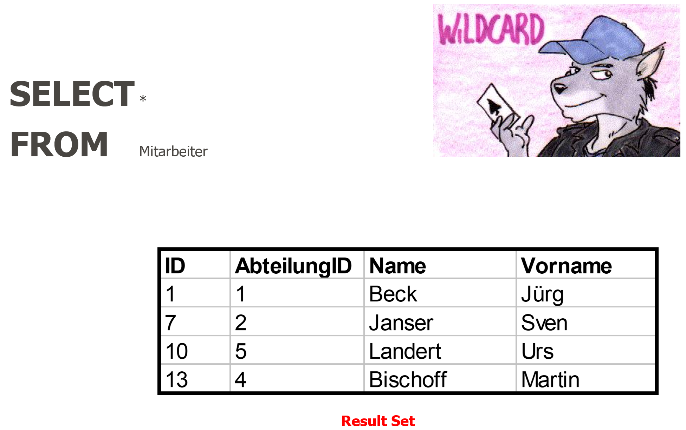

Der Stern (`*`) wählt alle Spalten – praktisch zum Erkunden, aber in Produktion vermeiden:

```sql
-- Alle Spalten (Entwicklung / Debugging)
SELECT * FROM buecher;

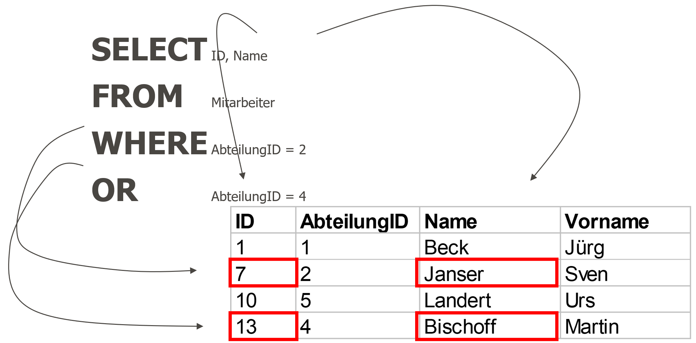

-- Nur benötigte Spalten (bevorzugt)
SELECT titel, genre, preis FROM buecher;
```

> **Best Practice: `SELECT *` vermeiden**

- Überträgt unnötige Daten (Performance)
- Bricht Code, wenn Spalten hinzugefügt/entfernt werden
- Erschwert das Lesen der Abfrageabsicht

### 1.3.2. Aliase (AS)

Spalten und Tabellen können mit `AS` umbenannt werden – besonders bei Berechnungen oder langen Namen nützlich:

```sql
SELECT
    titel              AS Buchtitel,
    preis * 1.077      AS Preis_CHF,
    lagerbestand       AS Verfuegbar
FROM buecher;
```

### 1.3.3. Berechnungen und Ausdrücke

```sql
-- Arithmetik direkt in SELECT
SELECT
    titel,
    preis,
    preis * 0.9           AS Rabattpreis,
    preis - (preis * 0.1) AS Ebenfalls_Rabatt
FROM buecher;

-- Texte verketten mit ||
SELECT vorname || ' ' || nachname AS Vollname
FROM autoren;
```

### 1.3.4. DISTINCT – Duplikate entfernen

`DISTINCT` sorgt dafür, dass jede Kombination nur einmal im Ergebnis erscheint:

```sql
-- Welche Genres gibt es? (ohne Duplikate)
SELECT DISTINCT genre FROM buecher ORDER BY genre;

-- Welche Länder haben Autoren?
SELECT DISTINCT land FROM autoren WHERE land IS NOT NULL;
```

---

## 1.4. Filtern mit WHERE und Prädikaten

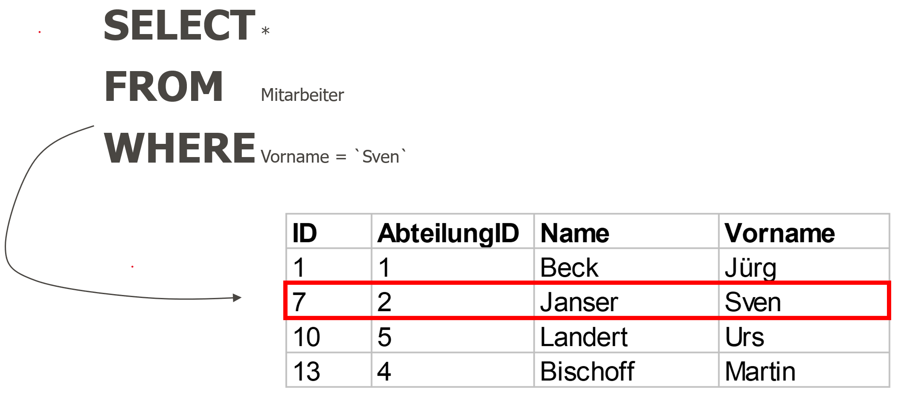

Die `WHERE`-Klausel schränkt das Ergebnis auf Zeilen ein, die eine Bedingung erfüllen. SQLite kennt verschiedene Prädikate:

### 1.4.1. Vergleichsoperatoren

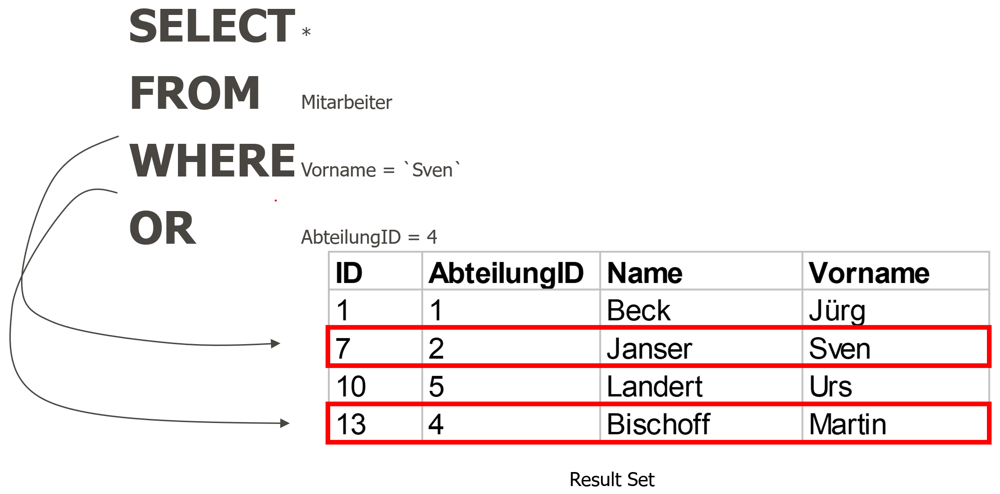

```sql
-- Einfache Vergleiche: =, <>, <, >, <=, >=
SELECT titel, preis FROM buecher
WHERE preis > 25.00;

SELECT titel, jahr FROM buecher
WHERE jahr >= 2000 AND jahr <= 2020;

-- Ungleich
SELECT * FROM autoren WHERE land <> 'Deutschland';
```

### 1.4.2. BETWEEN – Bereichsfilter

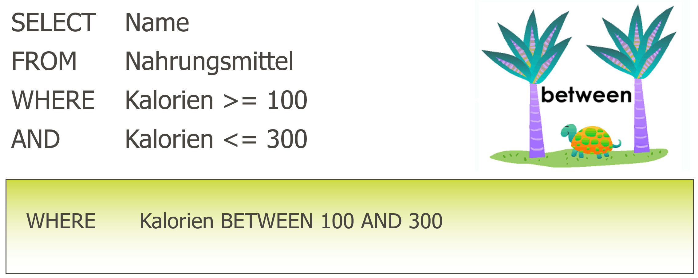

`BETWEEN` prüft, ob ein Wert in einem Bereich liegt (beide Grenzen **inklusive**):

```sql
-- Bücher zwischen 2000 und 2020
SELECT titel, jahr FROM buecher
WHERE jahr BETWEEN 2000 AND 2020;

-- Preisbereich
SELECT titel, preis FROM buecher
WHERE preis BETWEEN 10.00 AND 30.00
ORDER BY preis;
```

### 1.4.3. IN – Werteliste

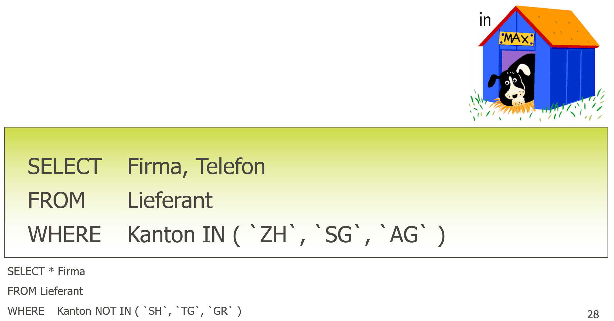

`IN` prüft, ob ein Wert in einer Menge von Werten vorkommt:

```sql
-- Mehrere Genres auf einmal
SELECT titel, genre FROM buecher
WHERE genre IN ('Roman', 'Krimi', 'Thriller');

-- NOT IN (Ausschlussliste)
SELECT titel, genre FROM buecher
WHERE genre NOT IN ('Sachbuch', 'Biografie');

-- Mit Subquery kombinieren
SELECT titel FROM buecher
WHERE autor_id IN (SELECT id FROM autoren WHERE land = 'Schweiz');
```

### 1.4.4. LIKE – Textmuster


`LIKE` erlaubt die Suche nach Textmustern. Zwei Wildcards stehen zur Verfügung:

| **Wildcard** | **Bedeutung**                   | **Beispiel**              |
| ------------ | ------------------------------- | ------------------------- |
| `%`          | Beliebig viele Zeichen (auch 0) | `'Ha%'` → Harry, Hans, Ha |
| `_`          | Genau ein beliebiges Zeichen    | `'H_ns'` → Hans, Hens     |

```sql
-- Titel, die mit 'Der' beginnen
SELECT titel FROM buecher WHERE titel LIKE 'Der%';

-- Titel, die 'Krieg' enthalten
SELECT titel FROM buecher WHERE titel LIKE '%Krieg%';

-- E-Mails von Google
SELECT name, email FROM kunden WHERE email LIKE '%@gmail.com';

-- Genau 4-buchstabige Vornamen
SELECT vorname, nachname FROM autoren WHERE vorname LIKE '____';

-- Case-insensitiv: LOWER() verwenden
SELECT titel FROM buecher WHERE LOWER(titel) LIKE '%harry%';
```

### 1.4.5. IS NULL / IS NOT NULL

`NULL` bedeutet «unbekannt» oder «nicht vorhanden». Achtung: `NULL` kann **nicht** mit `=` verglichen werden!

```sql
-- FALSCH: findet nichts!
SELECT * FROM autoren WHERE land = NULL;

-- RICHTIG:
SELECT vorname, nachname FROM autoren WHERE land IS NULL;
SELECT vorname, nachname FROM autoren WHERE land IS NOT NULL;

-- COALESCE: Fallback-Wert für NULL
SELECT vorname, COALESCE(land, 'Unbekannt') AS Land
FROM autoren;
```

### 1.4.6. Logische Operatoren: AND, OR, NOT

[](./x_gitres/select-column-where-or.png)

Bedingungen können mit `AND`, `OR` und `NOT` kombiniert werden. Klammerung beachten!

```sql
-- Bücher: Roman UND Preis unter 20 CHF
SELECT titel, genre, preis FROM buecher
WHERE genre = 'Roman' AND preis < 20.00;

-- Bücher: Krimi ODER Thriller
SELECT titel, genre FROM buecher
WHERE genre = 'Krimi' OR genre = 'Thriller';

-- Klammerung ist entscheidend!
SELECT titel, genre, preis FROM buecher
WHERE (genre = 'Roman' OR genre = 'Krimi') AND preis < 25.00;
-- vs.
SELECT titel, genre, preis FROM buecher
WHERE genre = 'Roman' OR (genre = 'Krimi' AND preis < 25.00);
```

> **Operator-Priorität:** `NOT` hat höchste Priorität, dann `AND`, dann `OR`.
> Im Zweifelsfall immer Klammern setzen – das macht die Absicht klar!

---

## 1.5. Sortieren, Begrenzen und Aggregieren

### 1.5.1. ORDER BY – Sortierung

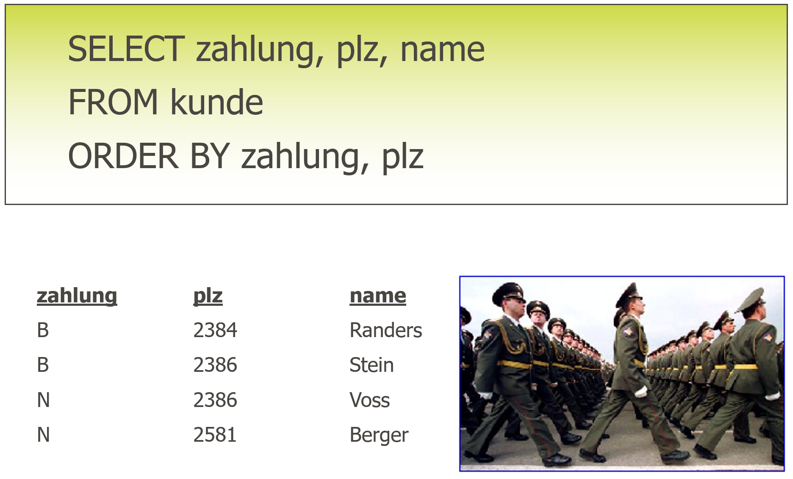

```sql
-- Aufsteigend (Standard)
SELECT titel, preis FROM buecher ORDER BY preis ASC;

-- Absteigend
SELECT titel, preis FROM buecher ORDER BY preis DESC;

-- Mehrere Spalten: zuerst nach Genre, dann nach Preis
SELECT titel, genre, preis FROM buecher
ORDER BY genre ASC, preis DESC;

-- NULL-Werte ans Ende stellen
SELECT vorname, nachname, geburtsjahr FROM autoren
ORDER BY geburtsjahr NULLS LAST;
```

### 1.5.2. LIMIT und OFFSET – Paginierung

```sql
-- Die 5 teuersten Bücher
SELECT titel, preis FROM buecher
ORDER BY preis DESC
LIMIT 5;

-- Seite 2 (Datensätze 6–10)
SELECT titel, preis FROM buecher
ORDER BY preis DESC
LIMIT 5 OFFSET 5;

-- Das teuerste Buch
SELECT titel, preis FROM buecher
ORDER BY preis DESC
LIMIT 1;
```

### 1.5.3. Aggregatfunktionen

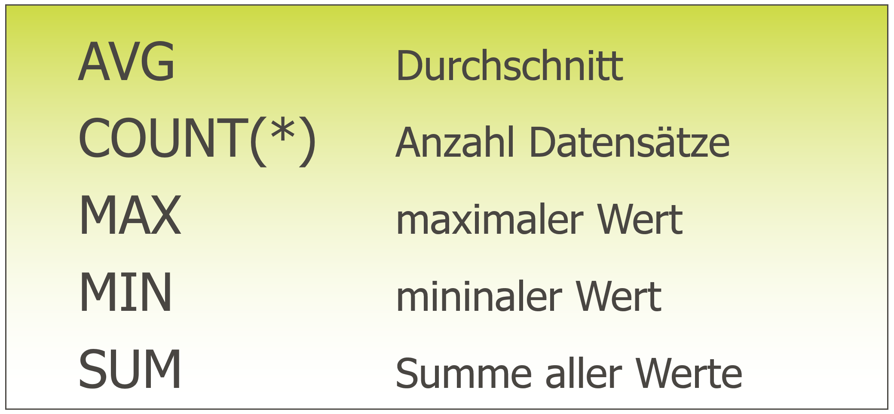

Aggregatfunktionen berechnen einen Wert über mehrere Zeilen:

| Funktion        | Beschreibung               | Beispiel               |
| --------------- | -------------------------- | ---------------------- |
| `COUNT(*)`      | Anzahl Zeilen (inkl. NULL) | `COUNT(*) → 42`        |
| `COUNT(spalte)` | Anzahl Nicht-NULL-Werte    | `COUNT(land) → 38`     |
| `SUM(spalte)`   | Summe                      | `SUM(preis) → 1250.50` |
| `AVG(spalte)`   | Durchschnitt               | `AVG(preis) → 22.30`   |
| `MIN(spalte)`   | Kleinster Wert             | `MIN(jahr) → 1950`     |
| `MAX(spalte)`   | Grösster Wert              | `MAX(preis) → 59.90`   |

```sql
-- Statistiken über den Buchbestand
SELECT
    COUNT(*)            AS Anzahl_Buecher,
    ROUND(AVG(preis),2) AS Durchschnittspreis,
    MIN(preis)          AS Guenstigstes,
    MAX(preis)          AS Teuerstes,
    SUM(lagerbestand)   AS Gesamtbestand
FROM buecher;
```

### 1.5.4. GROUP BY – Gruppierung

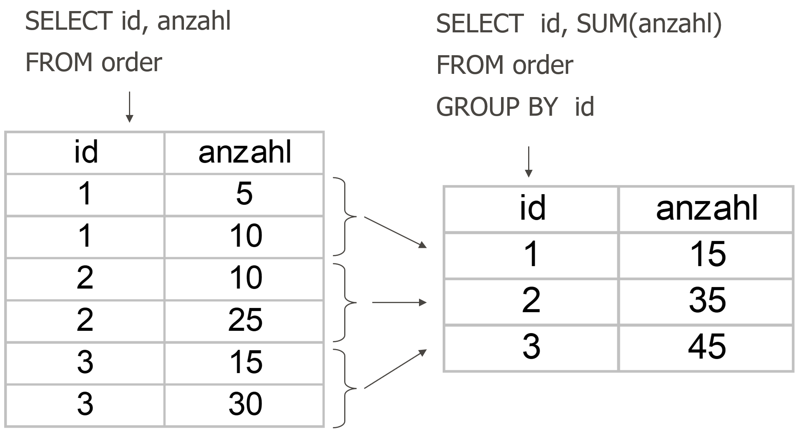

`GROUP BY` fasst Zeilen mit gleichem Wert zusammen und erlaubt Aggregationen pro Gruppe:

```sql
-- Anzahl Bücher pro Genre
SELECT genre, COUNT(*) AS Anzahl
FROM buecher
GROUP BY genre
ORDER BY Anzahl DESC;

-- Statistiken pro Genre
SELECT
    genre,
    COUNT(*)            AS Anzahl,
    ROUND(AVG(preis),2) AS Avg_Preis,
    MIN(preis)          AS Min_Preis,
    MAX(preis)          AS Max_Preis
FROM buecher
GROUP BY genre
ORDER BY Avg_Preis DESC;
```

> **Wichtige Regel:** Alle Spalten im `SELECT`, die **nicht** in einer Aggregatfunktion stehen, **müssen** in `GROUP BY` erscheinen!
>
> ```sql
> -- Falsch:
> SELECT genre, titel, COUNT(*) FROM buecher GROUP BY genre;
> -- Richtig:
> SELECT genre, COUNT(*) FROM buecher GROUP BY genre;
> ```

### 1.5.5. HAVING – Filter auf Gruppen

`HAVING` filtert Gruppen (nach `GROUP BY`), während `WHERE` einzelne Zeilen filtert:

```sql
-- Genres mit mehr als 3 Büchern
SELECT genre, COUNT(*) AS Anzahl
FROM buecher
GROUP BY genre
HAVING COUNT(*) > 3
ORDER BY Anzahl DESC;

-- WHERE vor GROUP BY, HAVING nach GROUP BY
SELECT genre, COUNT(*) AS Anzahl
FROM buecher
WHERE jahr >= 2000        -- filtert Zeilen (vor Gruppierung)
GROUP BY genre
HAVING COUNT(*) >= 2;     -- filtert Gruppen (nach Gruppierung)
```

---

## 1.6. Tabellen verknüpfen mit JOINs

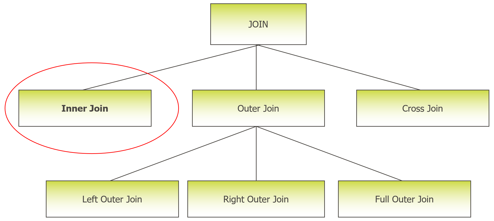

`JOIN`s verbinden Daten aus mehreren Tabellen anhand einer gemeinsamen Spalte (meist Fremdschlüssel).

### 1.6.1. INNER JOIN (nur übereinstimmende Zeilen)

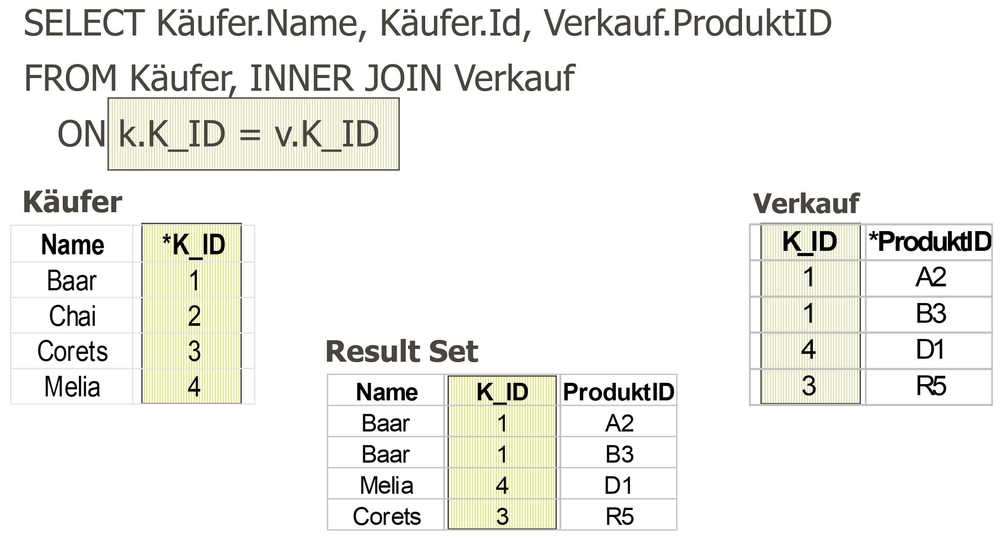

`INNER JOIN` gibt nur Zeilen zurück, die in **beiden** Tabellen einen Treffer haben:

```sql
-- Bücher mit Autorenname
SELECT
    b.titel,
    a.vorname || ' ' || a.nachname AS Autor,
    b.genre,
    b.preis
FROM buecher b
INNER JOIN autoren a ON b.autor_id = a.id
ORDER BY b.titel;
```

> **Tabellenaliase:** Bei `JOIN`s immer kurze Aliase verwenden (`b`, `a`, `k`...) und Spalten damit qualifizieren (`b.titel` statt `titel`). Das verhindert Fehler bei gleichnamigen Spalten.

```sql
-- Ausleihen mit Kunden- und Buchinformationen (3-Table-Join)
SELECT
    k.name          AS Kunde,
    b.titel         AS Buch,
    a.ausleihdatum,
    a.rueckgabe
FROM ausleihen a
INNER JOIN kunden  k ON a.kunden_id = k.id
INNER JOIN buecher b ON a.buch_id   = b.id
ORDER BY a.ausleihdatum DESC;
```

### 1.6.2. LEFT JOIN (alle linken Zeilen)

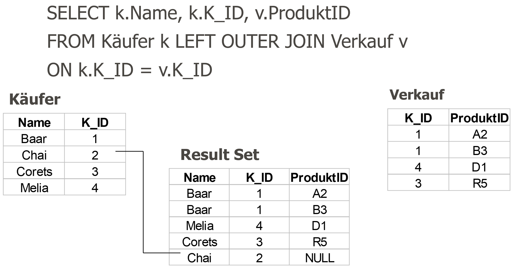

`LEFT JOIN` gibt **alle** Zeilen der linken Tabelle zurück, auch wenn es keinen Treffer in der rechten gibt. Fehlende Werte werden mit `NULL` gefüllt:

```sql
-- Alle Autoren, auch jene ohne Buch in der DB
SELECT
    a.vorname || ' ' || a.nachname AS Autor,
    b.titel,
    b.genre
FROM autoren a
LEFT JOIN buecher b ON b.autor_id = a.id
ORDER BY a.nachname;

-- Anti-Join: Autoren OHNE Buch in der Datenbank
SELECT a.vorname, a.nachname
FROM autoren a
LEFT JOIN buecher b ON b.autor_id = a.id
WHERE b.id IS NULL;
```

### 1.6.3. Übersicht der JOIN-Typen

| **JOIN-Typ** | **Ergebnis**                              | **Typischer Einsatz**                      |
| ------------ | ----------------------------------------- | ------------------------------------------ |
| `INNER JOIN` | Nur Zeilen mit Treffer in beiden Tabellen | Normale Verknüpfungen (Bestellung + Kunde) |
| `LEFT JOIN`  | Alle linken + passende rechte Zeilen      | Optionale Beziehungen (Autor ohne Buch)    |
| `RIGHT JOIN` | Alle rechten + passende linke Zeilen      | Nicht in SQLite! → Tabellen umdrehen       |
| `CROSS JOIN` | Kartesisches Produkt (jede × jede)        | Kombinationstabellen, selten nötig         |

> **RIGHT JOIN in SQLite:** Erst ab Version 3.39.0 (2022) unterstützt.
> Besser: Tabellen in `LEFT JOIN` einfach umdrehen.
> `FROM buecher b RIGHT JOIN autoren a` → `FROM autoren a LEFT JOIN buecher b`

### 1.6.4. JOIN mit Aggregation kombinieren

```sql
-- Anzahl Bücher und Durchschnittspreis pro Autor
SELECT
    a.vorname || ' ' || a.nachname AS Autor,
    a.land,
    COUNT(b.id)                    AS Anzahl_Buecher,
    ROUND(AVG(b.preis), 2)         AS Avg_Preis
FROM autoren a
LEFT JOIN buecher b ON b.autor_id = a.id
GROUP BY a.id, a.vorname, a.nachname, a.land
ORDER BY Anzahl_Buecher DESC;

-- Häufigste Ausleiher (Top 10)
SELECT
    k.name,
    k.stadt,
    COUNT(au.id) AS Anzahl_Ausleihen
FROM kunden k
LEFT JOIN ausleihen au ON au.kunden_id = k.id
GROUP BY k.id, k.name, k.stadt
ORDER BY Anzahl_Ausleihen DESC
LIMIT 10;
```

---

## 1.7. Unterabfragen (Subqueries)

Eine Unterabfrage ist ein `SELECT`-Statement innerhalb eines anderen `SELECT`-Statements.

### 1.7.1. Subquery in WHERE

```sql
-- Bücher, die teurer sind als der Durchschnitt
SELECT titel, preis
FROM buecher
WHERE preis > (SELECT AVG(preis) FROM buecher)
ORDER BY preis DESC;

-- Bücher von Autoren aus der Schweiz
SELECT titel, genre, preis
FROM buecher
WHERE autor_id IN (
    SELECT id FROM autoren WHERE land = 'Schweiz'
);

-- Kunden, die das teuerste Buch ausgeliehen haben
SELECT DISTINCT k.name
FROM kunden k
INNER JOIN ausleihen au ON au.kunden_id = k.id
WHERE au.buch_id = (
    SELECT id FROM buecher ORDER BY preis DESC LIMIT 1
);
```

### 1.7.2. Subquery in FROM (Derived Table)

Eine Unterabfrage kann auch als virtuelle Tabelle im `FROM` verwendet werden:

```sql
-- Genres mit überdurchschnittlicher Buchanzahl
SELECT g.genre, g.anzahl
FROM (
    SELECT genre, COUNT(*) AS anzahl
    FROM buecher
    GROUP BY genre
) AS g
WHERE g.anzahl > (
    SELECT AVG(cnt)
    FROM (SELECT COUNT(*) AS cnt FROM buecher GROUP BY genre)
)
ORDER BY g.anzahl DESC;
```

### 1.7.3. EXISTS – Existenzprüfung

`EXISTS` gibt `TRUE` zurück, wenn die Unterabfrage mindestens eine Zeile liefert:

```sql
-- Kunden, die mindestens eine Ausleihe haben
SELECT name, email
FROM kunden k
WHERE EXISTS (
    SELECT 1 FROM ausleihen au WHERE au.kunden_id = k.id
);

-- Bücher, die derzeit ausgeliehen sind (Rückgabe noch offen)
SELECT titel, genre
FROM buecher b
WHERE EXISTS (
    SELECT 1 FROM ausleihen au
    WHERE au.buch_id = b.id
    AND au.rueckgabe IS NULL
);
```

> **EXISTS vs. IN**
>
> - `EXISTS` stoppt bei erstem Treffer → oft schneller bei grossen Tabellen
> - `IN` lädt alle Werte der Unterabfrage → besser bei kleinen Listen
> - Bei `NULL`-Werten verhält sich `NOT IN` anders als `NOT EXISTS` – Vorsicht!

---

## 1.8. Zusammenfassung und Cheatsheet

### 1.8.1. Klausel-Reihenfolge

| **Reihenfolge** | **Klausel**      | **Zweck**                          |
| --------------- | ---------------- | ---------------------------------- |
| 1               | `SELECT`         | Spalten / Ausdrücke wählen         |
| 2               | `FROM`           | Quelltabelle definieren            |
| 3               | `JOIN ... ON`    | Tabellen verknüpfen                |
| 4               | `WHERE`          | Zeilen filtern (vor Gruppierung)   |
| 5               | `GROUP BY`       | Zeilen gruppieren                  |
| 6               | `HAVING`         | Gruppen filtern (nach Gruppierung) |
| 7               | `ORDER BY`       | Ergebnis sortieren                 |
| 8               | `LIMIT / OFFSET` | Anzahl Zeilen begrenzen            |

### 1.8.2. Prädikate Übersicht

| **Prädikat** | **Syntax**                  | **Bedeutung**           |
| ------------ | --------------------------- | ----------------------- |
| Vergleich    | `=, <>, <, >, <=, >=`       | Direkter Wertvergleich  |
| `BETWEEN`    | `spalte BETWEEN x AND y`    | Wertebereich (inklusiv) |
| `IN`         | `spalte IN (a, b, c)`       | Wert in Menge           |
| `LIKE`       | `spalte LIKE 'Mu%'`         | Textmuster (`%`, `_`)   |
| `IS NULL`    | `spalte IS NULL`            | Fehlender Wert          |
| `EXISTS`     | `WHERE EXISTS (SELECT ...)` | Existenzprüfung         |
| `AND/OR/NOT` | `bed1 AND bed2`             | Logische Verknüpfung    |

### 1.8.3. JOIN-Typen

| **JOIN**     | **Ergebnis**                                                  |
| ------------ | ------------------------------------------------------------- |
| `INNER JOIN` | Nur Zeilen mit Treffer in **beiden** Tabellen                 |
| `LEFT JOIN`  | Alle linken Zeilen + passende rechte (NULL wenn kein Treffer) |
| `CROSS JOIN` | Jede Zeile links kombiniert mit jeder rechts (selten)         |

---

### 1.8.4. Weiterführende Ressourcen

- SQLite Dokumentation: <https://www.sqlite.org/lang_select.html>
- Interaktiv üben: <https://sqliteonline.com>
- DB Browser for SQLite (GUI): <https://sqlitebrowser.org>
- SQL-Übungsplattform: <https://www.sql-practice.com>

---

</br>

# 2. Aufgaben

## 2.1. Datenbank Bibliothek erstellen

| **Vorgabe**             | **Beschreibung**                                    |
| :---------------------- | :-------------------------------------------------- |
| **Lernziele**           | Datenbank Schema implementieren und Datein einfügen |
| **Sozialform**          | Einzelarbeit                                        |
| **Auftrag**             | siehe unten                                         |
| **Hilfsmittel**         |                                                     |
| **Erwartete Resultate** |                                                     |
| **Zeitbedarf**          | 15 min                                              |
| **Lösungselemente**     | Beispieldatenbank `bibliothek.db`                   |

**Datenbank und Initial Daten wie folgt erstellen:**

- Erstelle mit **[SQLiteStudio](https://sqlitestudio.pl)** oder **[DB Browser for SQLite](https://sqlitebrowser.org)** eine neue Datenbank (`bibliothek.db`)
- Führe die SQL-Befehle der Datei  aus.
- Prüfe ob alle vier Tabellen angelegt und mit Daten befüllt wurden.

> **Setup**
> Erstellt die Datenbank lokal: `sqlite3 bibliothek.db < schema.sql`

---

## 2.2. Abfragen Bibliothek Datenbank

| **Vorgabe**             | **Beschreibung**                                                            |
| :---------------------- | :-------------------------------------------------------------------------- |
| **Lernziele**           | Einfache SQL-Abfragen mit Spalten Selektion und Sortierung ausführen        |
|                         | Einfache SQL-Abfragen mit WHERE Klause und Prädikaten                       |
|                         | Einfache SQL-Abfragen Aggregatfunktionen und Gruppierungen                  |
|                         | Komplexe SQL-Abfragen mit mehreren Tabellen (JOIN)                          |
|                         | Komplexe SQL-Abfragen mit mehreren Tabellen und Unterabfragen (Sub-Queries) |
| **Sozialform**          | Einzelarbeit                                                                |
| **Auftrag**             | siehe unten                                                                 |
| **Hilfsmittel**         |                                                                             |
| **Erwartete Resultate** |                                                                             |
| **Zeitbedarf**          | 60 min                                                                      |
| **Lösungselemente**     | SQL Abfragebefehle                                                          |

**Schreibe eine Abfrage, die folgendes ausgibt:**

**A1 - Einfache Abfragen mit Spaltenselektion:**

1. Vorname und Nachname aller Autoren als eine Spalte `Autor`
2. Das Erscheinungsjahr der Bücher
3. Den Preis erhöht um 10% als `Neuer_Preis`
4. Sortiert nach Erscheinungsjahr absteigend

**A2 - Abfragen mit Zeilenrestriktionen (WHERE Klausel):**

1. Alle Bücher, die zwischen 2000 und 2010 erschienen sind und mehr als 15 CHF kosten
2. Alle Kunden aus Zürich oder Bern
3. Alle Bücher, deren Titel das Wort «Welt» enthält
4. Alle Autoren, bei denen das Geburtsjahr nicht bekannt ist
5. Alle Bücher mit einem Lagerbestand von 0 (ausverkauft)

**A3 - Abfragen mit Aggregatfunktionen und Gruppierungen:**

1. Wie viele Bücher gibt es pro Erscheinungsjahr? (Sortiert nach Jahr absteigend)
2. Welche Genres haben einen Durchschnittspreis über 20 CHF?
3. Welche Stadt hat die meisten Kunden? (Top 3)
4. Wie viele Bücher wurden nach 2000 veröffentlicht und kosten unter 20 CHF?

**A4 - Abfragen mit mehreren Tabellen (JOIN):**

1. Listet alle Bücher mit dem vollständigen Autorennamen und dem Land des Autors
2. Zeigt alle Kunden, die noch **nie** ein Buch ausgeliehen haben
3. Findet die 5 beliebtesten Bücher (meiste Ausleihen)
4. Welche Genres werden von Autoren aus der Schweiz geschrieben?

**A5 - Komplexe Abfragen mit Unterabfragen (Herausforderungsaufgaben):**

1. Welche Bücher kosten mehr als das teuerste Buch im Genre «Roman»?
2. Welche Autoren haben mehr Bücher als der Durchschnitt aller Autoren?
3. Listet alle Kunden, die noch kein Buch aus dem Genre «Krimi» ausgeliehen haben

---

## 2.7. Praxisprojekt: Bibliotheksauswertung

| **Vorgabe**             | **Beschreibung**                                    |
| :---------------------- | :-------------------------------------------------- |
| **Lernziele**           | Komplexe SQL-Abfragen für statistische Auswertungen |
| **Sozialform**          | Einzelarbeit                                        |
| **Auftrag**             | siehe unten                                         |
| **Hilfsmittel**         |                                                     |
| **Erwartete Resultate** |                                                     |
| **Zeitbedarf**          | 30 min                                              |
| **Lösungselemente**     | SQL Abfragebefehle                                  |

Setzt das gesamte Wissen ein. Erstellt einen vollständigen Bibliotheksbericht.

**Aufgabe A – Bestandsübersicht:**

- Erstellt eine vollständige Bestandsübersicht pro Genre
- Erwartete Spalten:
  - Genre, Anzahl_Titel, Verfuegbar (Summe Lagerbestand),
  - Avg_Preis, Guenstigstes, Teuerstes
- Nur Genres mit mindestens 2 Titeln
- Sortiert nach Anzahl_Titel absteigend


**Aufgabe B – Top-Ausleiher Report:**

- Erstellt einen Kunden-Report:
  - Name, Stadt, Anzahl_Ausleihen, Aktuell_Ausgeliehen (rueckgabe IS NULL)
  - Alle Kunden anzeigen (auch ohne Ausleihe)
  - Sortiert nach Anzahl_Ausleihen DESC

**Aufgabe C – Autoren-Performance:**

- Für jeden Autor:
  - Vollname, Land, Anzahl_Buecher, Gesamtausleihen (über alle Bücher),
  - Avg_Preis, Beliebtestes_Buch (Titel mit meisten Ausleihen)
  - Nur Autoren mit mindestens einem Buch

---

## 2.7. Abfragen Schulverwaltungsdatenbank

| **Vorgabe**             | **Beschreibung**                                    |
| :---------------------- | :-------------------------------------------------- |
| **Lernziele**           | Komplexe SQL-Abfragen für statistische Auswertungen |
| **Sozialform**          | Einzelarbeit                                        |
| **Auftrag**             | siehe unten                                         |
| **Hilfsmittel**         |                                                     |
| **Erwartete Resultate** |                                                     |
| **Zeitbedarf**          | 60 min                                              |
| **Lösungselemente**     | SQL Abfragebefehle                                  |

**Teil 1: Einfache Abfragen:**

**A1.1:**

- Suche alle Studenten mit *Name, Vorname, Geburtsdatum*.
- Sortiere die Ausgabe nach *Geburtsdatum* aufsteigend.

**A1.2:**

- Suche alle Studenten mit *Name, Vorname, Geburtsdatum*, welche nach dem *01.01.1990* geboren sind.
- Sortiere die Ausgabe nach *Name, Vorname* aufsteigend.

> Hinweis: SQLite speichert Daten als Text im Format YYYY-MM-DD.

**A1.3:**

- Suche alle Studenten deren Name mit *"M"* beginnt und zeige den *Vornamen, Nachname Geburtsdatum* an.

**A1.4:**

- Suche alle Studenten deren *StudentNr* kleiner *5* ist und vor dem *01.01.1989* geboren sind.

**A1.5:**

- Suche Studenten, deren Name ein *"ll"* enthält.

**A1.6:**

- Suche alle Studenten, die zwischen *01.01.1980 und 13.12.1989* geboren sind.
- Zeige die Ausgabe sortiert nach Geburtsdatum an.

**A1.7:**

- Suche alle Studenten, deren Name ein *"a"* enthält oder der Vorname mit *"n"* endet.

---

</br>

**Teil 2: Abfragen mit mehreren Tabellen (Join):**

**A2.1:**

- Liste alle Studenten mit den Fachrichtungen
- Die Liste soll die Spalten *StudentName, StudentVorname, StudentGeburtsdatum, Fachrichtung, AnzahlSemester* enthalten und nach *StudentName u. StudentVorname* aufsteigend sortiert sein.

**A2.2:**

- Liste alle Studenten, die der Fachrichtung *"Maschinenbau"* angehören
- Die Liste soll die Spalten *StudentName, StudentVorname, StudentGeburtsdatum, Fachrichtung, AnzahlSemester* enthalten und nach *StudentName u. StudentVorname* aufsteigend sortiert sein.

**A2.3:**

- Liste alle Studenten, deren Fachrichtung länger als *6 Semester* dauert und nach dem *1.1.1990* geboren sind.
- Die Liste soll die Spalten *StudentName, StudentVorname, StudentGeburtsdatum, Fachrichtung, AnzahlSemester* enthalten und nach *AnzahlSemester* absteigend sortiert sein.

**A2.4:**

- Liste alle Studenten, die den Kurs *"Mathe"* besuchen.
- Die Liste soll die Spalten *StudentName, StudentVorname, StudentGeburtsdatum* aufsteigend sortiert nach *StudentName, StudentVorname* anzeigen.

**A2.5:**

- Liste alle Studenten, die den Kurs *"Mathe" oder "VWL"* besuchen.
- Die Liste soll die Spalten *StudentName, StudentVorname, StudentGeburtsdatum, Kursbezeichnung* aufsteigend sortiert nach *StudentName, StudentVorname* anzeigen.
- **Tipp: IN-Operator verwenden!**

**A2.6:**

- Liste alle Studenten, die den Kurs *"Mathe"* besuchen.
- Die Liste soll die Spalten *StudentName, StudentVorname, StudentGeburtsdatum, FachrichtungBezeichnung* aufsteigend sortiert nach *FachrichtungBezeichnung, StudentName, StudentVorname* anzeigen.

**A2.7:**

- Erstelle eine Gesamtübersicht zu den Studenten, Kursen und den Fachrichtungen.
- Die Liste soll die Spalten *StudentNr, StudentName, StudentVorname, StudentGeburtsdatum, FachrichtungNr, FachrichtungBezeichnung, AnzahlSemester, KursNr, Kursbezeichnung* aufsteigend sortiert nach *StudentNr* anzeigen.

---

</br>

**Teil 3: Abfragen mit Funktionen:**

**A3.1:**

- Erstelle eine Abfrage, welche die Vornamen und Nachnamen der Studenten kommagetrennt zusammengefügt und als eine Spalte mit Überschrift "*StudentName*"  aufsteigend listet.
- > Hinweis: SQLite verwendet || für String-Konkatenation; CONCAT() wird ab SQLite 3.44 unterstützt. Die ||-Variante ist universell sicherer.

**A3.2:**

- Ändere die Abfrage aus der A3.1 und zeige Vorname u. Name in Grossschrift an.
- > Hinweis: UPPER() funktioniert in SQLite nur zuverlässig für ASCII-Zeichen. Umlaute (ä, ö, ü) werden nicht konvertiert (SQLite-Limitation).

**A3.3:**

- Liste alle Studenten mit *Name, Vorname*.
- Die Ausgabe soll nach der Zeichenlänge (Anzahl Zeichen) des *Namens* absteigend sortiert sein.
- > Hinweis: SQLite verwendet LENGTH() statt LEN()

**A3.4:**

- Liste alle Studenten mit der Kurzbezeichnung (**Erster Buchstabe aus Name u. Vorname**) aufsteigend.
- Die Ausgabe soll *Name, Vorname* und die Spaltenüberschrift "*Kurzzeichen*" anzeigen.
- > Hinweis: SUBSTR() in SQLite

**A3.5:**

- Liste alle Studenten mit *Vorname, Name und dem Geburtsjahr (z.B. 1990)*. Sortiere die Ausgabe nach dem *Geburtsjahr* absteigend.
- > Hinweis: YEAR() → STRFTIME('%Y', ...) in SQLite; liefert Text, CAST für Sortierung

**A3.6:**

- Ermittle mit einer Abfrage die Studenten (*Vorname, Name, Geburtsdatum*) welche im Jahr *1989* geboren sind.

**A3.7:**

- Ermittle mit einer Abfrage die Studenten (*Vorname, Name, Geburtsdatum*) und deren *Alter* in Jahren.
- > Hinweis: DATE('now') liefert das aktuelle Datum.
- > Die Berechnung berücksichtigt, ob der Geburtstag dieses Jahr bereits war.

---

</br>

**Teil 4: Aggregatfunktionen:**

**A4.1:**

- Ermittle die Anzahl der erfassten Studenten.
- Spaltenübersicht "*AnzahlStudenten*".

**A4.2:**

- Ermittle die durchschnittliche Semester Anzahl aller Fachrichtungen.
- Spaltenübersicht "*DurchschnittlicheSemester*".

**A4.3:**

- Ermittle die Anzahl der Studenten, die der Fachrichtung "*BWL*" zugeordnet sind.
- Spaltenübersicht "*AnzahlStudenten*".

**A4.4:**

- Ermittle die Anzahl der Kurse, die von Student *Hans, Müller* belegt werden.
- Die Liste soll die Spalten *StudentName, StudentVorname* und *AnzahlKurse* enthalten.

**A4.5:**

- Ermittle die Anzahl der Studierende pro Fachrichtung.
- Die Ausgabe soll die Spalten *Fachrichtung u. AnzahlStudierende* enthalten.

**A4.6:**

- Ermittle die Anzahl der belegten Kurse pro Student.
- Die Ausgabe soll die Spalten *StudentName, StudentVorname u. AnzahlBelegteKurse* enthalten.

**A4.7:**

- Ermittle die Studenten, die mehr als einen Kurs belegen.
- Die Ausgabe soll die Spalten *StudentName, StudentVorname u. AnzahlBelegteKurse* enthalten.

---

© 2026 Lukas Müller – Licensed under CC BY-NC-ND 4.0
See [LICENSE](..\license.md) file for details.
