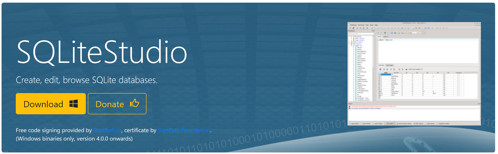
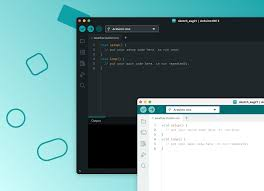
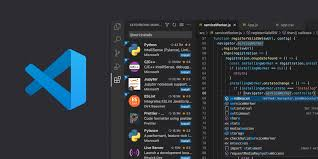
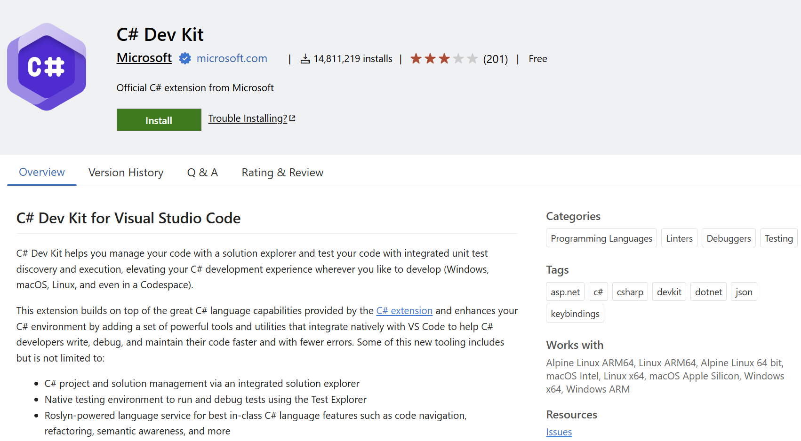
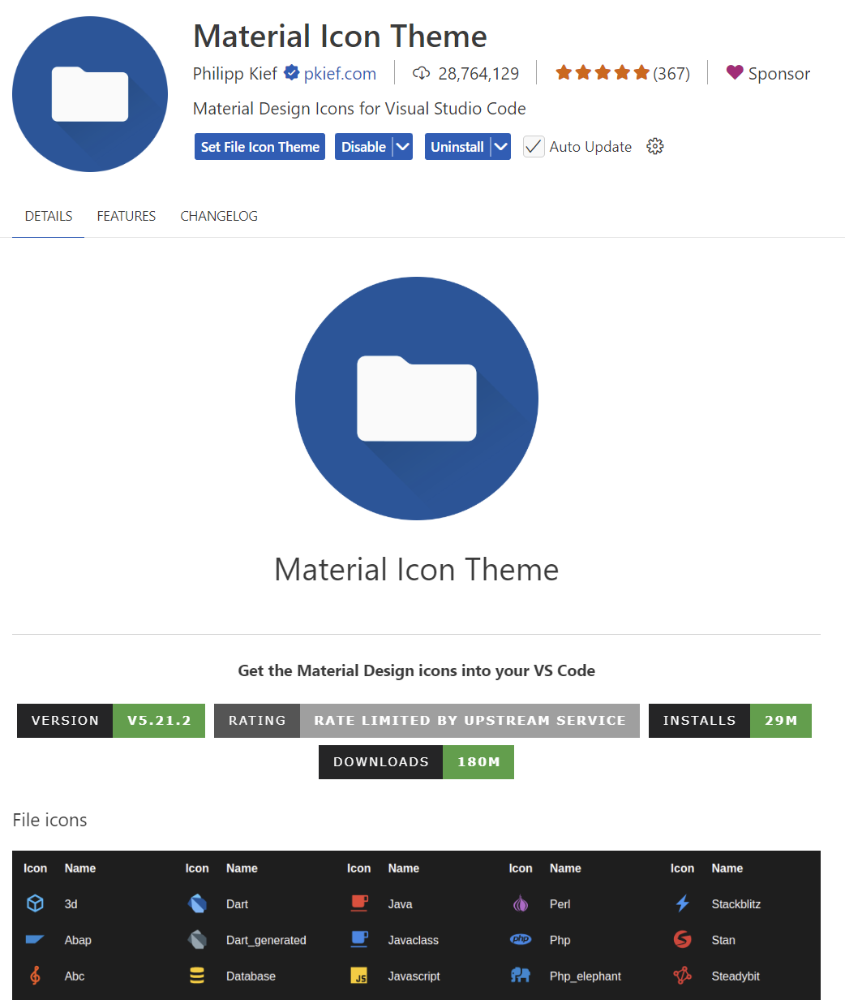

|                      |                           |                               |
| -------------------- | ------------------------- | ----------------------------- |
| **HF Systemtechnik** | **Softwareentwicklung B** |  |

- [1. Voraussetzungen / Softwareinstallationen](#1-voraussetzungen--softwareinstallationen)
  - [1.1. SQLite](#11-sqlite)
  - [1.2. Arduino IDE](#12-arduino-ide)
  - [1.3. .NET SDK](#13-net-sdk)
  - [1.4. Visual Studio Code](#14-visual-studio-code)
  - [1.5. C# Extension für VS Code](#15-c-extension-für-vs-code)
  - [1.6. Extension Draw.io Integration](#16-extension-drawio-integration)
    - [1.6.1. Extension Material Icon Theme](#161-extension-material-icon-theme)
    - [1.6.2. Extension Markdown All in One](#162-extension-markdown-all-in-one)
  - [1.7. Flowgorithm](#17-flowgorithm)
- [2. Aufgaben](#2-aufgaben)
  - [2.1. Installation u. Softwarevoraussetzungen / Tools](#21-installation-u-softwarevoraussetzungen--tools)
  - [2.2. GitHub Account erstellen](#22-github-account-erstellen)

---

 

# 1. Voraussetzungen / Softwareinstallationen

## 1.1. SQLite

- [How to Download & Install SQLite Tools](https://www.sqlitetutorial.net/download-install-sqlite/)
- [Precompiled Binaries for Windows](https://sqlite.org/download.html)
  - > **"Command-line tools for Windows x64"** wählen
- [SQLite Studio](https://sqlitestudio.pl/)
  - 

---

## 1.2. Arduino IDE

[Download Arduino IDE](https://www.arduino.cc/en/software/)

---

## 1.3. .NET SDK

Dies ist das wichtigste **Werkzeugpaket** von Microsoft, das zum Erstellen, Kompilieren und Ausführen von **C#-Anwendungen** erforderlich ist.

[Download .NET SDK for Windows](https://dotnet.microsoft.com/en-us/download)

---

## 1.4. Visual Studio Code

**VS Code** ist ein leichtgewichtiger Editor, der auf Windows, macOS und Linux läuft.

[Download Visual Studio Code](https://code.visualstudio.com/)

---

## 1.5. C# Extension für VS Code

Dieses Kit installiert automatisch alle nötigen Abhängigkeiten wie die **Basis-C#-Unterstützung**, **IntelliCode** und das **.NET Install Tool**.

---

## 1.6. Extension Draw.io Integration

Diese Erweiterung integriert die **draw.io** Anwendung in Visual Studio Code.

Alternativ stehen auch folgende Möglichkeiten zur Verfügung:

- [Web-App](https://app.diagrams.net/)
- [Lokale Installation](https://www.drawio.com/)

---

### 1.6.1. Extension Material Icon Theme

---

### 1.6.2. Extension Markdown All in One

[Markdown Getting-Started](https://www.markdownguide.org/getting-started/)

---

 

## 1.7. Flowgorithm

[Download Flowgorithm](http://www.flowgorithm.org/download/index.html)

---

 

# 2. Aufgaben

## 2.1. Installation u. Softwarevoraussetzungen / Tools

| **Vorgabe**             | **Beschreibung**                     |
| :---------------------- | :----------------------------------- |
| **Lernziele**           | Softwarevoraussetzungen sind erfüllt |
| **Sozialform**          | Einzelarbeit                         |
| **Auftrag**             | Softwareinstallationen auf Laptop    |
| **Hilfsmittel**         | siehe Download links                 |
| **Erwartete Resultate** |                                      |
| **Zeitbedarf**          | 40 min                               |
| **Lösungselemente**     | Ausführbare SW Anwendungen           |

Installiere alle erforderlichen Softwarekomponenten auf Deinem Rechner.
Teste soweit möglich, dass alle Komponenten ohne Fehler ausgeführt werden und funktionstauglich sind.

 

## 2.2. GitHub Account erstellen

| **Vorgabe**         | **Beschreibung**                           |
| :------------------ | :----------------------------------------- |
| **Lernziele**       | GitHub Account seht zur Verfügung          |
|                     | GitHub Benutzername in OneNote eingetragen |
| **Sozialform**      | Einzelarbeit                               |
| **Auftrag**         | siehe unten                                |
| **Hilfsmittel**     | Internet / Browser                         |
| **Zeitbedarf**      | 10 min                                     |
| **Lösungselemente** |                                            |

Erstelle einen GitHub Account. Verwende dabei wenn möglich eine IPSO E-Mail Adresse.
Gehe dabei wie folgt vor:

1. Gehe auf die Website
   1. <https://github.com/>
2. Klicke auf **„Sign up“**
   1. Oben rechts auf der Startseite findest du die Schaltfläche „Sign up“ (Registrieren).
3. Gib deine E-Mail-Adresse ein
   1. Beispiel: <dein.name@student.ipso.ch>
   2. ? Klicke dann auf **„Continue“**
4. Wähle einen Benutzernamen
   1. Das ist dein öffentlicher Name auf GitHub, z.B. **codefan123**.
5. Lege ein sicheres Passwort fest
   1. Mindestens 8 Zeichen, am besten mit Gross-, Kleinbuchstaben, Zahlen und Symbolen.
6. Gib an, ob du E-Mails von GitHub erhalten willst
   1. Das ist optional.
7. Verifiziere, dass du kein Roboter bist
   1. GitHub zeigt dir manchmal ein kleines Rätsel oder Bild-Puzzle.
8. Bestätige deine E-Mail-Adresse
   1. GitHub sendet dir eine Mail mit einem Bestätigungslink – klicke darauf, um dein Konto zu aktivieren.
9. Wähle deine GitHub-Einstellungen
   1. Privatperson oder Unternehmen
   2. Deine Interessen
10. Fertig!
    1. Du wirst zu deinem GitHub-Dashboard weitergeleitet.
11. Trage nun dein GitHub Benutzername im Class Notebook (Teams) bei Kursnotizen ein.

© 2026 Lukas Müller – Licensed under CC BY-NC-ND 4.0
See [LICENSE](..\license.md) file for details.
