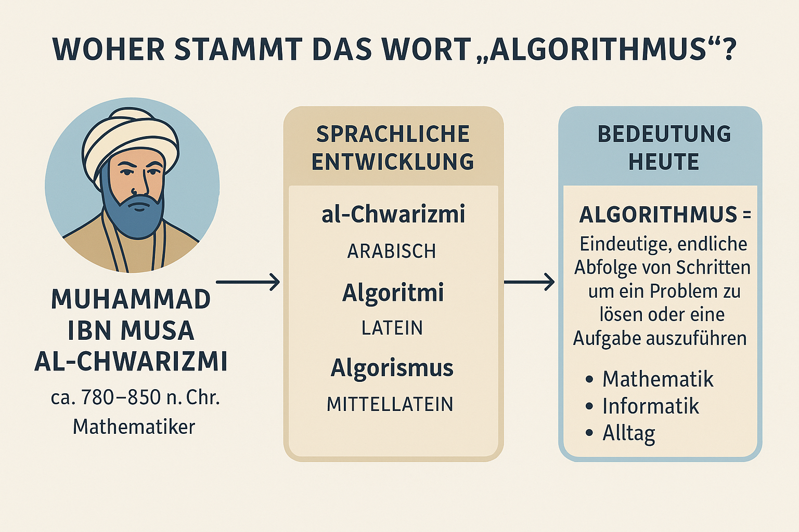
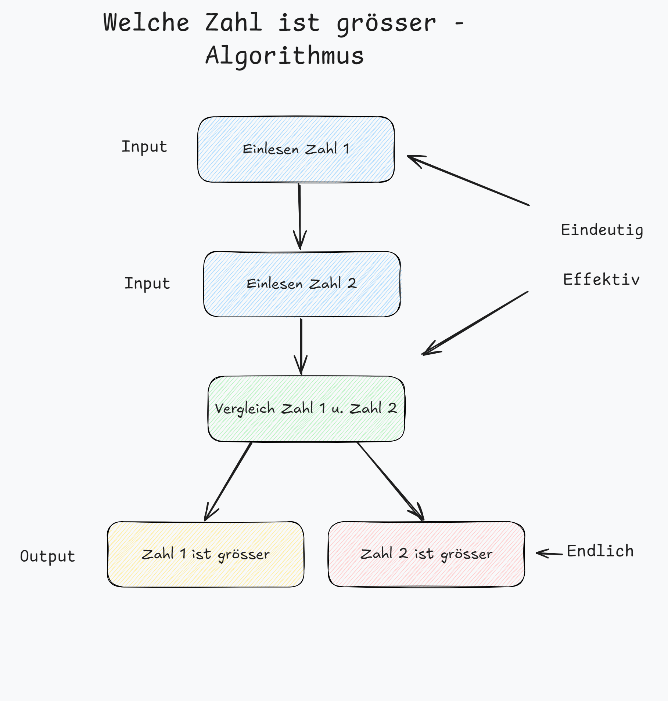
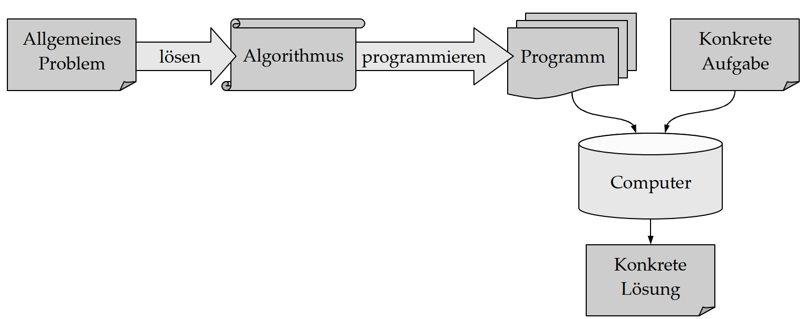
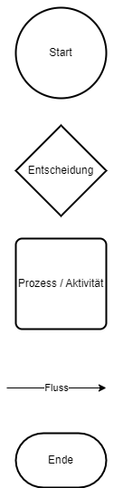
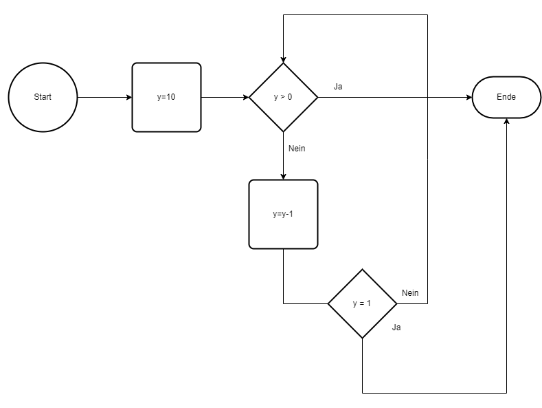
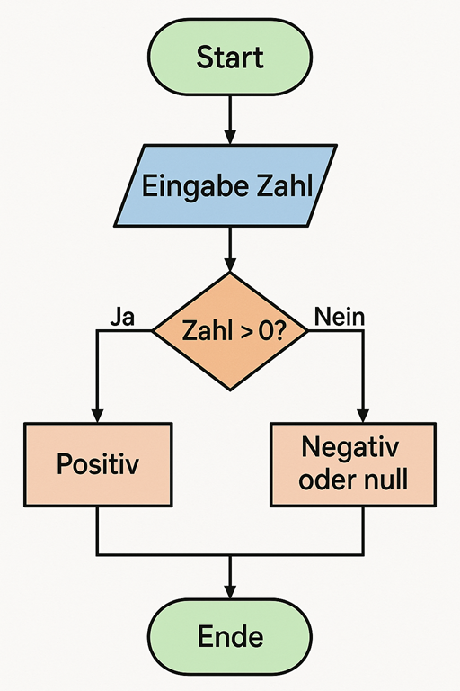

|                      |                           |                               |
| -------------------- | ------------------------- | ----------------------------- |
| **HF Systemtechnik** | **Softwareentwicklung B** |  |

- [1. Algorithmen Grundlagen](#1-algorithmen-grundlagen)
  - [1.1. Ursprung](#11-ursprung)
  - [1.2. Definition](#12-definition)
  - [1.3. Merkmale eines Algorithmus](#13-merkmale-eines-algorithmus)
  - [1.4. Der Weg vom Problem zur Lösung](#14-der-weg-vom-problem-zur-lösung)
  - [1.5. Grundstrukturen](#15-grundstrukturen)
  - [1.6. Erweiterte Strukturen](#16-erweiterte-strukturen)
    - [1.6.1. Annehmende und Abweisende Schleife](#161-annehmende-und-abweisende-schleife)
    - [1.6.2. Mehrfachauswahl](#162-mehrfachauswahl)
  - [1.7. Beispiele](#17-beispiele)
    - [1.7.1. Alltag – Zähneputzen (menschlicher Algorithmus)](#171-alltag--zähneputzen-menschlicher-algorithmus)
    - [1.7.2. Navigation – Wegbeschreibung (Algorithmus zur Wegfindung)](#172-navigation--wegbeschreibung-algorithmus-zur-wegfindung)
- [2. Flussdiagramm (PAP Programmablaufplan)](#2-flussdiagramm-pap-programmablaufplan)
  - [2.1. Einleitung](#21-einleitung)
  - [2.2. Grundelemente](#22-grundelemente)
    - [2.2.1. Übersicht der Grundelemente](#221-übersicht-der-grundelemente)
    - [2.2.2. Beispiel der Grundelemente](#222-beispiel-der-grundelemente)
  - [2.3. Beispiel](#23-beispiel)
  - [2.4. Zweck u. Ziele](#24-zweck-u-ziele)
  - [2.5. Mit draw.io einen Programmablaufplan (PAP) erstellen](#25-mit-drawio-einen-programmablaufplan-pap-erstellen)
- [3. Aufgaben](#3-aufgaben)
  - [3.1. Zahl auswerten](#31-zahl-auswerten)
  - [3.2. Wiederholungen](#32-wiederholungen)

---

 

# 1. Algorithmen Grundlagen

## 1.1. Ursprung

**„Algorithmus“** stammt vom Namen des Mathematikers **al-Chwarizmi**.
Durch Übersetzungen wurde aus **al-Chwarizmi → Algoritmi → Algorismus → Algorithmus**.

## 1.2. Definition

Ein Algorithmus ist eine **systematische, logische Reihe von Anweisungen**, die es ermöglicht, ein bestimmtes Problem zu lösen. Er besteht aus klar definierten Schritten und Regeln, die bei der Ausführung zu einem vorhersehbaren Ergebnis führen. **Algorithmen** sind die Grundbausteine der Programmierung und der technischen Informatik, da sie die Basis für die Entwicklung effizienter und funktionaler Software bieten

**Algorithmen** spielen in zahlreichen Bereichen eine zentrale Rolle, z.B. in der Informatik, Mathematik, Wirtschaft und Biologie. Sie sind die Grundlage für Softwareentwicklung, künstliche Intelligenz, Datenanalyse und vieles mehr.

Ein **Algorithmus** ist das **Herzstück** jeder Computeranwendung, aber auch im Alltag nutzen wir ständig implizite Algorithmen – beim Kochen, Autofahren oder Planen. In der Informatik sind Algorithmen besonders wichtig, weil sie den Computer anweisen, wie er Aufgaben lösen soll – egal ob es sich um Suchfunktionen, Bildbearbeitung oder maschinelles Lernen handelt.

Ein **Algorithmus** ist eine **Verarbeitungsvorschrift** zur Lösung einer Klasse von Problemen. Sie muss dabei so präzise formuliert sein, dass sie im Prinzip **maschinell** ausgeführt werden kann.

Die Lösung des Problems wird dabei durch die Festlegung von **Eingabewerten**, **Verarbeitungsschritten** und **Ausgabewerten** beschrieben.

Algorithmen und Programme sind **nicht** dasselbe. Ein Algorithmus ist ein abstraktes Objekt, welches

- unabhängig von der Programmiersprache ist, in der er geschrieben werden soll.
- unabhängig vom Computertyp oder der verwendeten Rechnertechnologie ist.

> **Programme sind demzufolge konkrete Formulierungen abstrakter Algorithmen.**

## 1.3. Merkmale eines Algorithmus

- **Endlichkeit**: Ein Algorithmus muss nach einer endlichen Anzahl von Schritten abgeschlossen sein. Der Algorithmus muss unabhängig von den Eingabewerten terminieren.
- **Eindeutigkeit**: Jeder Schritt ist klar und unmissverständlich definiert. Die Abfolge der Anweisungen ist **eindeutig**. Bei gleichen Eingabewerten werden die gleichen Anweisungen durchgeführt.
- **Input und Output**: Algorithmen nehmen Daten auf (Input), verarbeiten diese und produzieren Ergebnisse (Output).
- **Effektivität**: Jeder Schritt muss durchführbar und klar definiert sein. Jeder Schritt löst einen Teil des Problems (Keine „magischen“ Anweisungen).
- **Allgemeinheit**: Die Anwendung eines Algorithmus ist nicht auf eine spezifische Problemstellung beschränkt, sondern allgemein einsetzbar.

## 1.4. Der Weg vom Problem zur Lösung

## 1.5. Grundstrukturen

Ein Algorithmus umfasst grundsätzlich drei Arten von Strukturen

| **Art**                        | **Beschreibung**                                                                                               |
| :----------------------------- | :------------------------------------------------------------------------------------------------------------- |
| **Sequenzen (Folge)**          | Eine Abfolge von Schritten oder Anweisungen, die nacheinander ausgeführt werden.                               |
| **Entscheidungen**             | Punkte im Algorithmus, an denen auf Grundlage einer Bedingung zwischen zwei oder mehreren Pfaden gewählt wird. |
| **Wiederholungen (Schleifen)** | Eine Reihe von Anweisungen, die wiederholt ausgeführt werden, bis eine bestimmte Bedingung erfüllt ist.        |

## 1.6. Erweiterte Strukturen

### 1.6.1. Annehmende und Abweisende Schleife

- **Annehmende (fussgesteuerte) Schleife**: Führt den Schleifenkörper mindestens einmal aus, da die Bedingung am Ende der Schleife überprüft wird (Beispiel: do-while-Schleife in C/C++).
- **Abweisende (kopfgesteuerte) Schleife**: Überprüft die Bedingung vor dem Ausführen des Schleifenkörpers, was bedeutet, dass der Schleifenkörper möglicherweise nie ausgeführt wird, wenn die Bedingung von Beginn an falsch ist (Beispiel: while-Schleife in C/C++).

### 1.6.2. Mehrfachauswahl

Lässt sich in einem Struktogramm als geschachtelte Entscheidungsstruktur darstellen, in der mehrere Bedingungen geprüft und entsprechende Aktionen für jede Bedingung ausgeführt werden.

## 1.7. Beispiele

### 1.7.1. Alltag – Zähneputzen (menschlicher Algorithmus)

**Problem**: Zähne putzen

**Algorithmus**:

1. Zahnbürste nehmen
2. Zahnpasta auftragen
3. Wasser auf Zahnbürste geben
4. Zähne 2 Minuten lang in kreisenden Bewegungen putzen
5. Mund ausspülen
6. Zahnbürste auswaschen

### 1.7.2. Navigation – Wegbeschreibung (Algorithmus zur Wegfindung)

**Problem**: Den schnellsten Weg von A nach B finden

**Algorithmus (vereinfacht):**

1. Starte an Punkt A
2. Ermittle alle Nachbarn von A
3. Berechne die Entfernung zu Punkt B über jeden Nachbarn
4. Wähle den Nachbarn mit der kürzesten Strecke
5. Wiederhole ab Schritt 2 mit neuem Punkt, bis B erreicht ist

Ein solcher Algorithmus wird z. B. von Google Maps verwendet, oft basierend auf dem Dijkstra- oder A*-Algorithmus.

...

 

# 2. Flussdiagramm (PAP Programmablaufplan)

## 2.1. Einleitung

Ein **Flussdiagramm** (auch **Programmablaufplan**, englisch: flowchart) ist eine grafische Darstellung eines Ablaufs oder Prozesses.
Es zeigt Schritte, Entscheidungen und Abläufe in Form von Symbolen, die durch Pfeile miteinander verbunden sind. Flussdiagramme werden häufig verwendet, um **Algorithmen**, Programme oder Geschäftsprozesse übersichtlich darzustellen.

[Programmablaufplan Wiki](https://de.wikipedia.org/wiki/Programmablaufplan)

## 2.2. Grundelemente

Ein Flussdiagramm beginnt immer mit einem Startsymbol.
Von dort aus folgt man den Pfeilen von oben nach unten bzw. von Entscheidungspunkt zu Entscheidungspunkt.

| **Symbol**         | **Bedeutung**              | **Beschreibung**                                        |
| ------------------ | -------------------------- | ------------------------------------------------------- |
| **Oval**           | Start / Ende               | Markiert den Anfang oder das Ende des Prozesses         |
| **Rechteck**       | Anweisung / Aktion         | Ein Schritt im Ablauf (z. B. „x = x + 1“)               |
| **Parallelogramm** | Ein- oder Ausgabe          | Benutzerinteraktion (z. B. „Zahl eingeben“)             |
| **Raute**          | Entscheidung / Verzweigung | Logische Frage mit zwei möglichen Wegen („ja“ / „nein“) |
| **Pfeile**         | Ablauf                     | Zeigen die Reihenfolge der Schritte an                  |

---

### 2.2.1. Übersicht der Grundelemente

---

### 2.2.2. Beispiel der Grundelemente

## 2.3. Beispiel

## 2.4. Zweck u. Ziele

- Visuell und leicht verständlich
- Ideal für Einsteiger in die Programmierung
- Unterstützt beim Debuggen
- Verdeutlicht logische Abläufe
- Macht Programme und Prozesse leichter verständlich
- Hilft bei der Planung und Analyse
- Unterstützt beim Debugging und der Kommunikation in Teams
- Geeignet für Präsentationen und Dokumentationen

## 2.5. Mit draw.io einen Programmablaufplan (PAP) erstellen

[Kleines Tutorial](https://www.youtube.com/watch?v=QmF2p_fUcnM)

---

 

# 3. Aufgaben

## 3.1. Zahl auswerten

| **Vorgabe**         | **Beschreibung**                                   |
| :------------------ | :------------------------------------------------- |
| **Lernziele**       | Kennt die Grundelemente eines Flussdiagramms       |
|                     | Kann ein Flussdiagramm entwickeln                  |
|                     | Kann Algorithmen in einem Flussdiagramm darstellen |
| **Sozialform**      | Partnerarbeit                                      |
| **Auftrag**         | siehe unten                                        |
| **Hilfsmittel**     |                                                    |
| **Zeitbedarf**      | 20min                                              |
| **Lösungselemente** | Vollständiges Flussdiagramm                        |

Zeichne ein Flussdiagramm für folgendes Programm:

- Einlesen einer Zahl von einem User Input
- Vergleichen der Zahl, ob Sie grösser 0 ist.
- Ausgeben der Zahl falls Sie grösser als 0 ist.

---

## 3.2. Wiederholungen

| **Vorgabe**         | **Beschreibung**                                                     |
| :------------------ | :------------------------------------------------------------------- |
| **Lernziele**       | Kennt die Grundelemente von Struktogramm, PAP und Aktivitätsdiagramm |
|                     | Kann Algorithmen in einem Diagramm darstellen                        |
| **Sozialform**      | Partnerarbeit                                                        |
| **Auftrag**         | siehe unten                                                          |
| **Hilfsmittel**     |                                                                      |
| **Zeitbedarf**      | 20min                                                                |
| **Lösungselemente** | Vollständiges Diagramm                                               |

Zeichne mit einem Diagramm eurer Wahl folgendes Programm:

- Einlesen einer Zahl vom User (Console)
- Einlesen von **n-Zahlen** in einer Schleife bis der User nichts mehr eingibt.
- Ausgabe der des Mittelwertes der **n-Zahlen**

© 2026 Lukas Müller – Licensed under CC BY-NC-ND 4.0
See [LICENSE](..\license.md) file for details.
