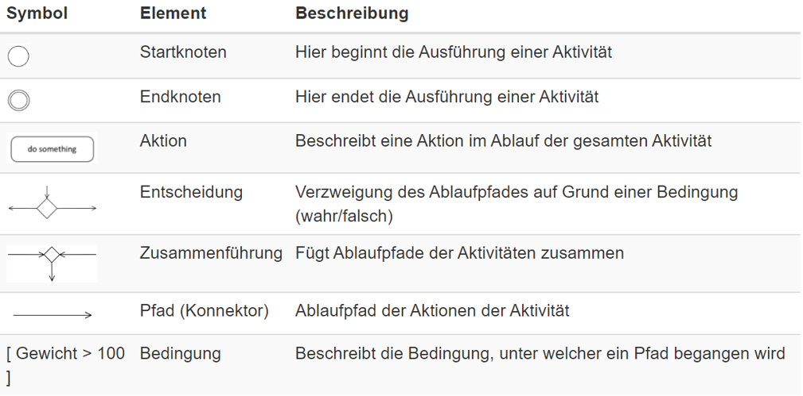
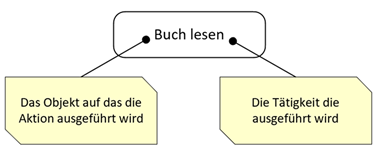
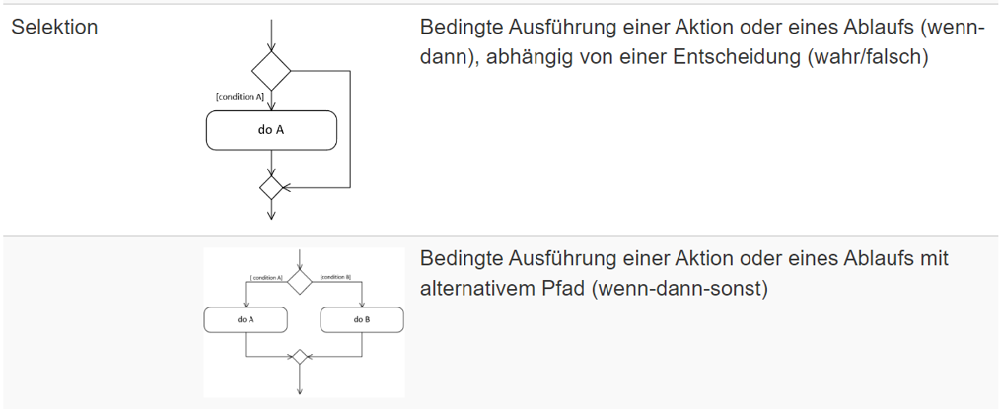
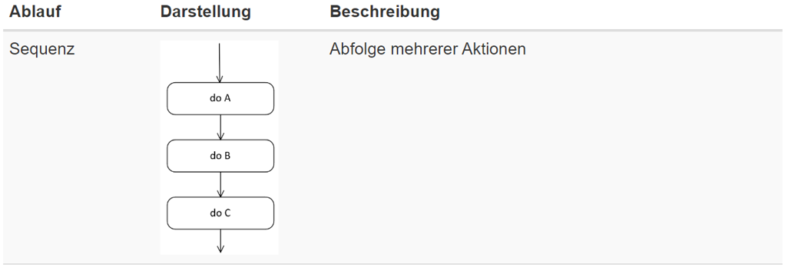
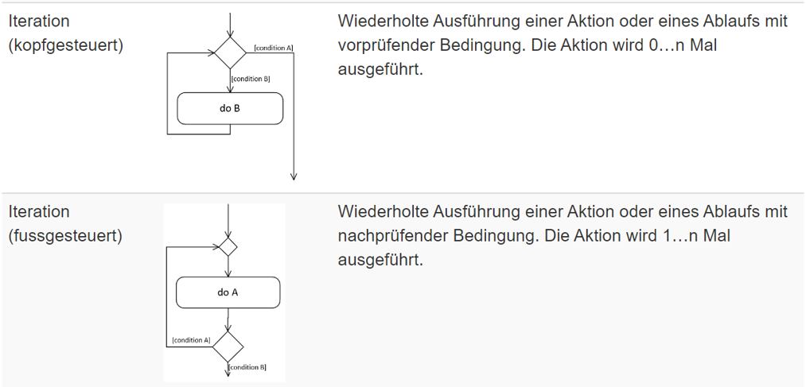
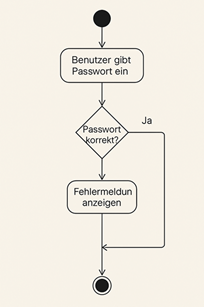
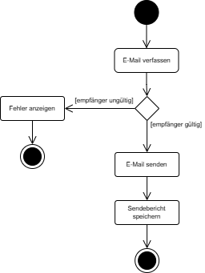

|                      |                           |                               |
| -------------------- | ------------------------- | ----------------------------- |
| **HF Systemtechnik** | **Softwareentwicklung B** |  |

- [1. UML-Aktivitätsdiagramm](#1-uml-aktivitätsdiagramm)
  - [1.1. Lernziele](#11-lernziele)
  - [1.2. Was ist UML?](#12-was-ist-uml)
    - [1.2.1. Definition und Geschichte](#121-definition-und-geschichte)
  - [1.3. Konstruktionspläne für Software](#13-konstruktionspläne-für-software)
    - [1.3.1. Warum UML in der Praxis?](#131-warum-uml-in-der-praxis)
    - [1.3.2. UML-Diagrammtypen](#132-uml-diagrammtypen)
  - [1.4. Definition und Einsatzgebiete](#14-definition-und-einsatzgebiete)
  - [1.5. Grundelemente \& Notation eines Aktivitätsdiagramms](#15-grundelemente--notation-eines-aktivitätsdiagramms)
    - [1.5.1. Startknoten (Initial Node)](#151-startknoten-initial-node)
    - [1.5.2. Endknoten (Activity Final Node)](#152-endknoten-activity-final-node)
  - [1.6. Aktion (Action / Activity Node)](#16-aktion-action--activity-node)
  - [1.7. Entscheidungsknoten (Decision Node)](#17-entscheidungsknoten-decision-node)
    - [1.7.1. Guards – Wächterbedingungen](#171-guards--wächterbedingungen)
    - [1.7.2. Verzweigungen: Decision und Merge](#172-verzweigungen-decision-und-merge)
  - [1.8. Kontrollfluss (Control Flow)](#18-kontrollfluss-control-flow)
  - [1.9. Fork-Knoten (Parallelisierung)](#19-fork-knoten-parallelisierung)
  - [1.10. Join-Knoten (Synchronisation)](#110-join-knoten-synchronisation)
  - [1.11. Objektknoten (Object Node)](#111-objektknoten-object-node)
  - [1.12. Swimlanes (Aktivitätsbereiche / Zuständigkeiten)](#112-swimlanes-aktivitätsbereiche--zuständigkeiten)
  - [1.13. Ablauf-Elemente - Iteration](#113-ablauf-elemente---iteration)
  - [1.14. Aktivität](#114-aktivität)
  - [1.15. Beispiel Aktivitätsdiagramm](#115-beispiel-aktivitätsdiagramm)
  - [1.16. Kurzreferenz (Spickzettel)](#116-kurzreferenz-spickzettel)
    - [1.16.1. Alle Elemente auf einen Blick](#1161-alle-elemente-auf-einen-blick)
    - [1.16.2. Checkliste – Fertig ist das Diagramm, wenn](#1162-checkliste--fertig-ist-das-diagramm-wenn)
    - [1.16.3. Häufige Fehler](#1163-häufige-fehler)
  - [1.17. Mit draw.io ein UML-Aktivitätsdiagramm erstellen](#117-mit-drawio-ein-uml-aktivitätsdiagramm-erstellen)
- [2. Aufgaben](#2-aufgaben)
  - [2.1. Kurzrecherche UML (Unified Modeling Language)](#21-kurzrecherche-uml-unified-modeling-language)
  - [2.2. Aktivitätsdiagramm für Geldautomat entwickeln](#22-aktivitätsdiagramm-für-geldautomat-entwickeln)
  - [2.3. Aktivitätsdiagramm für Kaffeeautomat entwickeln](#23-aktivitätsdiagramm-für-kaffeeautomat-entwickeln)
  - [2.4. Aktivitätsdiagramm für Passwortprüfung mit begrenzter Anzahl an Fehlversuchen](#24-aktivitätsdiagramm-für-passwortprüfung-mit-begrenzter-anzahl-an-fehlversuchen)

---

</br>

# 1. UML-Aktivitätsdiagramm

## 1.1. Lernziele

Nach dieser Lektion können die Studierenden:

1. Den Sinn und Zweck von **UML** allgemein erläutern und in eigenen Worten beschreiben, warum modellbasierte Kommunikation in der Softwareentwicklung wichtig ist.
2. Die 10 Kernelemente eines **Aktivitätsdiagramms** benennen, beschreiben und korrekt zeichnen.
3. Ein vorgegebenes **Aktivitätsdiagramm** lesen, interpretieren und den beschriebenen Ablauf in Worte fassen.
4. Einen einfachen bis mittelschweren Ablauf mit **Verzweigungen** und **Schleifen** selbständig als Aktivitätsdiagramm modellieren.
5. Häufige **Modellierungsfehler** (fehlende Guards, falsches Endknoten-Symbol, unvollständige Pfade) erkennen und korrigieren.

## 1.2. Was ist UML?

### 1.2.1. Definition und Geschichte

**UML** steht für **Unified Modeling Language** und ist eine grafische Modellierungssprache zur Beschreibung, Visualisierung und Dokumentation von Software-Systemen. Sie wurde von der Object Management Group (OMG) 1997 als Standard verabschiedet und liegt heute in **Version 2.5** vor.

Vor **UML** existierten zahlreiche konkurrierende Notationen (Booch, Rumbaugh/OMT, Jacobson/OOSE), was zu Kommunikationsproblemen in interdisziplinären Teams führte. **UML** vereinheitlichte diese Ansätze zu einer einzigen, standardisierten Sprache.

## 1.3. Konstruktionspläne für Software

Ein Plan beschreibt ein System
Zweck:

- Bauanleitung (Fabrikation)
- Dokumentation
- Modelldarstellung

Verbreitet in Ingenieur-Disziplinen:

- Maschinenindustrie
- Baugewerbe
- Elektronik
- **Informatik?**

[Konstruktionsplan](./x_gitres/konstruktionsplan.png)

### 1.3.1. Warum UML in der Praxis?

- **Gemeinsame Sprache:** Entwickler, Architekten, Business-Analysten und Kunden verwenden dieselbe Notation – unabhängig von Programmiersprache oder Technologie.
- **Frühe Fehlererkennung:** Logikfehler werden im Modell sichtbar, bevor teurer Code geschrieben wird.
- **Dokumentation:** Anforderungen und Systemabläufe werden formal und nachvollziehbar festgehalten.
- **Abstraktion:** Technologie- und sprachunabhängige Kommunikation über Systemgrenzen hinweg.
- **Testbasis:** Aus Aktivitätsdiagrammen lassen sich systematisch Testfälle und Testpfade ableiten.

### 1.3.2. UML-Diagrammtypen

UML 2.5 definiert **14 Diagrammtypen**, eingeteilt in zwei Kategorien:

| **Strukturdiagramme (statisch)** | **Verhaltensdiagramme (dynamisch)** |
| -------------------------------- | ----------------------------------- |
| Klassendiagramm                  | **Aktivitätsdiagramm ← heute!**     |
| Objektdiagramm                   | Use-Case-Diagramm                   |
| Komponentendiagramm              | Sequenzdiagramm                     |
| Paketdiagramm                    | Zustandsdiagramm                    |
| Verteilungsdiagramm              | Kommunikationsdiagramm              |

## 1.4. Definition und Einsatzgebiete

> **Definition:** Ein Aktivitätsdiagramm beschreibt den Ablauf von Aktivitäten (Aktionen) innerhalb eines Systems. Es zeigt, **WIE** etwas abläuft – mit Verzweigungen, Schleifen und parallelen Pfaden.

**Typische Einsatzgebiete:**

- Geschäftsprozesse (z.B. Bestellabwicklung, Genehmigungsworkflow)
- Softwareabläufe und Algorithmen (z.B. Login-Logik, Datenbankzugriff)
- Use-Case-Realisierungen (Detaillierung von Anwendungsfällen)
- Ableitung von Testfällen (jeder Pfad = potentieller Testfall)

*Wichtig: Das Aktivitätsdiagramm ist kein einfaches Flussdiagramm. Es ist formal standardisiert, objektorientiert und präziser in Notation und Semantik.*

Ein **Aktivitätsdiagramm** (engl. Activity Diagram) ist eine Art von Verhaltensdiagramm in der **UML (Unified Modeling Language)**, das den Ablauf von Aktivitäten oder Prozessen darstellt – ähnlich wie ein Flussdiagramm, jedoch strukturierter und objektorientierter.

Ein **Aktivitätsdiagramm** zeigt, welche **Aktionen** (Aktivitäten) in welcher Reihenfolge ausgeführt werden, wo Entscheidungen getroffen werden und wie parallele Abläufe aussehen können.
Es wird vor allem zur Modellierung von Geschäftsprozessen, Arbeitsabläufen oder Programmabläufen verwendet.

[Aktivitätsdiagramm Wiki](https://de.wikipedia.org/wiki/Aktivit%C3%A4tsdiagramm)

---

## 1.5. Grundelemente & Notation eines Aktivitätsdiagramms

| Symbol                         | Element                     | Beschreibung                                     |
| ------------------------------ | --------------------------- | ------------------------------------------------ |
| `●` (ausgefüllter Kreis)       | **Startknoten**             | Einziger Einstiegspunkt · kein eingehender Pfeil |
| `⊙` (Kreis mit Punkt)          | **Aktivitätsendknoten**     | Beendet den gesamten Ablauf                      |
| `✕` (Kreis mit X)              | **Flussendknoten**          | Beendet nur einen Zweig                          |
| Abgerundetes Rechteck          | **Aktion / Aktivität**      | Beschriftet mit Verb + Substantiv                |
| `◆` (1 rein, mehrere raus)     | **Entscheidungsknoten**     | Verzweigung mit Guards `[Bedingung]`             |
| `◆` (mehrere rein, 1 raus)     | **Zusammenführung (Merge)** | Führt Pfade zusammen, keine Guards               |
| Dicker Balken (rein → mehrere) | **Fork (Aufspaltung)**      | Startet parallele Abläufe                        |
| Dicker Balken (mehrere → raus) | **Join (Synchronisation)**  | Wartet auf alle parallelen Pfade                 |
| `→` Pfeil                      | **Kontrollfluss**           | Verbindet Elemente; Beschriftung optional        |
| Rechteck mit Trennlinie        | **Swim Lane / Partition**   | Zeigt Verantwortlichkeit (Rolle, System)         |



### 1.5.1. Startknoten (Initial Node)

- **Schwarzer ausgefüllter Kreis** (●)
- Der Startpunkt eines Prozesses.
- Von hier aus beginnt der Ablauf.

> Beispiel: Beim Anmeldeprozess: Der Nutzer öffnet das Login-Formular.

### 1.5.2. Endknoten (Activity Final Node)

- **Schwarzer Kreis** mit Umrandung (◯)
- Beendet den Ablauf vollständig.
- Nach diesem Punkt läuft keine Aktivität mehr.

> Beispiel: Nach erfolgreichem Login wird die Startseite angezeigt → Prozess endet.

## 1.6. Aktion (Action / Activity Node)

Eine Aktion ist ein einzelner, **atomarer Schritt** innerhalb einer **Aktivität** – also eine konkrete Handlung, wie z.B. "Zähne putzen", "Tasse aus dem Schrank holen" oder "Passwort eingeben".
**Sie ist nicht weiter unterteilt**.

- **Rechteck** mit abgerundeten Ecken
- Ein einzelner Bearbeitungsschritt, z. B. eine Eingabe, Berechnung oder Aktion.
- Es handelt sich um eine "auszuführende Aktivität".

> Beispiel: Benutzerdaten eingeben, "Zahlung berechnen", "PDF generieren".



## 1.7. Entscheidungsknoten (Decision Node)

- Raute (◆)
- Dient der Verzweigung mit Bedingungen.
- Es gibt mindestens zwei ausgehende Pfeile, beschriftet mit Bedingungen wie "ja" / "nein" oder "> 100" / "<= 100".

> Beispiel: "Ist das Passwort korrekt?" → Ja: Weiter zu "Zugang erlauben", Nein: "Fehlermeldung anzeigen".



### 1.7.1. Guards – Wächterbedingungen

An jedem Entscheidungsknoten (`◆`) werden die ausgehenden Pfeile mit **Guards** beschriftet. Guards stehen in eckigen Klammern und beschreiben die Bedingung, unter der dieser Pfad gewählt wird.

**Regeln für Guards:**

- Notation immer in eckigen Klammern: `[Bedingung]`
- **Vollständigkeit:** Alle möglichen Fälle müssen durch Guards abgedeckt sein
- **Disjunktheit:** Kein Fall darf durch zwei Guards gleichzeitig wahr sein
- `[else]` als Auffangbedingung für den Standardfall zulässig

**Beispiele:**

- `[Zahlung erfolgreich]` / `[Zahlung fehlgeschlagen]`
- `[Lagerbestand > 0]` / `[else]`
- `[korrekt]` / `[falsch & Versuche < 3]` / `[falsch & Versuche = 3]`

### 1.7.2. Verzweigungen: Decision und Merge

Beide Knoten verwenden das **gleiche Symbol `◆`** – der Unterschied liegt in der Anzahl der Pfeile:

|                       | Decision Node (Entscheidung) | Merge Node (Zusammenführung) |
| --------------------- | ---------------------------- | ---------------------------- |
| **Eingehende Pfeile** | 1                            | 2 oder mehr                  |
| **Ausgehende Pfeile** | 2 oder mehr                  | 1                            |
| **Guards**            | Pflicht an allen Ausgängen   | Nicht nötig                  |
| **Entspricht**        | `if / else if / else`        | Zusammenführung von Pfaden   |

## 1.8. Kontrollfluss (Control Flow)

- **Pfeile** zwischen den Knoten
- Zeigt die logische Reihenfolge der Aktivitäten.
- Verbindet Aktionen, Entscheidungen, Start- und Endpunkte.



## 1.9. Fork-Knoten (Parallelisierung)

- Schwarzer horizontaler oder vertikaler **Balken**
- Spaltet den Ablauf in mehrere parallele Prozesse auf.
- Jeder ausgehende Pfad läuft gleichzeitig ab.

> Beim Online-Kauf werden gleichzeitig E-Mail gesendet und Rechnung erstellt.

## 1.10. Join-Knoten (Synchronisation)

- Gleiches Symbol wie Fork (**Balken**)
- Führt mehrere parallele Abläufe wieder zusammen.
- Der Ablauf geht erst weiter, wenn alle parallelen Pfade abgeschlossen sind.

> Beispiel: Nach "E-Mail gesendet" und "Rechnung erstellt" folgt "Bestellung abgeschlossen".

## 1.11. Objektknoten (Object Node)

- **Rechteck** mit Objektname (optional mit Typ)
- Zeigt den Datenfluss (welches Objekt oder welche Information zwischen Aktivitäten übergeben wird).
- Optional mit Richtungspfeil für Ein- oder Ausgabe.

> Beispiel: Ein "Benutzerobjekt" wird in der Aktivität "Authentifizieren" verwendet.

## 1.12. Swimlanes (Aktivitätsbereiche / Zuständigkeiten)

- Unterteilung des Diagramms in vertikale oder horizontale Bahnen
- Zeigen, welcher Akteur (z. B. System, Benutzer, Admin) welche Aktivität durchführt.
- Oft genutzt zur Zuweisung von Verantwortlichkeiten.

> Beispiel: Ein Swimlane für "Kunde", ein anderer für "System". "Kunde gibt Daten ein", "System prüft Daten".

Swim Lanes zeigen, **WER** für welche Aktion zuständig ist.

```console
«partition» Online-Shop Bestellung
┌────────────────┬────────────────┬────────────────┐
│    Kunde       │    System      │     Lager      │
├────────────────┼────────────────┼────────────────┤
│                │                │                │
│  ╭──────────╮  │                │                │
│  │Bestellung│  │                │                │
│  │ aufgeben │  │                │                │
│  ╰──────────╯  │                │                │
│       |        │                │                │
│       └────────→ ╭───────────╮  │                │
│                │ │ Zahlung   │  │                │
│                │ │verarbeiten│  │                │
│                │ ╰───────────╯  │                │
│                │       |        │                │
│                │       └────────→  ╭──────────╮  │
│                │                │  │ Artikel  │  │
│                │                │  │kommisson.│  │
│                │                │  ╰──────────╯  │
│                │                │       |        │
│                │  ╭──────────╮  │       │        │
│                │  │Versandlbl│ ←────────┘        │
│                │  │erstellen │  │                │
│                │  ╰──────────╯  │                │
│                │       |        │                │
│  ╭──────────╮  │       │        │                │
│  │Versandbe-│ ←────────┘        │                │
│  │stätigung │  │                │                │
│  ╰──────────╯  │                │                │
└────────────────┴────────────────┴────────────────┘
```

## 1.13. Ablauf-Elemente - Iteration

Schleifen entstehen durch einen **Rückwärtspfeil** – ein Entscheidungsknoten leitet einen Pfad zurück zu einer früheren Stelle.



## 1.14. Aktivität

Eine **Aktivität** ist ein **komplexer Ablauf oder ein gesamter Prozess**, der sich aus mehreren Teilschritten zusammensetzt. Sie kann mehrere Aktionen enthalten und wird oft als **gesamtes Aktivitätsdiagramm** dargestellt.

## 1.15. Beispiel Aktivitätsdiagramm



## 1.16. Kurzreferenz (Spickzettel)

### 1.16.1. Alle Elemente auf einen Blick

| Symbol                   | Element             | Schlüsselregel                                            |
| ------------------------ | ------------------- | --------------------------------------------------------- |
| `●`                      | Startknoten         | Genau 1 pro Diagramm; kein eingehender Pfeil              |
| `⊙`                      | Aktivitätsendknoten | Beendet den gesamten Ablauf                               |
| `✕`                      | Flussendknoten      | Beendet nur einen Zweig                                   |
| `╭──╮` (abger. Rechteck) | Aktion              | Verb + Substantiv; 1 ein, 1 aus                           |
| `◆` (1 rein, n raus)     | Decision            | Guards `[...]` an allen Ausgängen; vollständig & disjunkt |
| `◆` (n rein, 1 raus)     | Merge               | Keine Guards; führt Pfade zusammen                        |
| `━━━━━` (1 rein, n raus) | Fork                | Startet Parallelabläufe                                   |
| `━━━━━` (n rein, 1 raus) | Join                | Synchronisiert Parallelabläufe                            |
| `→`                      | Kontrollfluss       | Verbindet Elemente; Guard in `[...]` bei Decision         |
| Swim Lane                | Partition           | `«partition»` als Bezeichnung; zeigt Verantwortlichkeit   |

### 1.16.2. Checkliste – Fertig ist das Diagramm, wenn

- [ ] Genau 1 Startknoten vorhanden
- [ ] Mindestens 1 Endknoten vorhanden (Typ beachten!)
- [ ] Alle Entscheidungsknoten haben vollständige Guards in `[...]`
- [ ] Alle Aktionen mit Verb + Substantiv benannt
- [ ] Alle Pfeile haben eine klare Richtung (keine Ambiguität)
- [ ] Decision- und Merge-Knoten korrekt unterschieden (Anzahl der Pfeile!)
- [ ] Schleifen haben einen Rückwärtspfeil mit Guard für den Abbruch

### 1.16.3. Häufige Fehler

| **Fehler**                                   | **Korrekte Lösung**                                          |
| -------------------------------------------- | ------------------------------------------------------------ |
| Guards fehlen an Entscheidungsknoten         | Alle Ausgänge mit `[Bedingung]` beschriften                  |
| Guards unvollständig (nicht alle Fälle)      | `[else]` als Auffang-Guard hinzufügen                        |
| Kein Endknoten                               | Jeden Pfad mit einem Endknoten abschliessen                  |
| Aktion mit Substantiv benannt (`"Rechnung"`) | Verb + Substantiv: `"Rechnung erstellen"`                    |
| Decision und Merge verwechselt               | Decision: 1 rein, mehrere raus · Merge: mehrere rein, 1 raus |
| Mehrere Startknoten                          | Genau 1 Startknoten; Zusammenführung via Merge               |

---

## 1.17. Mit draw.io ein UML-Aktivitätsdiagramm erstellen

[Kleines Tutorial](https://www.youtube.com/watch?v=IKq-wBDfU7s)

</br>

# 2. Aufgaben

## 2.1. Kurzrecherche UML (Unified Modeling Language)

| **Vorgabe**         | **Beschreibung**                                                         |
| :------------------ | :----------------------------------------------------------------------- |
| **Lernziele**       | Kennen Sinn u. Zweck sowie Einsatzbereich von UML Diagrammen             |
|                     | Können mindestens 3 Diagramme inkl. den Konstruktionselementen erläutern |
| **Sozialform**      | Einzelarbeit                                                             |
| **Auftrag**         | siehe unten                                                              |
| **Hilfsmittel**     |                                                                          |
| **Zeitbedarf**      | 10min                                                                    |
| **Lösungselemente** | Lösungen zu den aufgeführten Fragen                                      |

Betrachten Sie das folgende Aktivitätsdiagramm eines **E-Mail-Versandprozesses** und beantworten Sie die Fragen.



**Fragen:**

1. Wie viele **Aktionsknoten** enthält das Diagramm? Benennen Sie sie alle.

   *Antwort:* _______________________________________________

2. Wie viele **Endknoten** hat das Diagramm und welchen Typ haben sie?

   *Antwort:* _______________________________________________

3. Welche **Guards** sind an der Entscheidungsraute vorhanden? Sind sie vollständig? Begründen Sie.

   *Antwort:* _______________________________________________

4. Was passiert, wenn der Empfänger **ungültig** ist?

   *Antwort:* _______________________________________________

5. Enthält das Diagramm eine **Schleife**? Begründen Sie Ihre Antwort.

   *Antwort:* _______________________________________________

---

</br>

## 2.2. Aktivitätsdiagramm für Geldautomat entwickeln

| **Vorgabe**         | **Beschreibung**                                       |
| :------------------ | :----------------------------------------------------- |
| **Lernziele**       | Ein UML-Aktivitätsdiagramm erstellt                    |
|                     | Grundelementen der UML-Notation                        |
|                     | Verständnis für für strukturierte Ablaufbeschreibungen |
|                     | Abläufe und Prozesse grafisch darzustellen             |
| **Sozialform**      | Einzelarbeit                                           |
| **Auftrag**         | siehe unten                                            |
| **Hilfsmittel**     |                                                        |
| **Zeitbedarf**      | 20min                                                  |
| **Lösungselemente** | Vollständiges Aktivitätsdiagramm                       |

Modelliere den folgenden Ablauf als **vollständiges Aktivitätsdiagramm**. Verwende korrekte UML-Notation für alle Elemente.

> **Szenario: Geldautomat (ATM) – Bargeld abheben**
>
> 1. Bankkarte einstecken
> 2. PIN eingeben
> 3. PIN prüfen:
>    - Korrekt → weiter mit Schritt 4
>    - Falsch → Fehlermeldung anzeigen
>      - Versuche < 3 → zurück zu Schritt 2 (Schleife!)
>      - Versuche = 3 → Karte einziehen → **ENDE** (Sperrung)
> 4. Betrag eingeben
> 5. Kontodeckung prüfen:
>    - Ausreichend → Bargeld ausgeben → Karte zurückgeben → **ENDE** (Erfolg)
>    - Nicht ausreichend → Fehlermeldung → Karte zurückgeben → **ENDE**

**Hinweise zur Bearbeitung:**

- Beginnen Sie mit dem Startknoten und arbeiten Sie sich schrittweise durch den Ablauf.
- Markieren Sie alle Guards an den Entscheidungsknoten deutlich in eckigen Klammern.
- Achten Sie auf die **Schleife** bei falscher PIN (Rückwärtspfeil einzeichnen).
- Verwenden Sie **unterschiedliche Endknoten** für Sperrung, Erfolg und fehlende Deckung.

---

## 2.3. Aktivitätsdiagramm für Kaffeeautomat entwickeln

| **Vorgabe**         | **Beschreibung**                                       |
| :------------------ | :----------------------------------------------------- |
| **Lernziele**       | Ein UML-Aktivitätsdiagramm erstellt                    |
|                     | Grundelementen der UML-Notation                        |
|                     | Verständnis für für strukturierte Ablaufbeschreibungen |
|                     | Abläufe und Prozesse grafisch darzustellen             |
| **Sozialform**      | Einzelarbeit                                           |
| **Auftrag**         | siehe unten                                            |
| **Hilfsmittel**     |                                                        |
| **Zeitbedarf**      | 20min                                                  |
| **Lösungselemente** | Vollständiges Aktivitätsdiagramm                       |

Modelliere den folgenden Ablauf als **vollständiges Aktivitätsdiagramm**. Verwende korrekte UML-Notation für alle Elemente.

Ein **Kaffeeautomat** funktioniert wie folgt:

- Ein Benutzer startet den Automaten.
- Danach wählt er ein Getränk:
  - Kaffee
  - Tee
- Wenn der Benutzer Kaffee wählt:
  - Es wird geprüft, ob genügend Wasser vorhanden ist
  - Wenn ja → Kaffee wird zubereitet
  - Wenn nein → Fehlermeldung "Wasser nachfüllen"
- Wenn der Benutzer Tee wählt:
  - Tee wird direkt zubereitet
- Am Ende wird das Getränk ausgegeben.

Dein Diagramm soll enthalten:

- Start- und Endknoten
- Aktionen (z.B. "Getränk wählen")
- Eine Entscheidung (Kaffee oder Tee)
- Eine weitere Entscheidung (Wasser vorhanden?)
- Korrekte Beschriftung der Bedingungen (z. B. `[ja]`, `[nein]`)

Optional (keine Erweiterung)

- Oder erweitere um eine dritte Auswahl (z.B. "Heisse Schokolade")

---

## 2.4. Aktivitätsdiagramm für Passwortprüfung mit begrenzter Anzahl an Fehlversuchen

| **Vorgabe**             | **Beschreibung**                                                                           |
| :---------------------- | :----------------------------------------------------------------------------------------- |
| **Lernziele**           | komplexe Abläufe mit Verzweigungen und Schleifen in einem UML Aktivitätsdiagramm umsetzen. |
|                         | Ablauf und Logik prüfen                                                                    |
| **Sozialform**          | Einzelarbeit                                                                               |
| **Hilfsmittel**         |                                                                                            |
| **Erwartete Resultate** |                                                                                            |
| **Zeitbedarf**          | 30 min                                                                                     |
| **Lösungselemente**     | Vollständiges UML Aktivitätsdiagramm                                                       |

Nach dem die Logik der Passwortanmeldung grafisch als PAP (siehe vorherige Aufgabe) entwickelt wurde, soll nun diese in einem UML Aktivitätsdiagramm implementiert werden.
Erstelle zur Logik der Passwortanmeldung ein vollständig UML Aktivitätsdiagramm.

</br>

© 2026 Lukas Müller – Licensed under CC BY-NC-ND 4.0
See [LICENSE](..\license.md) file for details.
